# Enumeration
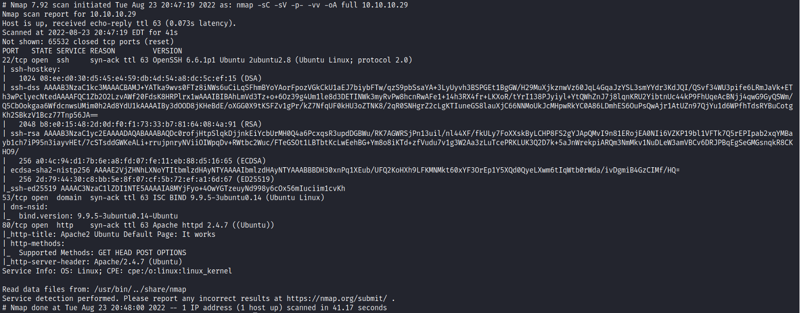 </br>
## Initial Shell
When I navigated to the webserver, I saw this: </br>
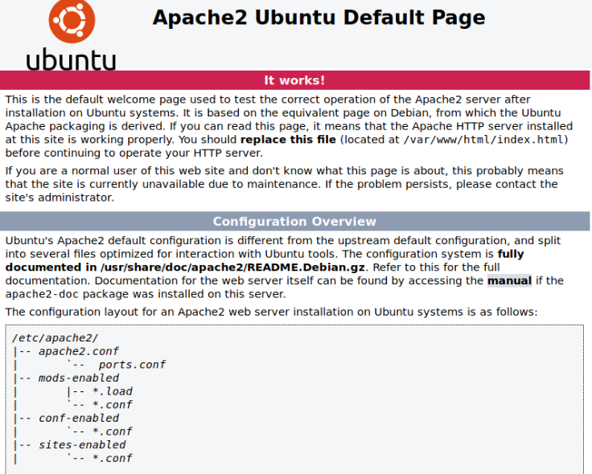 </br>
Since the name of the box is bank, I added it to the ```/etc/hosts``` file, and when I searched for http://bank.htb , this is what I got: </br>
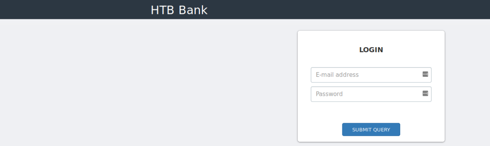 </br>
Next, I ran a fuzzing scan with gobuster: </br>
```bash
gobuster dir -u http://bank.htb/ -w /usr/share/wordlists/dirbuster/directory-list-2.3-medium.txt -x php,html,txt -t 30
``` 

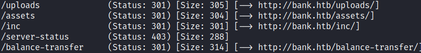 </br>
When I checked ```/balance-transfer``` directory, I saw a list of files: </br>
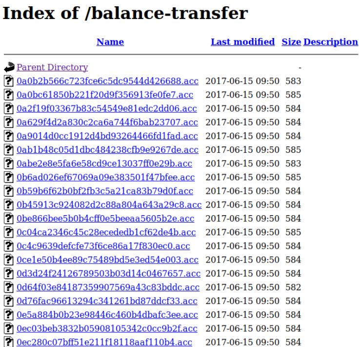 </br>
But when I tried to access any of them, they contained encrypted usernames and passwords. </br>
I have figured that not all of the files there have the same size, I found a file with a different size and opened it: </br>
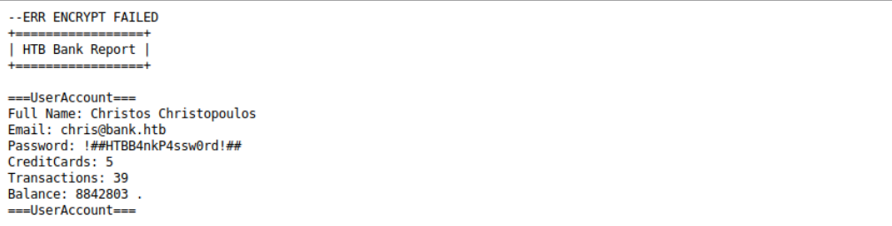 </br>
This file contains clear text credentials, I tried it out on the login portal: </br>
 </br>
I navigated to the support page, and I have found an upload function there: </br>
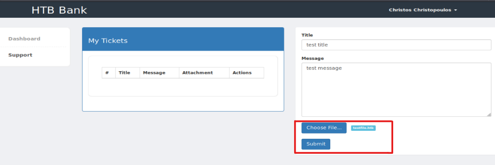 </br>
I tried to upload a php reverse shell from [pentestmonkey](https://github.com/pentestmonkey/php-reverse-shell/blob/master/php-reverse-shell.php) But I got this error: </br>
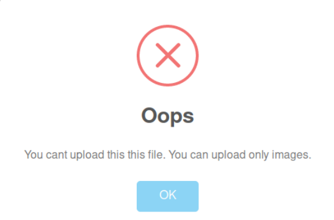 </br>
I inspected the source code, and found an important DEBUG comment: </br>
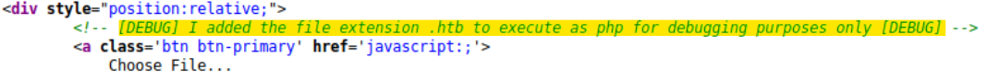 </br>
I renamed the php reverse shell extension to ```.htb``` , and it worked: </br>
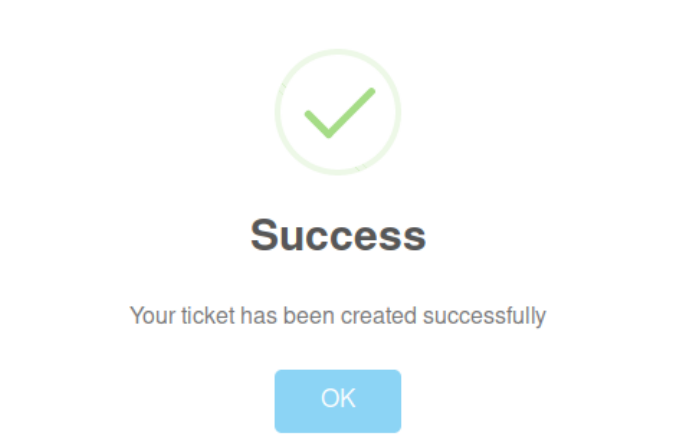 </br>
I set up a netcat listener and catched the reverse shell: </br>
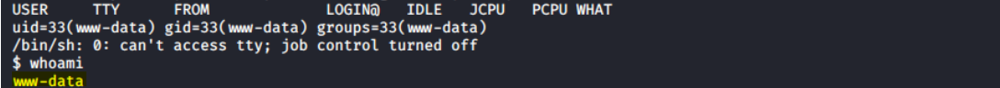 </br> 
# Privilege Escalation
After I got Initial Access, I enumerated the machine, and found this at ```/var/htb``` directory: </br>
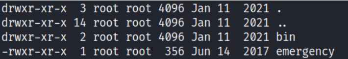 </br>
The emergency file looked like a python script, and when I read it this is what I saw: </br>
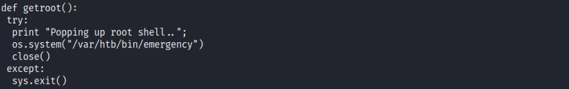 </br>
I tried executing the file, and it worked: </br>
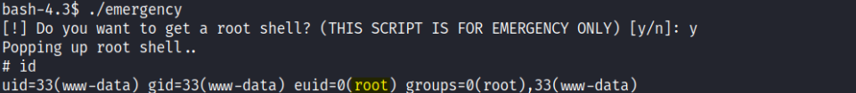 </br>
I was in the root group and could access /root directory and read the root flag, but I wanted full access, so I did this: </br>
- openssl passwd -6 -salt xyz test -> Generated a hashed password, I used ‘test’. </br>
- Made an interactive shell, so I could edit it with vim/nano: </br>
- python3 -c 'import pty; pty.spawn("/bin/bash")' </br>
B. Ctrl + Z to background my shell, stty raw -echo </br>
C. stty raw -echo;fg </br>
- nano /etc/shadow -> pasted the new hashed password to root. </br>
- su root, entered 'test' password, and it worked: </br> </br>
**Vulnerability Exploited:** Suid Binary Bit Set </br>
**Vulnerability Explanation:** If the binary has the SUID bit set, it does not drop the elevated privileges
and may be abused to access the file system, escalate or maintain privileged access as a SUID backdoor.
If it is used to run sh -p, omit the -p argument on systems like Debian (<= Stretch) that allow the default
sh shell to run with SUID privileges. </br>
**Vulnerability Fix:** Remove the unsafe SUID since any low priveleged user has access to it and can
elevate his privileges. </br> </br>
**Proof Of Screenshot:** </br>
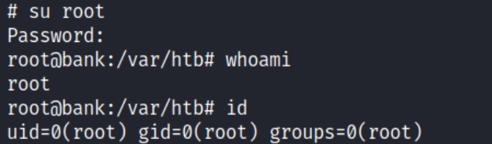 </br>
 

