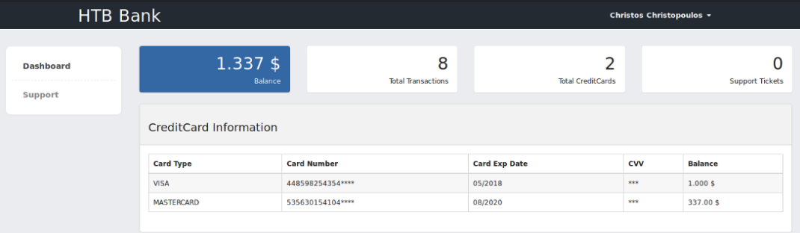

# Enumeration
 </br>
## Initial Shell
When I navigated to the webserver, I saw this: </br>
 </br>
Since the name of the box is bank, I added it to the ```/etc/hosts``` file, and when I searched for http://bank.htb , this is what I got: </br>
 </br>
Next, I ran a fuzzing scan with gobuster: </br>
```bash
gobuster dir -u http://bank.htb/ -w /usr/share/wordlists/dirbuster/directory-list-2.3-medium.txt -x php,html,txt -t 30
``` 

 </br>
When I checked ```/balance-transfer``` directory, I saw a list of files: </br>
 </br>
But when I tried to access any of them, they contained encrypted usernames and passwords. </br>
I have figured that not all of the files there have the same size, I found a file with a different size and opened it: </br>
 </br>
This file contains clear text credentials, I tried it out on the login portal: </br>
 </br>
I navigated to the support page, and I have found an upload function there: </br>
 </br>
I tried to upload a php reverse shell from [pentestmonkey](https://github.com/pentestmonkey/php-reverse-shell/blob/master/php-reverse-shell.php) But I got this error: </br>
 </br>
I inspected the source code, and found an important DEBUG comment: </br>
 </br>
I renamed the php reverse shell extension to ```.htb``` , and it worked: </br>
 </br>
I set up a netcat listener and catched the reverse shell: </br>
 </br> 
# Privilege Escalation


