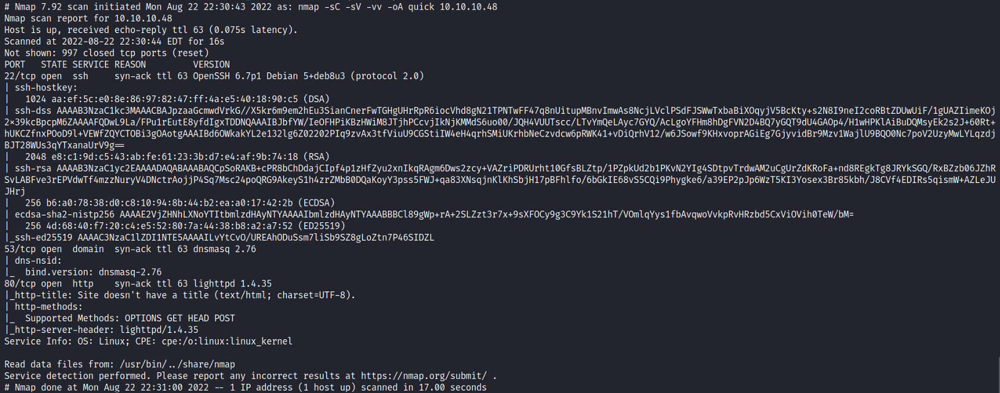
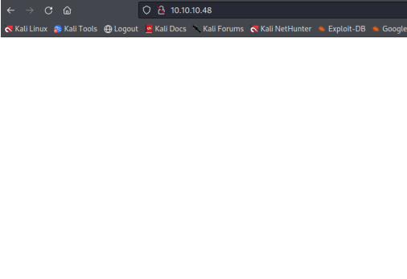
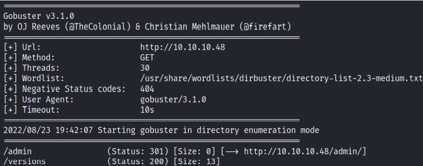
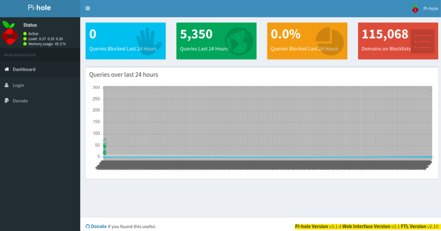
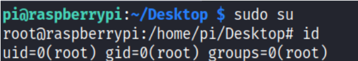
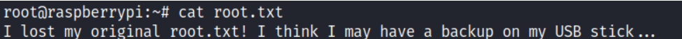
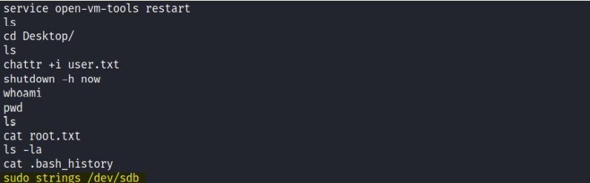
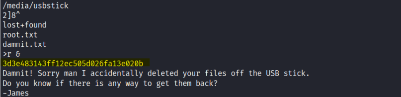
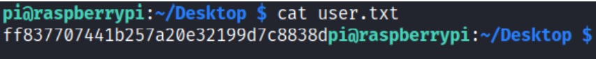
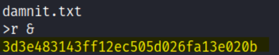

# Enumeration
 </br>
**Initial Shell:** </br>
I started with port 80 and tried to access the website but saw a blank page: </br>
 </br>
I ran a fuzzing scan, and saw that the ```/admin``` directory was accessible: </br>
 </br>
 </br> </br>
**Pi-hole** is a DNS sinkhole that protects your devices from unwanted content, without installing any
client-side software, it is installed on a Raspberry Pie. </br> </br>
It looked like an admin dashboard, I tried logging in with Raspberry Pie default credentials, but it didn't work. </br>
I tried logging in with the same credentials using the SSH service, and it worked. </br>
Default Username and Password are: </br>
**Username:** pi </br>
**Password:** raspberry </br> </br>
**Vulnerability Exploited**: Default Credentials Vulnerability </br>
**Vulnerability Explanation:** A Default Credential vulnerability is a type of vulnerability in a computing device 
that most commonly affects devices having some pre-set (default) administrative credentials to
access all configuration settings.
The vendor or manufacturer of such devices uses a single pre-defined set of admin credentials to access
the device configurations, and any potential hacker can misuse this fact to hack such devices, if those
credentials are not changed by consumers. </br>
**Vulnerability Fix:** Ensuring not to use a known and weak password , and making sure to change the
original, default passwords. </br> </br>
# Privilege Escalation
I tried ```sudo su``` command, and managed to successfully authenticate as root: </br>
 </br>
I tried to grab the root flag from the root directory, but saw this: </br>
 </br>
I used ```ls -la``` to list all of the hidden files, and saw the ```.bash_history``` file. </br>
when I tried reading its content I saw this: </br>
 </br>
```sudo strings /dev/sdb:``` </br>
 </br> </br>
I could see the usb stick's directory listing, I read in one of the files there that the files were accidently removed from the usb stick, but I could also see something that looked like a flag, I tried it out, and it worked. </br>
**strings:** A command that grabs the data of the device. </br> </br>
**Proof.txt Contents:** </br>
 </br>
