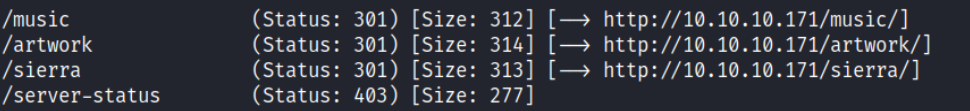
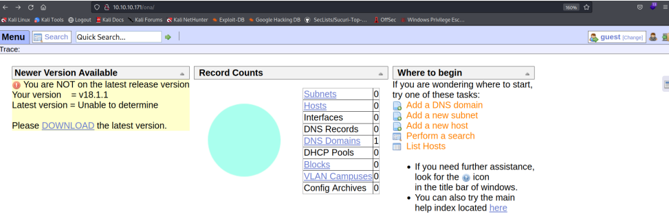
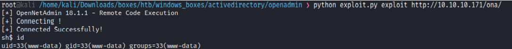
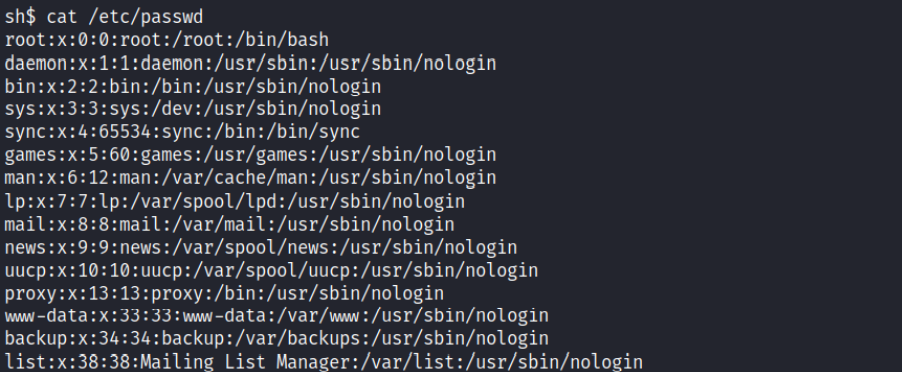
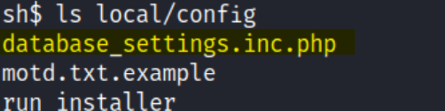
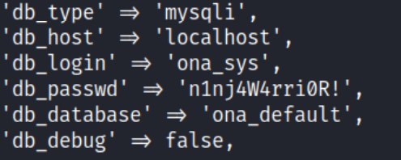

# Enumeration
```bash
Nmap scan report for 10.10.10.171
Host is up (0.077s latency).

PORT   STATE SERVICE VERSION
22/tcp open  ssh     OpenSSH 7.6p1 Ubuntu 4ubuntu0.3 (Ubuntu Linux; protocol 2.0)
| ssh-hostkey: 
|   2048 4b:98:df:85:d1:7e:f0:3d:da:48:cd:bc:92:00:b7:54 (RSA)
|   256 dc:eb:3d:c9:44:d1:18:b1:22:b4:cf:de:bd:6c:7a:54 (ECDSA)
|_  256 dc:ad:ca:3c:11:31:5b:6f:e6:a4:89:34:7c:9b:e5:50 (ED25519)
80/tcp open  http    Apache httpd 2.4.29 ((Ubuntu))
|_http-server-header: Apache/2.4.29 (Ubuntu)
|_http-title: Apache2 Ubuntu Default Page: It works
Service Info: OS: Linux; CPE: cpe:/o:linux:linux_kernel

Service detection performed. Please report any incorrect results at https://nmap.org/submit/ .
Nmap done: 1 IP address (1 host up) scanned in 9.13 seconds
```

## Initial Shell
I did a fuzzing scan with gobuster: </br>
```
gobuster dir --url http://10.10.10.171/ --wordlist /usr/share/wordlists/dirbuster/directory-list-2.3-medium.txt -t 30
```

And got this result: </br>
 </br>
I first started with the /music website and began searching for hints. When I clicked the 'login' button in
the navbar, I was redirected to some interesting webpage. </br>
 </br>
 </br>
I searched for an exploit for this version (OpenNetAdmin v18.1.1) and found one on [GitHub](https://github.com/amriunix/ona-rce) </br>
 </br>
It worked but the shell I got was somewhat limited, I could not use ```cd``` and move from my working
directory, but I could read and access files that were outside my working directory: </br>
 </br>
So I started to enumerate the machine first from within my working directory, and I found out MySQL
database login credentials: </br>
 </br>
 </br>
Since logging into the database didn't seem to work, and SSH port was open, I checked for the users in
this machine: </br>
 </br>
And I tried using the database credentials for 'jimmy' user (n1nj4W4rri0R!), and it worked: </br>
 </br>

