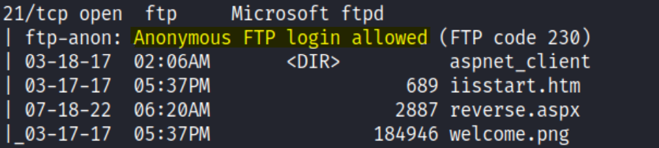
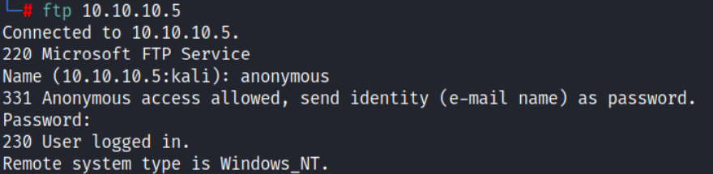
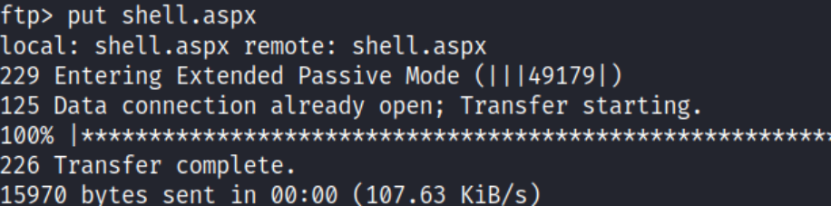
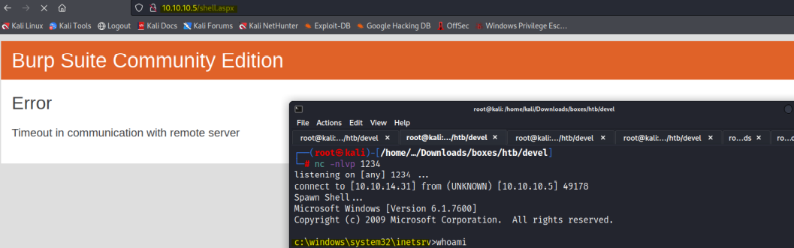
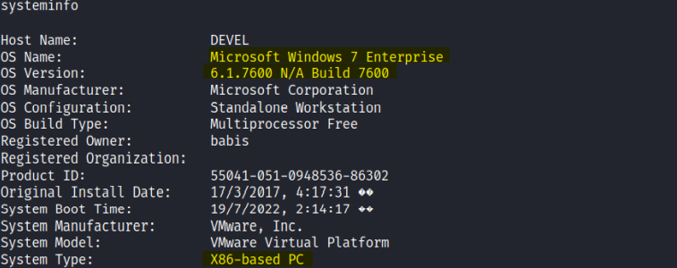
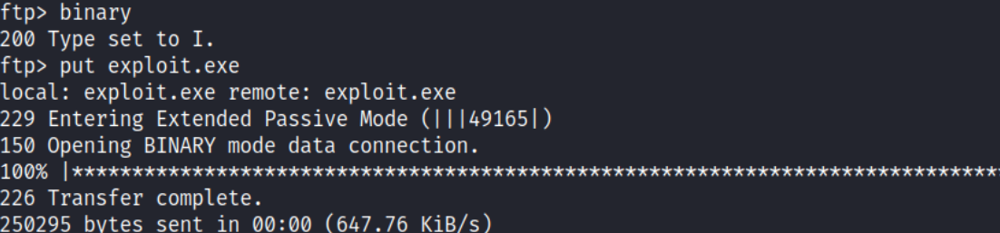

# Enumeration:
Started with an nmap scan to enumerate the box:
```bash
# Nmap 7.92 scan initiated Sun Jul 17 23:23:13 2022 as: nmap -sS -sV -A -p- -oN nmap.txt 10.10.10.5
Nmap scan report for 10.10.10.5
Host is up (0.072s latency).
Not shown: 65533 filtered tcp ports (no-response)
PORT   STATE SERVICE VERSION
21/tcp open  ftp     Microsoft ftpd
| ftp-anon: Anonymous FTP login allowed (FTP code 230)
| 03-18-17  02:06AM       <DIR>          aspnet_client
| 03-17-17  05:37PM                  689 iisstart.htm
| 07-18-22  06:20AM                 2887 reverse.aspx
|_03-17-17  05:37PM               184946 welcome.png
| ftp-syst: 
|_  SYST: Windows_NT
80/tcp open  http    Microsoft IIS httpd 7.5
|_http-title: IIS7
|_http-server-header: Microsoft-IIS/7.5
| http-methods: 
|_  Potentially risky methods: TRACE
Warning: OSScan results may be unreliable because we could not find at least 1 open and 1 closed port
Device type: specialized|general purpose|phone
Running (JUST GUESSING): Microsoft Windows 7|8|Phone|2008|8.1|Vista (90%)
OS CPE: cpe:/o:microsoft:windows_7 cpe:/o:microsoft:windows_8 cpe:/o:microsoft:windows cpe:/o:microsoft:windows_server_2008:r2 cpe:/o:microsoft:windows_8.1 cpe:/o:microsoft:windows_vista::- cpe:/o:microsoft:windows_vista::sp1
Aggressive OS guesses: Microsoft Windows Embedded Standard 7 (90%), Microsoft Windows 8.1 Update 1 (90%), Microsoft Windows Phone 7.5 or 8.0 (90%), Microsoft Windows 7 or Windows Server 2008 R2 (90%), Microsoft Windows Server 2008 (90%), Microsoft Windows Server 2008 R2 (90%), Microsoft Windows Server 2008 R2 or Windows 8.1 (90%), Microsoft Windows Server 2008 R2 SP1 (90%), Microsoft Windows Server 2008 R2 SP1 or Windows 8 (90%), Microsoft Windows 7 (90%)
No exact OS matches for host (test conditions non-ideal).
Network Distance: 2 hops
Service Info: OS: Windows; CPE: cpe:/o:microsoft:windows

TRACEROUTE (using port 80/tcp)
HOP RTT      ADDRESS
1   71.09 ms 10.10.14.1
2   71.10 ms 10.10.10.5

OS and Service detection performed. Please report any incorrect results at https://nmap.org/submit/ .
# Nmap done at Sun Jul 17 23:25:14 2022 -- 1 IP address (1 host up) scanned in 121.23 seconds
```
**Initial Shell Vulnerability Exploited:** </br>
Anonymous login was allowed through the FTP Service: </br>
 </br> </br>
I logged in using the username ```anonymous``` and an empty password. </br>
 </br> </br>
Since I could log into the FTP Service, I thought it might be possible to upload a malicious file there, and I tried uploading an .aspx reverse shell. </br>
I figured I should upload an .aspx reverse shell, because the webserver was ```Microsoft IIS``` </br>
I uploaded this [webshell](https://github.com/borjmz/aspx-reverse-shell/blob/master/shell.aspx) I found on GitHub. </br>
I transferred it from my Kali machine to the FTP service with ```put``` command:
 </br> </br>
I modified it to my IP Address and set it to 1234 port, and opened a netcat listener on my Kali machine on port 1234 with: ```nc -nlvp 1234``` , and it worked. </br>
 </br>
**Vulnerability Explanation:** The FTP service allows anonymous login and write access. The anonymous
user can upload any binary and execute it directly in the browser. </br>
**Vulnerability Fix:** Anonymous users should have limited access rights and operation restrictions,
Therefore the solution would be disallowing the anonymous user write access. </br>

<!-- Privilege Escalation -->

# Privilege Escalation:
I first used system info command, and I could see that the machine was running on Windows 7, 6.1.7600 Version and had 32bits 32 bit architecture: </br>
 </br> </br>
I searched online and found an exploit on [Exploit-DB](https://www.exploit-db.com/exploits/40564). </br>
I first had to compile the exploit to binary (.exe extension), so I used ```gcc-mingw32``` library for that, (Downloaded
the library to my kali with: ```sudo apt-get install gcc-mingw32```). </br>
Then I compiled the exploit with this command: ```i586-mingw32msvc-gcc privesc.c -lws2_32 -o exploit.exe``` </br>
Since it is a binary file, I had to type ```binary``` while using the ftp service, and then to upload the file using
the put command:
 </br> </br>


