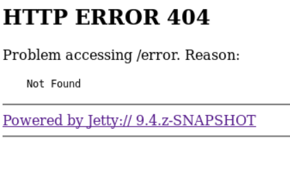

# Enumeration:
 </br> </br>
**Initial Shell:** </br>
Navigating to the webserver we get this: </br>
 </br>
When trying to submit anything, we get this: </br>
 </br>
I tried running a fuzzing scan using gobuster, but I didn't find anything. </br>
I then navigated to the page on port 50000, and saw an error message: </br>
 </br>
Tried running a fuzzing scan with gobuster again: </br>
```bash
root@kali# gobuster -u http://10.10.10.63:50000/ -w /usr/share/wordlists/dirbuster/directory-list-2.3-medium.txt -x txt,php,html

Gobuster v1.4.1              OJ Reeves (@TheColonial)
=====================================================
=====================================================
[+] Mode         : dir
[+] Url/Domain   : http://10.10.10.63:50000/
[+] Threads      : 10
[+] Wordlist     : /usr/share/wordlists/dirbuster/directory-list-2.3-medium.txt
[+] Status codes : 200,204,301,302,307
[+] Extensions   : .txt,.php,.html
=====================================================
/askjeeves (Status: 302)
```
</br>

Browsing to the ```askjeeves``` directory, I saw this page: </br>
 </br> </br>
Browsing through the system, I found a way to execute arbitrary code on the webserver: </br>
I went to the ```manage jenkins``` tab, and saw this: </br>
 </br>
This is a groovy script console, to exploit it I used a groovy reverse shell I found on [GitHub](https://gist.github.com/frohoff/fed1ffaab9b9beeb1c76) </br>
Opened a netcat listener on another terminal, and it worked. </br> </br>
**Proof Of Screenshot:** </br>
 </br> </br>
# Privilege Escalation: 
