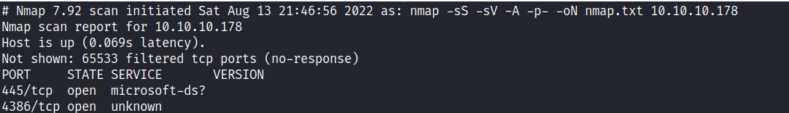
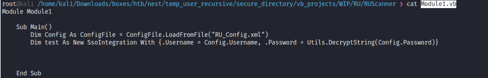
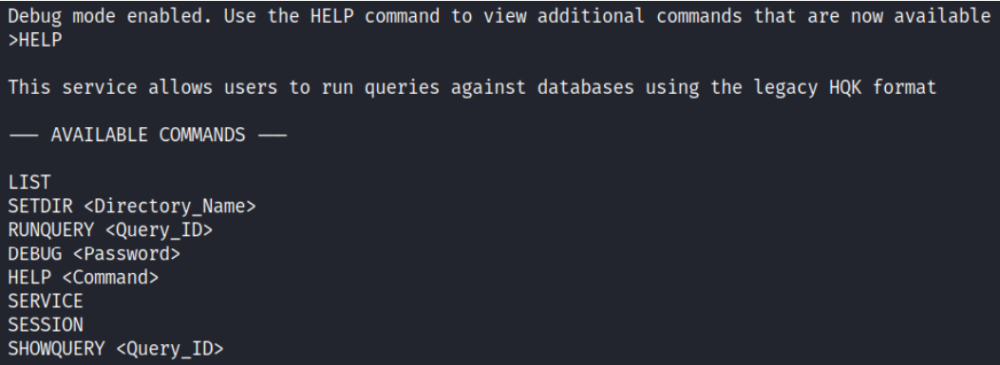
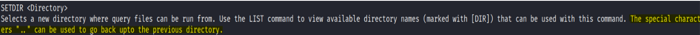
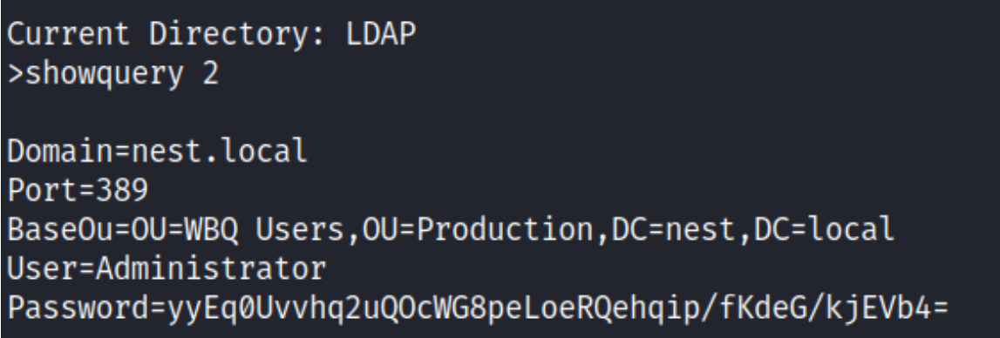
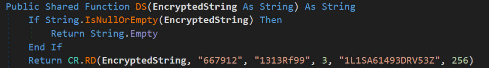
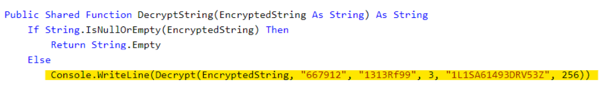
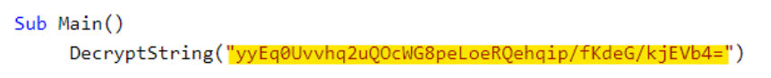
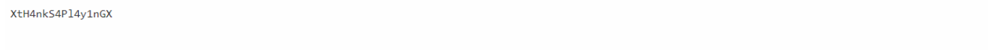
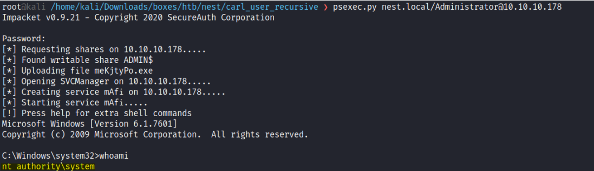

# Enumeration:
 </br>
**Initial Shell Vulnerability Exploited: Sensitive Data Exposure** </br>
First, I listed the smb shares with smbshare: </br>
 </br>
I could see that I had read access to the Data and Users smb directories as an anonymous user. </br>
I first got into the 'Data' directory, and recursively downloaded all of the files: </br>
 </br>
I found on ```Data/Shared/Templates/HR``` what seemed to be credentials for a user: </br>
 </br>
I tried logging with this ```TempUser```: </br>
 </br>
It worked. This time I had access to more files in ```IT/Configs``` Directory, and I found this: </br>
**1.** In the ```/IT/Configs/NotepadPlusPlus``` directory I found a file called ```config.xml``` that listed directories, it came into use later on: </br>
 </br>
**2.** In ```/IT/Configs/Ru``` scanner directory, I found another user credentials: </br>
 </br>
The password is encrypted in a format that looks like base64, but I couldn't decode it, so I assumed it was
a salted base64. </br>
I used the clue from the ```config.xml``` file that I've found, which included a smb directory: </br>
```Secure$/IT/Carl/``` When I got into the ```IT``` directory, I noticed that I didn't have any access to it, I couldn't even list the files in that directory: </br>
 </br>
But when I tried to access directly to ```IT/Carl``` it worked, I then downloaded all of the files there. </br>
I found a file called ```Utils.vb``` that seemed to have the decrypt function, I copied its contents to ```dotnetfiddle``` (An online VB compiler), and tried to compile it, but I got this error: </br>
 </br>
I remembered stumbling upon a file called ```Module1.vb``` that seemed to contain the Sub Main: </br>
 </br>
But I modified it entirely, to only use the ```DecryptString``` function, and passed the encrypted string (The user password I found earlier): </br>
 </br>
The ```DecryptString``` function takes a string and return the decrypted value, I changed it to ```Console.WriteLine``` so it would print out the decrypted password: </br>
 </br>
And it worked, I got the decrypted password: </br>
 </br>
Next, I got into carl user, and got into the Users smb directory: ```smbclient -U c.smith \\\\10.10.10.178\\Users``` </br>
I got into carl's directory, and recursively downloaded all of the files inside the directory. </br>
I found the user flag, and 3 interesting files, that might help me to escalate my privileges: </br>
The files I found: ```HQK_Config_Backup.xml``` - indicates it has something to do with the HQK service that was open (port 4386). </br>
```HqkLdap.exe```, and an empty bytes file called ```Debug Mode Password``` </br>
There is a thing related to the ```Debug Mode Password``` file called Alternative Data Streams , which basically means that you can hide more data in a file on an alternate stream, so it won't show. </br>
Alternative Data Streams in more detail: </br>
```bash
Adversaries may use NTFS file attributes to hide their file data in order to
evade detection. Every New Technology File System (NTFS) formatted partition
contains a Master File Table (MFT) that maintains a record for every
file/directory on the partition. Within MFT entries are file attributes such as
Extended Attributes and Data (known as Alternate Data Streams when more than
one Data attribute is present], that can be used to store arbitrary data (and
even complete files).
``` 
</br>

So the list the data inside the file, I can do: ```allinfo 'Debug Mode Password.txt'``` </br>
 </br>
It looked like it had 15 bytes in ```:Password:$Data:``` stream, so I downloaded the file with: ```get "Debug Mode Password.txt:Password:$DATA``` </br>
```HqkLdap.exe:``` I found a binary, probably related to HQK Service, at first I tried using hexdump but couldn't really figure out what was inside. </br>
but this file came in handy later on. Since I saw a bunch of files related to the HQK service on port 4386, I tried to connect to that port with netcat, but after I got in it seemed to timeout, I then tried using telnet and it worked: </br>
 </br>
**Vulnerability Explanation:** </br>
Sensitive data is any information that is meant to be protected from unauthorized access, Sensitive data can include anything from personally identifiable information, to banking information, to login credentials </br>
When this data is accessed by an attacker as a result of a data breach, users are at risk for sensitive data exposure. </br>
</br>
**Vulnerability Fix:** </br>
- Classify data processed, stored or transmitted by an application. Identify which data is sensitive
according to privacy laws, regulatory requirements, or business needs. </br>
- Don’t store sensitive data unnecessarily. </br>
- Make sure to encrypt all sensitive data at rest.
- Ensure up-to-date and strong standard algorithms, protocols, and keys are in place; use proper key
management. </br>
- Store passwords using strong adaptive and salted hashing functions with a work factor. </br>

# Privilege Escalation:
I could see a list of commands there: </br>
**LIST:** Lists the available queries in the current directory, along with an ID number for each query. This
number can be used with the RUNQUERY or SHOWQUERY commands. </br>
**SETDIR:** Selects a new directory where query files can be run from. </br>
**RUNQUERY:** Runs the specified database query and displays the results, unfortunately, this command
didn't work. </br>
**DEBUG:** Enables debug mode, which allows the use of additional commands to use for troubleshooting network and configuration issues. </br>
That requires a password, so I tried to use the password I found before in the ```Password.txt:Password:$DATA"``` file. And it worked, It allowed the use of some new commands: </br>
 </br>
**SERVICE:** Shows information about the HQK reporting service that is serving this client. </br>
**SESSION:** Shows information about the current network session established with the HQK reporting service. </br>
**SHOWQUERY:** Shows the contents of the specified database query. </br>
I couldn’t find anything in this current directory, but I figured that I can move back up to the previous directory: </br>
 </br>
In ```HQK/LDAP``` Directory I found the same binary I found before in the smb service, and I also found an Administrator user credentials. </br>
I used ```showquery``` command to read the content of ```LDAP.conf``` file, and saw this: </br>
 </br>
Once again it looked like a base64 encoding, I tried to decode it but it didn't work, I then tried using the VB.NET code from earlier to decode it but it still didn't work. </br>
I decided to try and open the executable ```HqkLdap.exe``` I found before, to Investigate it I used a program called [dnSpy](https://github.com/dnSpy/dnSpy) (A windows debugger and a disassembler). </br>
I opened ```HqkLdap.exe``` in dnSpy I could see all of the code of the program, I found the encryption
class and modified my decryption code from earlier, according to the new file I found: </br>
 </br>
According to this, I modified the previous code in VB.NET compiler: </br>
**1.** </br>
 </br>
**2.** </br>
 </br>
This is the encrypted Administrator password. </br>
And It worked: </br>
 </br>
I then tried logging in using psexec. </br>
**PsExec:** allows for remote command execution (and receipt of resulting output) over a named pipe with
the Server Message Block (SMB) protocol, which runs on TCP port 445. </br> </br>
I specified the nest.local domain, as I saw it in the LDAP.conf file. </br>
```psexec.py nest.local/Administrator@10.10.10.178``` </br> </br>
**Vulnerability Exploited:** Path Traversal Vulnerability that allows to obtain the encrypted admin
password. </br>
**Vulnerability Explanation:** HqkLdap SETDIR command allows directory traversal, by going back to the
previous directories it allowed us to read arbitrary files in the system. </br>
**Vulnerability Fix:** Do not allow using the ```SETDIR``` command into directories that may contain sensitive
files, whitelist only the files you want the user to access. </br> </br>
**Proof Of Screenshot:** </br>


