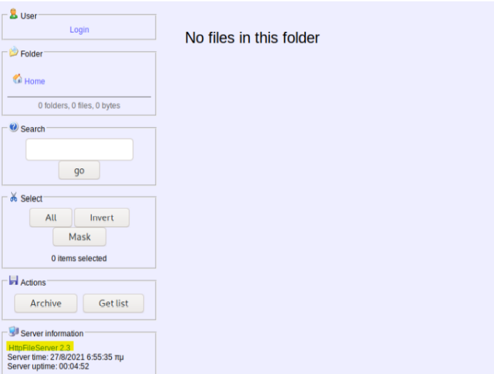
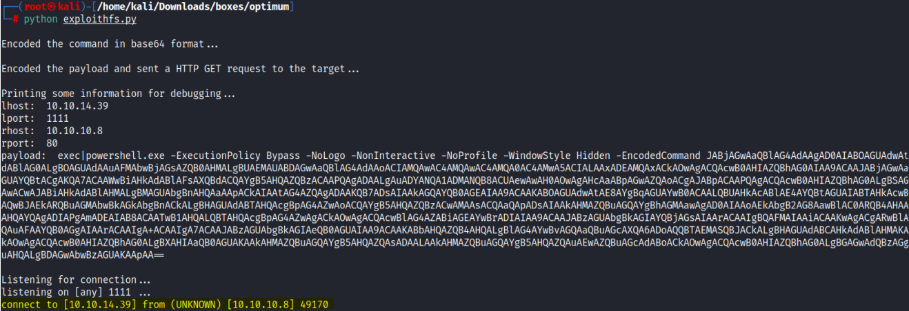

# Enumeration:
Started with an nmap scan to enumerate the box:
```bash
# Nmap 7.92 scan initiated Sat Jul  9 21:40:08 2022 as: nmap -sS -sV -A -p- -oN nmap.txt 10.10.10.8
Nmap scan report for 10.10.10.8
Host is up (0.073s latency).
Not shown: 65534 filtered tcp ports (no-response)
PORT   STATE SERVICE VERSION
80/tcp open  http    HttpFileServer httpd 2.3
|_http-title: HFS /
|_http-server-header: HFS 2.3
Warning: OSScan results may be unreliable because we could not find at least 1 open and 1 closed port
Aggressive OS guesses: Microsoft Windows Server 2012 (91%), Microsoft Windows Server 2012 or Windows Server 2012 R2 (91%), Microsoft Windows Server 2012 R2 (91%), Microsoft Windows 7 Professional (87%), Microsoft Windows 8.1 Update 1 (86%), Microsoft Windows Phone 7.5 or 8.0 (86%), Microsoft Windows 7 or Windows Server 2008 R2 (85%), Microsoft Windows Server 2008 R2 (85%), Microsoft Windows Server 2008 R2 or Windows 8.1 (85%), Microsoft Windows Server 2008 R2 SP1 or Windows 8 (85%)
No exact OS matches for host (test conditions non-ideal).
Network Distance: 2 hops
Service Info: OS: Windows; CPE: cpe:/o:microsoft:windows

TRACEROUTE (using port 80/tcp)
HOP RTT      ADDRESS
1   74.28 ms 10.10.14.1
2   74.34 ms 10.10.10.8

OS and Service detection performed. Please report any incorrect results at https://nmap.org/submit/ .
# Nmap done at Sat Jul  9 21:42:08 2022 -- 1 IP address (1 host up) scanned in 120.47 seconds
```
\
**Initial Shell Vulnerability Exploited:**\
Since port 80 was open, I got into the main page and could see that it was powered by HttpFileServer (HFS) 2.3:\
 </br>
I found an exploit for this version on [Exploit-DB](https://www.exploit-db.com/exploits/49584) and modified the exploit to my IP Address and port, and it worked: </br>
 </br>
