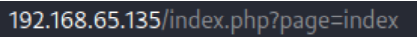
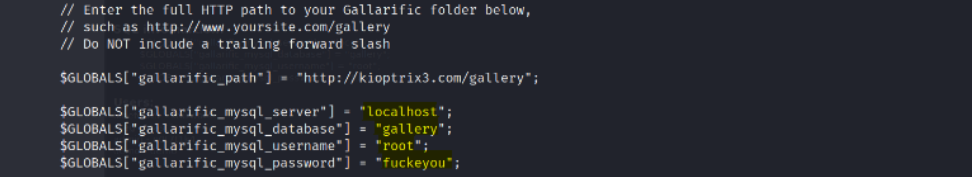
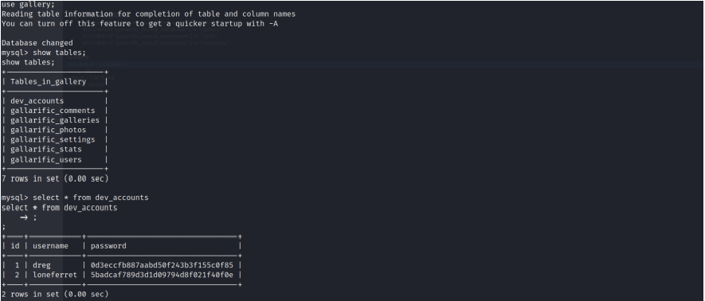
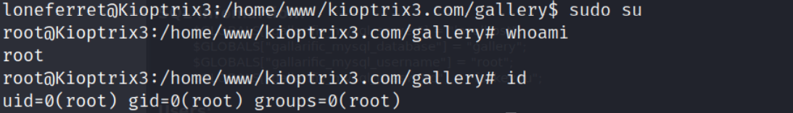

# Enumeration:
Started with an nmap scan to enumerate the box:
```bash
# Nmap 7.92 scan initiated Fri May 27 18:37:17 2022 as: nmap -sS -sV -A -p- -oN nmap.txt 192.168.65.135
Nmap scan report for 192.168.65.135
Host is up (0.00074s latency).
Not shown: 65533 closed tcp ports (reset)
PORT   STATE SERVICE VERSION
22/tcp open  ssh     OpenSSH 4.7p1 Debian 8ubuntu1.2 (protocol 2.0)
| ssh-hostkey: 
|   1024 30:e3:f6:dc:2e:22:5d:17:ac:46:02:39:ad:71:cb:49 (DSA)
|_  2048 9a:82:e6:96:e4:7e:d6:a6:d7:45:44:cb:19:aa:ec:dd (RSA)
80/tcp open  http    Apache httpd 2.2.8 ((Ubuntu) PHP/5.2.4-2ubuntu5.6 with Suhosin-Patch)
| http-cookie-flags: 
|   /: 
|     PHPSESSID: 
|_      httponly flag not set
|_http-title: Ligoat Security - Got Goat? Security ...
|_http-server-header: Apache/2.2.8 (Ubuntu) PHP/5.2.4-2ubuntu5.6 with Suhosin-Patch
MAC Address: 00:0C:29:BF:8B:D4 (VMware)
Device type: general purpose
Running: Linux 2.6.X
OS CPE: cpe:/o:linux:linux_kernel:2.6
OS details: Linux 2.6.9 - 2.6.33
Network Distance: 1 hop
Service Info: OS: Linux; CPE: cpe:/o:linux:linux_kernel

TRACEROUTE
HOP RTT     ADDRESS
1   0.74 ms 192.168.65.135

OS and Service detection performed. Please report any incorrect results at https://nmap.org/submit/ .
# Nmap done at Fri May 27 18:37:32 2022 -- 1 IP address (1 host up) scanned in 15.12 seconds
``` 
</br>

**Initial Shell Vulnerability Exploited:** </br>
Website Main Page: </br>
 </br>
I got into the ‘Login’ section, and I saw that it was powered by ‘LotusCMS’ system: </br>
 </br>
I searched online for an exploit and found one in [Github](https://github.com/Hood3dRob1n/LotusCMS-Exploit/blob/master/lotusRCE.sh), and [Exploit-DB](https://www.exploit-db.com/exploits/18565) </br>
I read the code, and decided to try to exploit it manually: </br>
 </br>
```
 ?page=index (Might be a LFI/RFI vulnerability)
```
</br>

 </br>
As written in the script- the vulnerable parameter is ```');${};#``` </br>
I tried it out on burpsuite: </br>
 </br>
**Vulnerability Explanation:**  An attacker can exploit this vulnerability to execute local commands through
the webserver’s URL. </br>
This allowed the attacker to gain remote access to and compromise the system. </br>
**Vulnerability Fix:** Upgrade to the latest version of LotusCMS, available from the LotusCMS Web site. </br> </br>
***Proof Of Screenshot:** </br>
 </br>
# Privilege Escalation: 
I found 3 users inside the machine - dreg, loneferret and www (the user I was logged into). </br>
Also, in ```/www``` directory, I found the MySQL service credentials: </br>
 </br>
After enumerating the database, I also found credentials to the other users in the machine: </br>
 </br>
I logged into ```loneferret``` user and tried ```sudo -l``` command: </br>
 </br>
HT is an interactive file editor, so the sudo privileges would give us permissions to edit files like
‘sudoers’ and eventually give us root privileges. </br>
in order to use an interactive file editor, I made my shell interactive: </br>
```bash
python -c 'import pty; pty.spawn("/bin/bash")'
Ctrl + Z -> Background the shell
stty raw -echo
stty raw -echo;fg
export TERM=xterm
export SHELL=bash
```
</br>

F3 -> Opened ```/etc/sudoers``` file </br>
Added ```/bin/su``` to the list, and got root privileges: </br>
 </br>
F2 -> Save. </br>
F10 -> Exit. </br>
**Vulnerability Exploited:**  HT is a file viewer, editor, and analyzer for text, binary, and executable files
and it was running with root privileges. </br>
**Vulnerability Explanation:**  I edited the /etc/sudoers file and added a new binary (/bin/su) - whenever I
write this binary in the terminal, I run this command as root </br>
**Vulnerability Fix:** Be aware of what permissions you grant, and to whom it is granted. </br> </br>
**Proof Of Screenshot:** </br>

