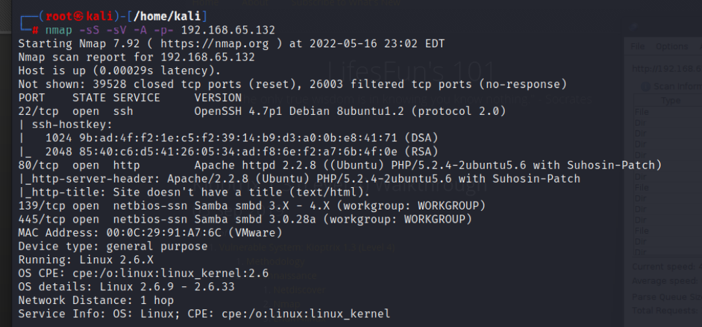
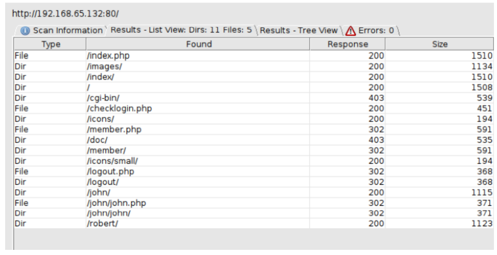
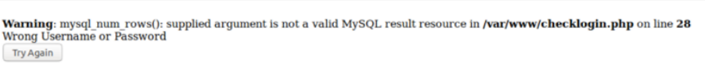
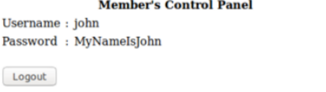
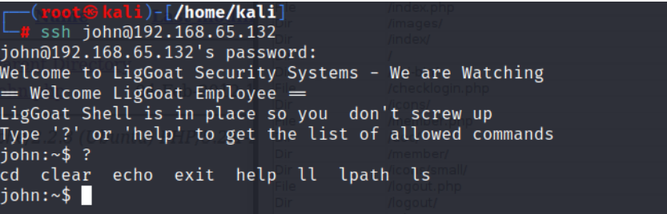
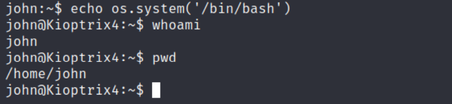
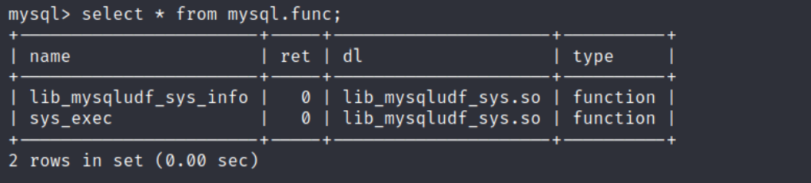
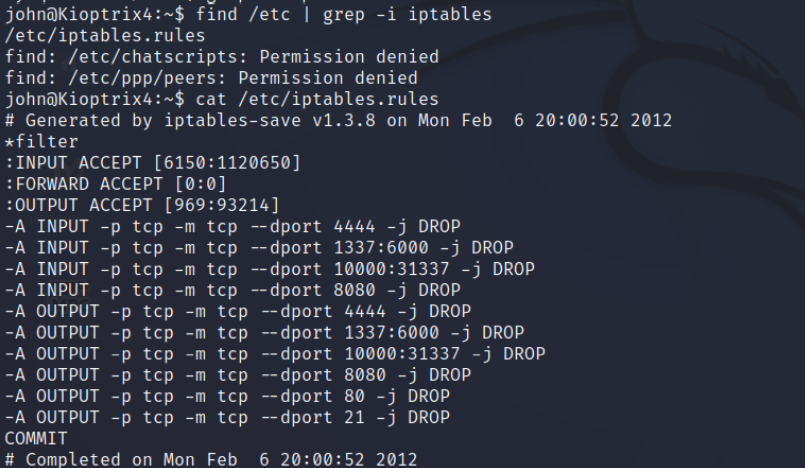
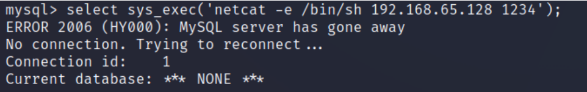
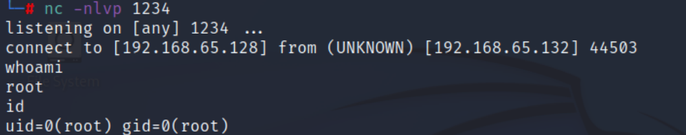

# Enumeration:
 </br>
Started with port 80, this was the main page: </br>
 </br>
I did a directory scan with dirbuster, and found this: </br>
 </br>
Back to the main page: </br>
By writing ```‘``` I could see that the login panel is vulnerable to SQL Injection: </br>
 </br>
I tried the username ```john``` that I found doing the dirbuster scan, and this payload in the password: ```' 'OR 1=1’```, and it worked. </br>
 </br>
SSH port was open, and I successfully connected with john’s credentials: </br>
 </br>
But it was a very limited shell and could only run a few commands. </br>
I managed to escape from that limited shell with this command: </br>
```echo os.system('/bin/bash')``` </br>

**Vulnerability Explanation:** A SQL injection attack consists of insertion or “injection” of a SQL query
via the input data from the client to the application. </br>
**Vulnerability Fix:** Most instances of SQL injection can be prevented by using parameterized queries
(also known as prepared statements) instead of string concatenation within the query. </br>
**Initial Shell Screenshot:** </br>
 </br>
# Privilege Escalation:
I checked what services are running as root by the machine with the command: </br>
```ps aux | grep root``` </br>

And saw this: </br>
 </br>
I tried to connect to the MySQL service as root, and It worked - I got in without a password. </br>
While enumerating the database I found this: </br>
 </br>
There is an exploit for ```sys_exec``` function on [Exploit-DB](https://www.exploit-db.com/exploits/50236) </br>
this machine had a restriction on specific ports, I figured it after I tried to set up a netcat, but got no
results. </br>
I saw the port restriction with this command: ```find /etc | grep -i iptables``` </br>
 </br>
I used a port that wasn’t blocked and managed to successfully exploit the machine: </br> 
**Target Machine:** </br>
 </br>
On my Kali I used netcat to listen to the machine: ```nc -nlvp 1234``` </br>
**Vulnerability Exploited:** MySQL User Defined Functions capabilities along with having administrative
privileges allows for system commands to be executed from within the database with administrative
privileges. </br>
**Vulnerability Explanation:** The function will pass the argument ‘args->args[0]’ inside the ‘system’
function. It is possible to use this to execute system commands on the target machine. </br>
**Vulnerability Fix:** MySQL database should be protected with a strong password, MySQL database
should be run under a limited privilege user. </br> </br>
**Screenshot Proof:** </br>



